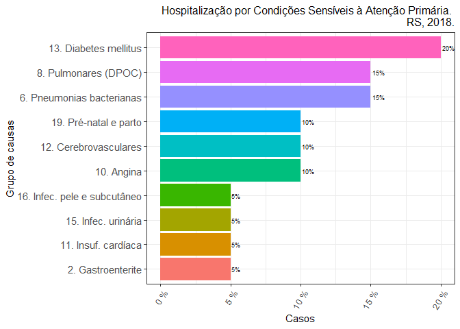
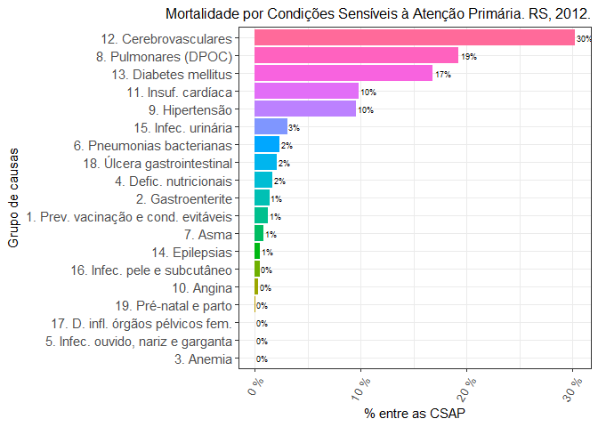

csapAIH: <font size="4"> Classificar Condições Sensíveis à Atenção
Primária</font>
================
Fúlvio Borges Nedel

Atualizado em 20 de março de 2023

- <a href="#apresentação" id="toc-apresentação">Apresentação</a>
- <a href="#justificativa" id="toc-justificativa">Justificativa</a>
- <a href="#instalação" id="toc-instalação">Instalação</a>
- <a href="#conteúdo-timeline" id="toc-conteúdo-timeline">Conteúdo
  (<em>timeline</em>)</a>
- <a href="#dependências" id="toc-dependências">Dependências</a>
- <a href="#exemplos-de-uso" id="toc-exemplos-de-uso">Exemplos de uso</a>
  - <a href="#classificação-da-causa-código-cid-10"
    id="toc-classificação-da-causa-código-cid-10">Classificação da causa
    (código CID-10)</a>
    - <a href="#em-arquivos-de-dados" id="toc-em-arquivos-de-dados">Em
      arquivos de dados</a>
    - <a href="#em-um-banco-de-dados-existente-na-sessão-de-trabalho"
      id="toc-em-um-banco-de-dados-existente-na-sessão-de-trabalho">Em um
      banco de dados existente na sessão de trabalho</a>
    - <a href="#a-partir-de-uma-variável-com-códigos-da-cid-10"
      id="toc-a-partir-de-uma-variável-com-códigos-da-cid-10">A partir de uma
      variável com códigos da CID-10:</a>
  - <a href="#apresentação-de-resultados"
    id="toc-apresentação-de-resultados">Apresentação de resultados</a>
    - <a href="#resumo-de-importação-de-dados"
      id="toc-resumo-de-importação-de-dados">Resumo de importação de dados</a>
    - <a href="#tabela-bruta" id="toc-tabela-bruta">Tabela “bruta”</a>
    - <a href="#tabela-para-apresentação"
      id="toc-tabela-para-apresentação">Tabela para apresentação</a>
    - <a href="#gráficos" id="toc-gráficos">Gráficos</a>
  - <a href="#calcular-taxas" id="toc-calcular-taxas">Calcular taxas</a>
    - <a href="#taxas-de-icsap-em-cerro-largo-rs-2010"
      id="toc-taxas-de-icsap-em-cerro-largo-rs-2010">Taxas de ICSAP em Cerro
      Largo, RS, 2010:</a>
- <a href="#agradecimentos" id="toc-agradecimentos">Agradecimentos</a>
- <a href="#referências" id="toc-referências">Referências</a>

<!-- README.md is generated from README.Rmd. Please edit that file -->

# Apresentação

Pacote em **R** para a classificação de códigos da CID-10 (Classificação
Internacional de Doenças, 10ª Revisão) segundo a Lista Brasileira de
Condições Sensíveis à Atenção Primária (CSAP). É particularmente voltado
ao trabalho com as bases de dados do Sistema de Informações Hospitalares
do SUS, o Sistema Único de Saúde brasileiro. Tais bases (BD-SIH/SUS)
contêm os “arquivos da AIH” (`RD??????.DBC`), que podem ser expandidos
para o formato DBF (`RD??????.DBF`), com as informações de cada
hospitalização ocorrida pelo SUS num período determinado. Assim, embora
o pacote permita a classificação de qualquer listagem de códigos da
CID-10, tem também algumas funcionalidades para facilitar o trabalho com
os “arquivos da AIH” e, atualmente, do Sistema de Informações sobre
Mortalidade (SIM).

# Justificativa

A hospitalização por CSAP é um indicador da qualidade do sistema de
saúde em sua primeira instância de atenção, uma vez que a internação por
tais condições —pneumonia, infecção urinária, sarampo, diabetes etc.— só
acontecerá se houver uma falha do sistema nesse âmbito de atenção, seja
por não prevenir a ocorrência da doença (caso das doenças preveníveis
por vacinação, como o sarampo), não diagnosticá-la ou tratá-la a tempo
(como na pneumonia ou infeccão urinária) ou por falhar no seu controle
clínico (como é o caso da diabete).

O Ministério da Saúde brasileiro estabeleceu em 2008, após amplo
processo de validação, uma lista com várias causas de internação
hospitalar consideradas CSAP, definindo em portaria a Lista Brasileira.
A Lista envolve vários códigos da CID-10 e classifica as CSAP em 19
subgrupos de causa, o que torna complexa e trabalhosa a sua
decodificação. Há alguns anos o Departamento de Informática do SUS
(DATASUS) incluiu em seu excelente programa de tabulação de dados TabWin
a opção de tabulação por essas causas, apresentando sua frequência
segundo a tabela definida pelo usuário.

Entretanto, muitas vezes a pesquisa exige a classificação de cada
internação individual como uma variável na base de dados. E não conheço
outro programa ou *script* (além do que tive de escrever em minha tese)
que automatize esse trabalho.

# Instalação

O pacote `csapAIH` pode ser instalado no **R** de duas maneiras:

- com a função `install.packages()` sobre os arquivos de instalação no
  [SourceForge](https://sourceforge.net/projects/csapaih/):

``` r
install.packages("https://sourceforge.net/projects/csapaih/files/v0.0.4.1/Versao%200.0.4.1.tar.gz/download", type = "source", repos = NULL) 
```

e

``` r
install.packages("https://sourceforge.net/projects/csapaih/files/v0.0.4.1/Versao%200.0.4.1.zip/download", type = "source", repos = NULL) 
```

ou

- através do pacote `remotes` sobre os arquivos-fonte do pacote em
  desenvolvimento, no [GitHub](https://github.com/fulvionedel/csapAIH):

``` r
# install.packages("remotes") # desnecessário se o pacote já estiver instalado
remotes::install_github("fulvionedel/csapAIH")
```

# Conteúdo (*timeline*)

Na sua primeira versão ([Nedel 2017](#ref-Nedel2017)), o pacote
`csapAIH` continha apenas uma função, homônima: `csapAIH`.

Na versão 0.0.2, foram acrescentadas as funções `descreveCSAP`,
`desenhaCSAP` e `nomesgruposCSAP`, para a representação gráfica e
tabular das CSAP pela lista brasileira. Esta versão também permite a
leitura de arquivos da AIH em formato .DBC, sem necessidade de prévia
expansão a .DBF. Isso é possível pelo uso do pacote `read.dbc`, de
Daniela Petruzalek
(<https://cran.r-project.org/web/packages/read.dbc/index.html>).

A partir da versão 0.0.3 ([Nedel 2019](#ref-Nedel2019)), a função
`desenhaCSAP` permite o detalhamento do gráfico por categorias de outros
fatores do banco de dados, com o uso das funções `facet_wrap()` e
`facet_grid()`, de `ggplot2`, e permite ainda o desenho de gráficos com
as funções básicas, sem a instalação do pacote `ggplot2`. Foi ainda
criada uma função para o cálculo da idade nos arquivos da AIH: a função
`idadeSUS` é usada internamente por `csapAIH` e pode ser chamada pelo
usuário para calcular a idade sem a necessidade de classificar as CSAP.

Na versão 0.0.4, a função `csapAIH` oferece a opção de classificação das
CSAP em 20 grupos de causa, como sugerido por Alfradique et al.
([2009](#ref-Alfradique2009)). As funções `desenhaCSAP` e `tabCSAP` têm
um argumento para seleção do idioma dos nomes de grupos, em português
(`pt`, padrão), espanhol (`es`) ou inglês (`en`). Foram criadas as
funções `ler_popbr` e `popbr2000_2021` (esta sobre o pacote de R.
Saldanha ([2022](#ref-brpopref))) para acesso às estimativas
populacionais publicadas pelo DATASUS e funções para categorização da
idade em faixas etárias.

A ajuda sobre o pacote oferece mais detalhes sobre as funções e seu uso.
Veja no
[manual](https://github.com/fulvionedel/csapAIH/blob/master/docs/csapAIH_0.0.4.pdf)
ou, no R, com `?'csapAIH-package'`.

# Dependências

A leitura de arquivos .DBC exige a instalação prévia do pacote
[`read.dbc`](https://cran.r-project.org/web/packages/read.dbc/index.html)
([Petruzalek 2016](#ref-readdbc)). Sua falta não impede o funcionamento
das demais funções do pacote (inclusive de leitura de arquivos em outro
formato). A função `desenhaCSAP` tem melhor desempenho com o pacote
`ggplot2` instalado, mas sua instalação não é necessária para que ela
funcione. A função `popbr2000_2021` usa o pacote
[`dplyr`](https://cran.r-project.org/package=dplyr), que é importado.
[`Hmisc`](https://cran.r-project.org/web/packages/Hmisc/index.html) e
[`haven`](https://cran.r-project.org/package=haven) também são
importados. O código da função `popbr2000_2021` é escrito com a função
de encadeamento de comandos (“*piping*”) própria do R (“\|\>”) e seu uso
exige, portanto, R\>=4.1.0.

# Exemplos de uso

``` r
library(dplyr) # facilitar o trabalho
library(csapAIH)
```

## Classificação da causa (código CID-10)

### Em arquivos de dados

É possível classificar as CSAP diretamente a partir de arquivos com
extensão .DBC, .DBF, ou .CSV, sem necessidade da leitura prévia dos
dados. Para outras extensões de arquivo é necessária a prévia importação
dos dados para um objeto de classe `data.frame`.

#### Arquivos do DATASUS

Através de seu site FTP, o DATASUS disponibiliza dados de diferentes
Sistemas de Informação em Saúde do SUS, em arquivos comprimidos de
extensão DBC. Os arquivos podem ser baixados baixados na página de
[transferência de
arquivos](https://datasus.saude.gov.br/transferencia-de-arquivos/) do
DATASUS e expandidos para DBF ou CSV (entre várias outras possibilidades
de manejo) pelo programa
[TabWin](https://datasus.saude.gov.br/transferencia-de-arquivos/),
disponível na mesma página. Graças ao pacote
[read.dbc](https://github.com/danicat/read.dbc), de Daniela Petruzalek,
também podemos ler os arquivos comprimidos do DATASUS no R, e graças ao
pacote [microdatasus](https://github.com/rfsaldanha/microdatasus), de
Raphael Saldanha ([R. de F. Saldanha, Bastos, and Barcellos
2019](#ref-Saldanha2019)), podemos ler com facilidade esses arquivos na
internet, sem necessidade de download.

Assim, se o que queremos é apenas ver em gráfico a distribuição
proporcional das internações e da mortalidade por CSAP por grupo de
causas, podemos ler os arquivos na internet e desenhar o gráfico
diretamente:

``` r
microdatasus::fetch_datasus(year_start = 2012, 1, 2012, 1, uf = "RS", 
                            information_system = "SIH-RD") %>% 
  csapAIH() %>% 
  desenhaCSAP(titulo = "auto", onde = "RS")

# Guardarei o arquivo de mortalidade, para usar mais tarde
DORS2012 <- microdatasus::fetch_datasus(year_start = 2012, year_end = 2012, uf = "RS", 
                                        information_system = "SIM-DO") 
csapAIH(DORS2012, sihsus = FALSE, cid = CAUSABAS, parto.rm = FALSE) %>% 
  desenhaCSAP(titulo = "Mortalidade por Condições Sensíveis à Atenção Primária. RS, 2012.")
```



Se o arquivo de dados está armazenado no computador, basta digitar,
entre aspas, o nome do arquivo (com a extensão), com o “*path*” se o
arquivo estiver em diretório diferente daquele da sessão de trabalho
ativa (neste exemplo, num sub-diretório do diretório de trabalho da
sessão ativa, chamado ‘data-raw’).

<!-- têm o nome de acordo à seguinte estrutura: "RDUFAAMM.DBC", onde "UF" é a Unidade da Federação do hospital de internação e "AA" e "MM" são, respectivamente, o ano e mês "_de referência_", isto é, de faturamento da AIH. Os arquivos são disponibilizados em formato comprimido com a extensão "DBC", na página de ["transferência de arquivos"](https://datasus.saude.gov.br/transferencia-de-arquivos/) do site do DATASUS.  -->

``` r
csap <- csapAIH("data-raw/RDRS1801.dbc") 
Importados 60.529 registros.
Excluídos 8.240 (13,6%) registros de procedimentos obstétricos.
Excluídos 366 (0,6%) registros de AIH de longa permanência.
Exportados 51.923 (85,8%) registros.
```

``` r
csap <- csapAIH("data-raw/RDRS1801.dbf") 
Importados 60.529 registros.
Excluídos 8.240 (13,6%) registros de procedimentos obstétricos.
Excluídos 366 (0,6%) registros de AIH de longa permanência.
Exportados 51.923 (85,8%) registros.
```

- No caso de arquivos CSV é mandatório indicar o tipo de separador de
  campos, com o argumento `sep`.

``` r
csap <- csapAIH("data-raw/RDRS1801.csv", sep = ",")
Importados 60.529 registros.
Excluídos 8.240 (13,6%) registros de procedimentos obstétricos.
Excluídos 366 (0,6%) registros de AIH de longa permanência.
Exportados 51.923 (85,8%) registros.
```

### Em um banco de dados existente na sessão de trabalho

#### Com a estrutura dos arquivos da AIH

``` r
read.csv("data-raw/RDRS1801.csv") |> # criar o data.frame
  csapAIH() |>
  glimpse()
Importados 60.529 registros.
Excluídos 5.044 (8,3%) registros de procedimentos obstétricos.
Excluídos 366 (0,6%) registros de AIH de longa permanência.
Exportados 55.119 (91,1%) registros.
Rows: 55,119
Columns: 16
$ n.aih      <chr> "4318100063695", "4318100349508", "4318100349563", "4318100…
$ munres     <int> 431340, 430450, 430450, 430450, 430450, 430450, 430450, 430…
$ munint     <int> 431080, 430450, 430450, 430450, 430450, 430450, 430450, 430…
$ sexo       <fct> masc, fem, fem, fem, masc, masc, masc, masc, fem, masc, fem…
$ nasc       <date> 1960-01-14, 1992-09-21, 1993-05-31, 1984-07-06, 1937-09-15…
$ idade      <dbl> 58, 25, 24, 33, 80, 69, 50, 58, 70, 69, 88, 61, 26, 42, 67,…
$ fxetar.det <fct> 55-59, 25-29, 20-24, 30-34, 80 e +, 65-69, 50-54, 55-59, 70…
$ fxetar5    <fct> 55-59, 25-29, 20-24, 30-34, 80 e +, 65-69, 50-54, 55-59, 70…
$ csap       <fct> não, não, não, não, sim, sim, não, não, sim, sim, não, não,…
$ grupo      <fct> não-CSAP, não-CSAP, não-CSAP, não-CSAP, g12, g03, não-CSAP,…
$ cid        <chr> "K439", "O628", "O641", "O623", "I64", "D500", "I408", "T63…
$ proc.rea   <int> 407040064, 411010034, 411010034, 303100044, 303040149, 3030…
$ data.inter <date> 2018-01-14, 2018-01-01, 2018-01-11, 2018-01-11, 2018-01-19…
$ data.saida <date> 2018-01-16, 2018-01-03, 2018-01-13, 2018-01-12, 2018-01-24…
$ cep        <int> 93544360, 96600000, 96600000, 96600000, 96600000, 96600000,…
$ cnes       <int> 2232189, 2232928, 2232928, 2232928, 2232928, 2232928, 22329…
```

#### Sem o padrão dos arquivos da AIH

Mude o argumento `sihsus` para `FALSE` e indique no argumento `cid` qual
variável contém os códigos diagnósticos.

A *Encuesta de Egresos Hospitalarios* do Equador:

``` r
data("eeh20") # Amostra da "Encuesta de egresos hospitalarios" do Equador, ano 2020
names(eeh20) # Os nomes das variáveis
 [1] "prov_ubi"   "cant_ubi"   "parr_ubi"   "area_ubi"   "clase"     
 [6] "tipo"       "entidad"    "sector"     "mes_inv"    "nac_pac"   
[11] "cod_pais"   "nom_pais"   "sexo"       "cod_edad"   "edad"      
[16] "etnia"      "prov_res"   "area_res"   "anio_ingr"  "mes_ingr"  
[21] "dia_ingr"   "fecha_ingr" "anio_egr"   "mes_egr"    "dia_egr"   
[26] "fecha_egr"  "dia_estad"  "con_egrpa"  "esp_egrpa"  "cau_cie10" 
[31] "cant_res"   "parr_res"   "causa3"     "cap221rx"   "cau221rx"  
[36] "cau298rx"  

csap.eeh20 <- csapAIH(eeh20, sihsus = FALSE, cid = cau_cie10)
Importados 1.000 registros.
Excluídos 150 registros de parto (15% do total).
names(csap.eeh20)
 [1] "prov_ubi"   "cant_ubi"   "parr_ubi"   "area_ubi"   "clase"     
 [6] "tipo"       "entidad"    "sector"     "mes_inv"    "nac_pac"   
[11] "cod_pais"   "nom_pais"   "sexo"       "cod_edad"   "edad"      
[16] "etnia"      "prov_res"   "area_res"   "anio_ingr"  "mes_ingr"  
[21] "dia_ingr"   "fecha_ingr" "anio_egr"   "mes_egr"    "dia_egr"   
[26] "fecha_egr"  "dia_estad"  "con_egrpa"  "esp_egrpa"  "cau_cie10" 
[31] "cant_res"   "parr_res"   "causa3"     "cap221rx"   "cau221rx"  
[36] "cau298rx"   "csap"       "grupo"     
csap.eeh20[c(30,37:38)] |> 
  head(3) 
  cau_cie10 csap    grupo
1      C169  não não-CSAP
2      U072  não não-CSAP
3      A090  sim      g02
```

A Declaração de Óbito do SIM (aqui podemos usar a função `idadeSUS` para
computar a idade).

``` r
DORS2012 %>% # O banco de dados criado anteriormente 
  csapAIH(sihsus = FALSE, cid = CAUSABAS, parto.rm = FALSE) %>% 
  mutate(idade = idadeSUS(DORS2012, sis = "SIM")$idade) %>% 
  head() %>% 
  gt::gt()
Importados 79.456 registros.
```

<<<<<<< HEAD
<div id="oemgzsenqg" style="padding-left:0px;padding-right:0px;padding-top:10px;padding-bottom:10px;overflow-x:auto;overflow-y:auto;width:auto;height:auto;">
=======
<div id="osvnugrzkh" style="padding-left:0px;padding-right:0px;padding-top:10px;padding-bottom:10px;overflow-x:auto;overflow-y:auto;width:auto;height:auto;">
>>>>>>> aec54e00a7c47f2c107e7ee8a7a3f7d735421a4d
<style>html {
  font-family: -apple-system, BlinkMacSystemFont, 'Segoe UI', Roboto, Oxygen, Ubuntu, Cantarell, 'Helvetica Neue', 'Fira Sans', 'Droid Sans', Arial, sans-serif;
}

#oemgzsenqg .gt_table {
  display: table;
  border-collapse: collapse;
  margin-left: auto;
  margin-right: auto;
  color: #333333;
  font-size: 16px;
  font-weight: normal;
  font-style: normal;
  background-color: #FFFFFF;
  width: auto;
  border-top-style: solid;
  border-top-width: 2px;
  border-top-color: #A8A8A8;
  border-right-style: none;
  border-right-width: 2px;
  border-right-color: #D3D3D3;
  border-bottom-style: solid;
  border-bottom-width: 2px;
  border-bottom-color: #A8A8A8;
  border-left-style: none;
  border-left-width: 2px;
  border-left-color: #D3D3D3;
}

#oemgzsenqg .gt_heading {
  background-color: #FFFFFF;
  text-align: center;
  border-bottom-color: #FFFFFF;
  border-left-style: none;
  border-left-width: 1px;
  border-left-color: #D3D3D3;
  border-right-style: none;
  border-right-width: 1px;
  border-right-color: #D3D3D3;
}

#oemgzsenqg .gt_caption {
  padding-top: 4px;
  padding-bottom: 4px;
}

#oemgzsenqg .gt_title {
  color: #333333;
  font-size: 125%;
  font-weight: initial;
  padding-top: 4px;
  padding-bottom: 4px;
  padding-left: 5px;
  padding-right: 5px;
  border-bottom-color: #FFFFFF;
  border-bottom-width: 0;
}

#oemgzsenqg .gt_subtitle {
  color: #333333;
  font-size: 85%;
  font-weight: initial;
  padding-top: 0;
  padding-bottom: 6px;
  padding-left: 5px;
  padding-right: 5px;
  border-top-color: #FFFFFF;
  border-top-width: 0;
}

#oemgzsenqg .gt_bottom_border {
  border-bottom-style: solid;
  border-bottom-width: 2px;
  border-bottom-color: #D3D3D3;
}

#oemgzsenqg .gt_col_headings {
  border-top-style: solid;
  border-top-width: 2px;
  border-top-color: #D3D3D3;
  border-bottom-style: solid;
  border-bottom-width: 2px;
  border-bottom-color: #D3D3D3;
  border-left-style: none;
  border-left-width: 1px;
  border-left-color: #D3D3D3;
  border-right-style: none;
  border-right-width: 1px;
  border-right-color: #D3D3D3;
}

#oemgzsenqg .gt_col_heading {
  color: #333333;
  background-color: #FFFFFF;
  font-size: 100%;
  font-weight: normal;
  text-transform: inherit;
  border-left-style: none;
  border-left-width: 1px;
  border-left-color: #D3D3D3;
  border-right-style: none;
  border-right-width: 1px;
  border-right-color: #D3D3D3;
  vertical-align: bottom;
  padding-top: 5px;
  padding-bottom: 6px;
  padding-left: 5px;
  padding-right: 5px;
  overflow-x: hidden;
}

#oemgzsenqg .gt_column_spanner_outer {
  color: #333333;
  background-color: #FFFFFF;
  font-size: 100%;
  font-weight: normal;
  text-transform: inherit;
  padding-top: 0;
  padding-bottom: 0;
  padding-left: 4px;
  padding-right: 4px;
}

#oemgzsenqg .gt_column_spanner_outer:first-child {
  padding-left: 0;
}

#oemgzsenqg .gt_column_spanner_outer:last-child {
  padding-right: 0;
}

#oemgzsenqg .gt_column_spanner {
  border-bottom-style: solid;
  border-bottom-width: 2px;
  border-bottom-color: #D3D3D3;
  vertical-align: bottom;
  padding-top: 5px;
  padding-bottom: 5px;
  overflow-x: hidden;
  display: inline-block;
  width: 100%;
}

#oemgzsenqg .gt_group_heading {
  padding-top: 8px;
  padding-bottom: 8px;
  padding-left: 5px;
  padding-right: 5px;
  color: #333333;
  background-color: #FFFFFF;
  font-size: 100%;
  font-weight: initial;
  text-transform: inherit;
  border-top-style: solid;
  border-top-width: 2px;
  border-top-color: #D3D3D3;
  border-bottom-style: solid;
  border-bottom-width: 2px;
  border-bottom-color: #D3D3D3;
  border-left-style: none;
  border-left-width: 1px;
  border-left-color: #D3D3D3;
  border-right-style: none;
  border-right-width: 1px;
  border-right-color: #D3D3D3;
  vertical-align: middle;
  text-align: left;
}

#oemgzsenqg .gt_empty_group_heading {
  padding: 0.5px;
  color: #333333;
  background-color: #FFFFFF;
  font-size: 100%;
  font-weight: initial;
  border-top-style: solid;
  border-top-width: 2px;
  border-top-color: #D3D3D3;
  border-bottom-style: solid;
  border-bottom-width: 2px;
  border-bottom-color: #D3D3D3;
  vertical-align: middle;
}

#oemgzsenqg .gt_from_md > :first-child {
  margin-top: 0;
}

#oemgzsenqg .gt_from_md > :last-child {
  margin-bottom: 0;
}

#oemgzsenqg .gt_row {
  padding-top: 8px;
  padding-bottom: 8px;
  padding-left: 5px;
  padding-right: 5px;
  margin: 10px;
  border-top-style: solid;
  border-top-width: 1px;
  border-top-color: #D3D3D3;
  border-left-style: none;
  border-left-width: 1px;
  border-left-color: #D3D3D3;
  border-right-style: none;
  border-right-width: 1px;
  border-right-color: #D3D3D3;
  vertical-align: middle;
  overflow-x: hidden;
}

#oemgzsenqg .gt_stub {
  color: #333333;
  background-color: #FFFFFF;
  font-size: 100%;
  font-weight: initial;
  text-transform: inherit;
  border-right-style: solid;
  border-right-width: 2px;
  border-right-color: #D3D3D3;
  padding-left: 5px;
  padding-right: 5px;
}

#oemgzsenqg .gt_stub_row_group {
  color: #333333;
  background-color: #FFFFFF;
  font-size: 100%;
  font-weight: initial;
  text-transform: inherit;
  border-right-style: solid;
  border-right-width: 2px;
  border-right-color: #D3D3D3;
  padding-left: 5px;
  padding-right: 5px;
  vertical-align: top;
}

#oemgzsenqg .gt_row_group_first td {
  border-top-width: 2px;
}

#oemgzsenqg .gt_summary_row {
  color: #333333;
  background-color: #FFFFFF;
  text-transform: inherit;
  padding-top: 8px;
  padding-bottom: 8px;
  padding-left: 5px;
  padding-right: 5px;
}

#oemgzsenqg .gt_first_summary_row {
  border-top-style: solid;
  border-top-color: #D3D3D3;
}

#oemgzsenqg .gt_first_summary_row.thick {
  border-top-width: 2px;
}

#oemgzsenqg .gt_last_summary_row {
  padding-top: 8px;
  padding-bottom: 8px;
  padding-left: 5px;
  padding-right: 5px;
  border-bottom-style: solid;
  border-bottom-width: 2px;
  border-bottom-color: #D3D3D3;
}

#oemgzsenqg .gt_grand_summary_row {
  color: #333333;
  background-color: #FFFFFF;
  text-transform: inherit;
  padding-top: 8px;
  padding-bottom: 8px;
  padding-left: 5px;
  padding-right: 5px;
}

#oemgzsenqg .gt_first_grand_summary_row {
  padding-top: 8px;
  padding-bottom: 8px;
  padding-left: 5px;
  padding-right: 5px;
  border-top-style: double;
  border-top-width: 6px;
  border-top-color: #D3D3D3;
}

#oemgzsenqg .gt_striped {
  background-color: rgba(128, 128, 128, 0.05);
}

#oemgzsenqg .gt_table_body {
  border-top-style: solid;
  border-top-width: 2px;
  border-top-color: #D3D3D3;
  border-bottom-style: solid;
  border-bottom-width: 2px;
  border-bottom-color: #D3D3D3;
}

#oemgzsenqg .gt_footnotes {
  color: #333333;
  background-color: #FFFFFF;
  border-bottom-style: none;
  border-bottom-width: 2px;
  border-bottom-color: #D3D3D3;
  border-left-style: none;
  border-left-width: 2px;
  border-left-color: #D3D3D3;
  border-right-style: none;
  border-right-width: 2px;
  border-right-color: #D3D3D3;
}

#oemgzsenqg .gt_footnote {
  margin: 0px;
  font-size: 90%;
  padding-left: 4px;
  padding-right: 4px;
  padding-left: 5px;
  padding-right: 5px;
}

#oemgzsenqg .gt_sourcenotes {
  color: #333333;
  background-color: #FFFFFF;
  border-bottom-style: none;
  border-bottom-width: 2px;
  border-bottom-color: #D3D3D3;
  border-left-style: none;
  border-left-width: 2px;
  border-left-color: #D3D3D3;
  border-right-style: none;
  border-right-width: 2px;
  border-right-color: #D3D3D3;
}

#oemgzsenqg .gt_sourcenote {
  font-size: 90%;
  padding-top: 4px;
  padding-bottom: 4px;
  padding-left: 5px;
  padding-right: 5px;
}

#oemgzsenqg .gt_left {
  text-align: left;
}

#oemgzsenqg .gt_center {
  text-align: center;
}

#oemgzsenqg .gt_right {
  text-align: right;
  font-variant-numeric: tabular-nums;
}

#oemgzsenqg .gt_font_normal {
  font-weight: normal;
}

#oemgzsenqg .gt_font_bold {
  font-weight: bold;
}

#oemgzsenqg .gt_font_italic {
  font-style: italic;
}

#oemgzsenqg .gt_super {
  font-size: 65%;
}

#oemgzsenqg .gt_footnote_marks {
  font-style: italic;
  font-weight: normal;
  font-size: 75%;
  vertical-align: 0.4em;
}

#oemgzsenqg .gt_asterisk {
  font-size: 100%;
  vertical-align: 0;
}

#oemgzsenqg .gt_indent_1 {
  text-indent: 5px;
}

#oemgzsenqg .gt_indent_2 {
  text-indent: 10px;
}

#oemgzsenqg .gt_indent_3 {
  text-indent: 15px;
}

#oemgzsenqg .gt_indent_4 {
  text-indent: 20px;
}

#oemgzsenqg .gt_indent_5 {
  text-indent: 25px;
}
</style>
<table class="gt_table">
  
  <thead class="gt_col_headings">
    <tr>
      <th class="gt_col_heading gt_columns_bottom_border gt_center" rowspan="1" colspan="1" scope="col" id="CONTADOR">CONTADOR</th>
      <th class="gt_col_heading gt_columns_bottom_border gt_center" rowspan="1" colspan="1" scope="col" id="ORIGEM">ORIGEM</th>
      <th class="gt_col_heading gt_columns_bottom_border gt_center" rowspan="1" colspan="1" scope="col" id="TIPOBITO">TIPOBITO</th>
      <th class="gt_col_heading gt_columns_bottom_border gt_center" rowspan="1" colspan="1" scope="col" id="DTOBITO">DTOBITO</th>
      <th class="gt_col_heading gt_columns_bottom_border gt_center" rowspan="1" colspan="1" scope="col" id="HORAOBITO">HORAOBITO</th>
      <th class="gt_col_heading gt_columns_bottom_border gt_center" rowspan="1" colspan="1" scope="col" id="NATURAL">NATURAL</th>
      <th class="gt_col_heading gt_columns_bottom_border gt_center" rowspan="1" colspan="1" scope="col" id="DTNASC">DTNASC</th>
      <th class="gt_col_heading gt_columns_bottom_border gt_center" rowspan="1" colspan="1" scope="col" id="IDADE">IDADE</th>
      <th class="gt_col_heading gt_columns_bottom_border gt_center" rowspan="1" colspan="1" scope="col" id="SEXO">SEXO</th>
      <th class="gt_col_heading gt_columns_bottom_border gt_center" rowspan="1" colspan="1" scope="col" id="RACACOR">RACACOR</th>
      <th class="gt_col_heading gt_columns_bottom_border gt_center" rowspan="1" colspan="1" scope="col" id="ESTCIV">ESTCIV</th>
      <th class="gt_col_heading gt_columns_bottom_border gt_center" rowspan="1" colspan="1" scope="col" id="ESC">ESC</th>
      <th class="gt_col_heading gt_columns_bottom_border gt_center" rowspan="1" colspan="1" scope="col" id="OCUP">OCUP</th>
      <th class="gt_col_heading gt_columns_bottom_border gt_center" rowspan="1" colspan="1" scope="col" id="CODMUNRES">CODMUNRES</th>
      <th class="gt_col_heading gt_columns_bottom_border gt_center" rowspan="1" colspan="1" scope="col" id="LOCOCOR">LOCOCOR</th>
      <th class="gt_col_heading gt_columns_bottom_border gt_center" rowspan="1" colspan="1" scope="col" id="CODESTAB">CODESTAB</th>
      <th class="gt_col_heading gt_columns_bottom_border gt_center" rowspan="1" colspan="1" scope="col" id="CODMUNOCOR">CODMUNOCOR</th>
      <th class="gt_col_heading gt_columns_bottom_border gt_center" rowspan="1" colspan="1" scope="col" id="IDADEMAE">IDADEMAE</th>
      <th class="gt_col_heading gt_columns_bottom_border gt_center" rowspan="1" colspan="1" scope="col" id="ESCMAE">ESCMAE</th>
      <th class="gt_col_heading gt_columns_bottom_border gt_center" rowspan="1" colspan="1" scope="col" id="OCUPMAE">OCUPMAE</th>
      <th class="gt_col_heading gt_columns_bottom_border gt_center" rowspan="1" colspan="1" scope="col" id="QTDFILVIVO">QTDFILVIVO</th>
      <th class="gt_col_heading gt_columns_bottom_border gt_center" rowspan="1" colspan="1" scope="col" id="QTDFILMORT">QTDFILMORT</th>
      <th class="gt_col_heading gt_columns_bottom_border gt_center" rowspan="1" colspan="1" scope="col" id="GRAVIDEZ">GRAVIDEZ</th>
      <th class="gt_col_heading gt_columns_bottom_border gt_center" rowspan="1" colspan="1" scope="col" id="SEMAGESTAC">SEMAGESTAC</th>
      <th class="gt_col_heading gt_columns_bottom_border gt_center" rowspan="1" colspan="1" scope="col" id="GESTACAO">GESTACAO</th>
      <th class="gt_col_heading gt_columns_bottom_border gt_center" rowspan="1" colspan="1" scope="col" id="PARTO">PARTO</th>
      <th class="gt_col_heading gt_columns_bottom_border gt_center" rowspan="1" colspan="1" scope="col" id="OBITOPARTO">OBITOPARTO</th>
      <th class="gt_col_heading gt_columns_bottom_border gt_center" rowspan="1" colspan="1" scope="col" id="PESO">PESO</th>
      <th class="gt_col_heading gt_columns_bottom_border gt_center" rowspan="1" colspan="1" scope="col" id="TPMORTEOCO">TPMORTEOCO</th>
      <th class="gt_col_heading gt_columns_bottom_border gt_center" rowspan="1" colspan="1" scope="col" id="OBITOGRAV">OBITOGRAV</th>
      <th class="gt_col_heading gt_columns_bottom_border gt_center" rowspan="1" colspan="1" scope="col" id="OBITOPUERP">OBITOPUERP</th>
      <th class="gt_col_heading gt_columns_bottom_border gt_center" rowspan="1" colspan="1" scope="col" id="ASSISTMED">ASSISTMED</th>
      <th class="gt_col_heading gt_columns_bottom_border gt_center" rowspan="1" colspan="1" scope="col" id="EXAME">EXAME</th>
      <th class="gt_col_heading gt_columns_bottom_border gt_center" rowspan="1" colspan="1" scope="col" id="CIRURGIA">CIRURGIA</th>
      <th class="gt_col_heading gt_columns_bottom_border gt_center" rowspan="1" colspan="1" scope="col" id="NECROPSIA">NECROPSIA</th>
      <th class="gt_col_heading gt_columns_bottom_border gt_center" rowspan="1" colspan="1" scope="col" id="LINHAA">LINHAA</th>
      <th class="gt_col_heading gt_columns_bottom_border gt_center" rowspan="1" colspan="1" scope="col" id="LINHAB">LINHAB</th>
      <th class="gt_col_heading gt_columns_bottom_border gt_center" rowspan="1" colspan="1" scope="col" id="LINHAC">LINHAC</th>
      <th class="gt_col_heading gt_columns_bottom_border gt_center" rowspan="1" colspan="1" scope="col" id="LINHAD">LINHAD</th>
      <th class="gt_col_heading gt_columns_bottom_border gt_center" rowspan="1" colspan="1" scope="col" id="LINHAII">LINHAII</th>
      <th class="gt_col_heading gt_columns_bottom_border gt_center" rowspan="1" colspan="1" scope="col" id="CAUSABAS">CAUSABAS</th>
      <th class="gt_col_heading gt_columns_bottom_border gt_center" rowspan="1" colspan="1" scope="col" id="COMUNSVOIM">COMUNSVOIM</th>
      <th class="gt_col_heading gt_columns_bottom_border gt_center" rowspan="1" colspan="1" scope="col" id="DTATESTADO">DTATESTADO</th>
      <th class="gt_col_heading gt_columns_bottom_border gt_center" rowspan="1" colspan="1" scope="col" id="CIRCOBITO">CIRCOBITO</th>
      <th class="gt_col_heading gt_columns_bottom_border gt_center" rowspan="1" colspan="1" scope="col" id="ACIDTRAB">ACIDTRAB</th>
      <th class="gt_col_heading gt_columns_bottom_border gt_center" rowspan="1" colspan="1" scope="col" id="FONTE">FONTE</th>
      <th class="gt_col_heading gt_columns_bottom_border gt_center" rowspan="1" colspan="1" scope="col" id="TPPOS">TPPOS</th>
      <th class="gt_col_heading gt_columns_bottom_border gt_center" rowspan="1" colspan="1" scope="col" id="DTINVESTIG">DTINVESTIG</th>
      <th class="gt_col_heading gt_columns_bottom_border gt_center" rowspan="1" colspan="1" scope="col" id="CAUSABAS_O">CAUSABAS_O</th>
      <th class="gt_col_heading gt_columns_bottom_border gt_center" rowspan="1" colspan="1" scope="col" id="DTCADASTRO">DTCADASTRO</th>
      <th class="gt_col_heading gt_columns_bottom_border gt_center" rowspan="1" colspan="1" scope="col" id="ATESTANTE">ATESTANTE</th>
      <th class="gt_col_heading gt_columns_bottom_border gt_center" rowspan="1" colspan="1" scope="col" id="FONTEINV">FONTEINV</th>
      <th class="gt_col_heading gt_columns_bottom_border gt_center" rowspan="1" colspan="1" scope="col" id="DTRECEBIM">DTRECEBIM</th>
      <th class="gt_col_heading gt_columns_bottom_border gt_center" rowspan="1" colspan="1" scope="col" id="DTRECORIGA">DTRECORIGA</th>
      <th class="gt_col_heading gt_columns_bottom_border gt_center" rowspan="1" colspan="1" scope="col" id="CAUSAMAT">CAUSAMAT</th>
      <th class="gt_col_heading gt_columns_bottom_border gt_center" rowspan="1" colspan="1" scope="col" id="ESC2010">ESC2010</th>
      <th class="gt_col_heading gt_columns_bottom_border gt_center" rowspan="1" colspan="1" scope="col" id="ESCMAE2010">ESCMAE2010</th>
      <th class="gt_col_heading gt_columns_bottom_border gt_center" rowspan="1" colspan="1" scope="col" id="DIFDATA">DIFDATA</th>
      <th class="gt_col_heading gt_columns_bottom_border gt_center" rowspan="1" colspan="1" scope="col" id="STDOEPIDEM">STDOEPIDEM</th>
      <th class="gt_col_heading gt_columns_bottom_border gt_center" rowspan="1" colspan="1" scope="col" id="STDONOVA">STDONOVA</th>
      <th class="gt_col_heading gt_columns_bottom_border gt_center" rowspan="1" colspan="1" scope="col" id="DTCADINV">DTCADINV</th>
      <th class="gt_col_heading gt_columns_bottom_border gt_center" rowspan="1" colspan="1" scope="col" id="TPOBITOCOR">TPOBITOCOR</th>
      <th class="gt_col_heading gt_columns_bottom_border gt_center" rowspan="1" colspan="1" scope="col" id="DTCADINF">DTCADINF</th>
      <th class="gt_col_heading gt_columns_bottom_border gt_center" rowspan="1" colspan="1" scope="col" id="MORTEPARTO">MORTEPARTO</th>
      <th class="gt_col_heading gt_columns_bottom_border gt_center" rowspan="1" colspan="1" scope="col" id="DTCONCASO">DTCONCASO</th>
      <th class="gt_col_heading gt_columns_bottom_border gt_center" rowspan="1" colspan="1" scope="col" id="NUDIASOBIN">NUDIASOBIN</th>
      <th class="gt_col_heading gt_columns_bottom_border gt_center" rowspan="1" colspan="1" scope="col" id="SERIESCFAL">SERIESCFAL</th>
      <th class="gt_col_heading gt_columns_bottom_border gt_center" rowspan="1" colspan="1" scope="col" id="SERIESCMAE">SERIESCMAE</th>
      <th class="gt_col_heading gt_columns_bottom_border gt_center" rowspan="1" colspan="1" scope="col" id="csap">csap</th>
      <th class="gt_col_heading gt_columns_bottom_border gt_center" rowspan="1" colspan="1" scope="col" id="grupo">grupo</th>
      <th class="gt_col_heading gt_columns_bottom_border gt_right" rowspan="1" colspan="1" scope="col" id="idade">idade</th>
    </tr>
  </thead>
  <tbody class="gt_table_body">
    <tr><td headers="CONTADOR" class="gt_row gt_center">1</td>
<td headers="ORIGEM" class="gt_row gt_center">1</td>
<td headers="TIPOBITO" class="gt_row gt_center">2</td>
<td headers="DTOBITO" class="gt_row gt_center">22022012</td>
<td headers="HORAOBITO" class="gt_row gt_center">1030</td>
<td headers="NATURAL" class="gt_row gt_center">NA</td>
<td headers="DTNASC" class="gt_row gt_center">28101922</td>
<td headers="IDADE" class="gt_row gt_center">489</td>
<td headers="SEXO" class="gt_row gt_center">1</td>
<td headers="RACACOR" class="gt_row gt_center">1</td>
<td headers="ESTCIV" class="gt_row gt_center">1</td>
<td headers="ESC" class="gt_row gt_center">2</td>
<td headers="OCUP" class="gt_row gt_center">999993</td>
<td headers="CODMUNRES" class="gt_row gt_center">431235</td>
<td headers="LOCOCOR" class="gt_row gt_center">5</td>
<td headers="CODESTAB" class="gt_row gt_center">NA</td>
<td headers="CODMUNOCOR" class="gt_row gt_center">431235</td>
<td headers="IDADEMAE" class="gt_row gt_center">NA</td>
<td headers="ESCMAE" class="gt_row gt_center">NA</td>
<td headers="OCUPMAE" class="gt_row gt_center">NA</td>
<td headers="QTDFILVIVO" class="gt_row gt_center">NA</td>
<td headers="QTDFILMORT" class="gt_row gt_center">NA</td>
<td headers="GRAVIDEZ" class="gt_row gt_center">NA</td>
<td headers="SEMAGESTAC" class="gt_row gt_center">NA</td>
<td headers="GESTACAO" class="gt_row gt_center">NA</td>
<td headers="PARTO" class="gt_row gt_center">NA</td>
<td headers="OBITOPARTO" class="gt_row gt_center">NA</td>
<td headers="PESO" class="gt_row gt_center">NA</td>
<td headers="TPMORTEOCO" class="gt_row gt_center">NA</td>
<td headers="OBITOGRAV" class="gt_row gt_center">NA</td>
<td headers="OBITOPUERP" class="gt_row gt_center">NA</td>
<td headers="ASSISTMED" class="gt_row gt_center">NA</td>
<td headers="EXAME" class="gt_row gt_center">2</td>
<td headers="CIRURGIA" class="gt_row gt_center">2</td>
<td headers="NECROPSIA" class="gt_row gt_center">2</td>
<td headers="LINHAA" class="gt_row gt_center">*I10X</td>
<td headers="LINHAB" class="gt_row gt_center">*J449</td>
<td headers="LINHAC" class="gt_row gt_center">NA</td>
<td headers="LINHAD" class="gt_row gt_center">NA</td>
<td headers="LINHAII" class="gt_row gt_center">NA</td>
<td headers="CAUSABAS" class="gt_row gt_center">J449</td>
<td headers="COMUNSVOIM" class="gt_row gt_center">NA</td>
<td headers="DTATESTADO" class="gt_row gt_center">22022012</td>
<td headers="CIRCOBITO" class="gt_row gt_center">NA</td>
<td headers="ACIDTRAB" class="gt_row gt_center">NA</td>
<td headers="FONTE" class="gt_row gt_center">NA</td>
<td headers="TPPOS" class="gt_row gt_center">NA</td>
<td headers="DTINVESTIG" class="gt_row gt_center">NA</td>
<td headers="CAUSABAS_O" class="gt_row gt_center">J449</td>
<td headers="DTCADASTRO" class="gt_row gt_center">15032012</td>
<td headers="ATESTANTE" class="gt_row gt_center">1</td>
<td headers="FONTEINV" class="gt_row gt_center">NA</td>
<td headers="DTRECEBIM" class="gt_row gt_center">22032012</td>
<td headers="DTRECORIGA" class="gt_row gt_center">22032012</td>
<td headers="CAUSAMAT" class="gt_row gt_center">NA</td>
<td headers="ESC2010" class="gt_row gt_center">NA</td>
<td headers="ESCMAE2010" class="gt_row gt_center">NA</td>
<td headers="DIFDATA" class="gt_row gt_center">029</td>
<td headers="STDOEPIDEM" class="gt_row gt_center">0</td>
<td headers="STDONOVA" class="gt_row gt_center">0</td>
<td headers="DTCADINV" class="gt_row gt_center">NA</td>
<td headers="TPOBITOCOR" class="gt_row gt_center">NA</td>
<td headers="DTCADINF" class="gt_row gt_center">NA</td>
<td headers="MORTEPARTO" class="gt_row gt_center">NA</td>
<td headers="DTCONCASO" class="gt_row gt_center">NA</td>
<td headers="NUDIASOBIN" class="gt_row gt_center">NA</td>
<td headers="SERIESCFAL" class="gt_row gt_center">NA</td>
<td headers="SERIESCMAE" class="gt_row gt_center">NA</td>
<td headers="csap" class="gt_row gt_center">sim</td>
<td headers="grupo" class="gt_row gt_center">g08</td>
<td headers="idade" class="gt_row gt_right">89</td></tr>
    <tr><td headers="CONTADOR" class="gt_row gt_center">2</td>
<td headers="ORIGEM" class="gt_row gt_center">1</td>
<td headers="TIPOBITO" class="gt_row gt_center">2</td>
<td headers="DTOBITO" class="gt_row gt_center">29042012</td>
<td headers="HORAOBITO" class="gt_row gt_center">1255</td>
<td headers="NATURAL" class="gt_row gt_center">NA</td>
<td headers="DTNASC" class="gt_row gt_center">16051966</td>
<td headers="IDADE" class="gt_row gt_center">445</td>
<td headers="SEXO" class="gt_row gt_center">2</td>
<td headers="RACACOR" class="gt_row gt_center">1</td>
<td headers="ESTCIV" class="gt_row gt_center">4</td>
<td headers="ESC" class="gt_row gt_center">NA</td>
<td headers="OCUP" class="gt_row gt_center">512120</td>
<td headers="CODMUNRES" class="gt_row gt_center">432010</td>
<td headers="LOCOCOR" class="gt_row gt_center">1</td>
<td headers="CODESTAB" class="gt_row gt_center">2235404</td>
<td headers="CODMUNOCOR" class="gt_row gt_center">432010</td>
<td headers="IDADEMAE" class="gt_row gt_center">NA</td>
<td headers="ESCMAE" class="gt_row gt_center">NA</td>
<td headers="OCUPMAE" class="gt_row gt_center">NA</td>
<td headers="QTDFILVIVO" class="gt_row gt_center">NA</td>
<td headers="QTDFILMORT" class="gt_row gt_center">NA</td>
<td headers="GRAVIDEZ" class="gt_row gt_center">NA</td>
<td headers="SEMAGESTAC" class="gt_row gt_center">NA</td>
<td headers="GESTACAO" class="gt_row gt_center">NA</td>
<td headers="PARTO" class="gt_row gt_center">NA</td>
<td headers="OBITOPARTO" class="gt_row gt_center">NA</td>
<td headers="PESO" class="gt_row gt_center">NA</td>
<td headers="TPMORTEOCO" class="gt_row gt_center">NA</td>
<td headers="OBITOGRAV" class="gt_row gt_center">2</td>
<td headers="OBITOPUERP" class="gt_row gt_center">NA</td>
<td headers="ASSISTMED" class="gt_row gt_center">NA</td>
<td headers="EXAME" class="gt_row gt_center">1</td>
<td headers="CIRURGIA" class="gt_row gt_center">2</td>
<td headers="NECROPSIA" class="gt_row gt_center">2</td>
<td headers="LINHAA" class="gt_row gt_center">*I219</td>
<td headers="LINHAB" class="gt_row gt_center">NA</td>
<td headers="LINHAC" class="gt_row gt_center">NA</td>
<td headers="LINHAD" class="gt_row gt_center">NA</td>
<td headers="LINHAII" class="gt_row gt_center">NA</td>
<td headers="CAUSABAS" class="gt_row gt_center">I219</td>
<td headers="COMUNSVOIM" class="gt_row gt_center">NA</td>
<td headers="DTATESTADO" class="gt_row gt_center">29042012</td>
<td headers="CIRCOBITO" class="gt_row gt_center">NA</td>
<td headers="ACIDTRAB" class="gt_row gt_center">NA</td>
<td headers="FONTE" class="gt_row gt_center">NA</td>
<td headers="TPPOS" class="gt_row gt_center">NA</td>
<td headers="DTINVESTIG" class="gt_row gt_center">NA</td>
<td headers="CAUSABAS_O" class="gt_row gt_center">I219</td>
<td headers="DTCADASTRO" class="gt_row gt_center">25062012</td>
<td headers="ATESTANTE" class="gt_row gt_center">1</td>
<td headers="FONTEINV" class="gt_row gt_center">NA</td>
<td headers="DTRECEBIM" class="gt_row gt_center">11072012</td>
<td headers="DTRECORIGA" class="gt_row gt_center">11072012</td>
<td headers="CAUSAMAT" class="gt_row gt_center">NA</td>
<td headers="ESC2010" class="gt_row gt_center">NA</td>
<td headers="ESCMAE2010" class="gt_row gt_center">NA</td>
<td headers="DIFDATA" class="gt_row gt_center">073</td>
<td headers="STDOEPIDEM" class="gt_row gt_center">0</td>
<td headers="STDONOVA" class="gt_row gt_center">0</td>
<td headers="DTCADINV" class="gt_row gt_center">10092012</td>
<td headers="TPOBITOCOR" class="gt_row gt_center">9</td>
<td headers="DTCADINF" class="gt_row gt_center">NA</td>
<td headers="MORTEPARTO" class="gt_row gt_center">NA</td>
<td headers="DTCONCASO" class="gt_row gt_center">NA</td>
<td headers="NUDIASOBIN" class="gt_row gt_center">134</td>
<td headers="SERIESCFAL" class="gt_row gt_center">NA</td>
<td headers="SERIESCMAE" class="gt_row gt_center">NA</td>
<td headers="csap" class="gt_row gt_center">não</td>
<td headers="grupo" class="gt_row gt_center">não-CSAP</td>
<td headers="idade" class="gt_row gt_right">45</td></tr>
    <tr><td headers="CONTADOR" class="gt_row gt_center">3</td>
<td headers="ORIGEM" class="gt_row gt_center">1</td>
<td headers="TIPOBITO" class="gt_row gt_center">2</td>
<td headers="DTOBITO" class="gt_row gt_center">03102012</td>
<td headers="HORAOBITO" class="gt_row gt_center">1040</td>
<td headers="NATURAL" class="gt_row gt_center">NA</td>
<td headers="DTNASC" class="gt_row gt_center">04091938</td>
<td headers="IDADE" class="gt_row gt_center">474</td>
<td headers="SEXO" class="gt_row gt_center">1</td>
<td headers="RACACOR" class="gt_row gt_center">1</td>
<td headers="ESTCIV" class="gt_row gt_center">NA</td>
<td headers="ESC" class="gt_row gt_center">2</td>
<td headers="OCUP" class="gt_row gt_center">NA</td>
<td headers="CODMUNRES" class="gt_row gt_center">430200</td>
<td headers="LOCOCOR" class="gt_row gt_center">3</td>
<td headers="CODESTAB" class="gt_row gt_center">NA</td>
<td headers="CODMUNOCOR" class="gt_row gt_center">430200</td>
<td headers="IDADEMAE" class="gt_row gt_center">NA</td>
<td headers="ESCMAE" class="gt_row gt_center">NA</td>
<td headers="OCUPMAE" class="gt_row gt_center">NA</td>
<td headers="QTDFILVIVO" class="gt_row gt_center">NA</td>
<td headers="QTDFILMORT" class="gt_row gt_center">NA</td>
<td headers="GRAVIDEZ" class="gt_row gt_center">NA</td>
<td headers="SEMAGESTAC" class="gt_row gt_center">NA</td>
<td headers="GESTACAO" class="gt_row gt_center">NA</td>
<td headers="PARTO" class="gt_row gt_center">NA</td>
<td headers="OBITOPARTO" class="gt_row gt_center">NA</td>
<td headers="PESO" class="gt_row gt_center">NA</td>
<td headers="TPMORTEOCO" class="gt_row gt_center">NA</td>
<td headers="OBITOGRAV" class="gt_row gt_center">NA</td>
<td headers="OBITOPUERP" class="gt_row gt_center">NA</td>
<td headers="ASSISTMED" class="gt_row gt_center">1</td>
<td headers="EXAME" class="gt_row gt_center">2</td>
<td headers="CIRURGIA" class="gt_row gt_center">2</td>
<td headers="NECROPSIA" class="gt_row gt_center">2</td>
<td headers="LINHAA" class="gt_row gt_center">*I509</td>
<td headers="LINHAB" class="gt_row gt_center">*I10X</td>
<td headers="LINHAC" class="gt_row gt_center">NA</td>
<td headers="LINHAD" class="gt_row gt_center">NA</td>
<td headers="LINHAII" class="gt_row gt_center">NA</td>
<td headers="CAUSABAS" class="gt_row gt_center">I110</td>
<td headers="COMUNSVOIM" class="gt_row gt_center">NA</td>
<td headers="DTATESTADO" class="gt_row gt_center">03102012</td>
<td headers="CIRCOBITO" class="gt_row gt_center">NA</td>
<td headers="ACIDTRAB" class="gt_row gt_center">NA</td>
<td headers="FONTE" class="gt_row gt_center">NA</td>
<td headers="TPPOS" class="gt_row gt_center">NA</td>
<td headers="DTINVESTIG" class="gt_row gt_center">NA</td>
<td headers="CAUSABAS_O" class="gt_row gt_center">I110</td>
<td headers="DTCADASTRO" class="gt_row gt_center">27122012</td>
<td headers="ATESTANTE" class="gt_row gt_center">1</td>
<td headers="FONTEINV" class="gt_row gt_center">NA</td>
<td headers="DTRECEBIM" class="gt_row gt_center">28012013</td>
<td headers="DTRECORIGA" class="gt_row gt_center">28012013</td>
<td headers="CAUSAMAT" class="gt_row gt_center">NA</td>
<td headers="ESC2010" class="gt_row gt_center">NA</td>
<td headers="ESCMAE2010" class="gt_row gt_center">NA</td>
<td headers="DIFDATA" class="gt_row gt_center">117</td>
<td headers="STDOEPIDEM" class="gt_row gt_center">0</td>
<td headers="STDONOVA" class="gt_row gt_center">0</td>
<td headers="DTCADINV" class="gt_row gt_center">NA</td>
<td headers="TPOBITOCOR" class="gt_row gt_center">NA</td>
<td headers="DTCADINF" class="gt_row gt_center">NA</td>
<td headers="MORTEPARTO" class="gt_row gt_center">NA</td>
<td headers="DTCONCASO" class="gt_row gt_center">NA</td>
<td headers="NUDIASOBIN" class="gt_row gt_center">NA</td>
<td headers="SERIESCFAL" class="gt_row gt_center">NA</td>
<td headers="SERIESCMAE" class="gt_row gt_center">NA</td>
<td headers="csap" class="gt_row gt_center">sim</td>
<td headers="grupo" class="gt_row gt_center">g09</td>
<td headers="idade" class="gt_row gt_right">74</td></tr>
    <tr><td headers="CONTADOR" class="gt_row gt_center">4</td>
<td headers="ORIGEM" class="gt_row gt_center">1</td>
<td headers="TIPOBITO" class="gt_row gt_center">2</td>
<td headers="DTOBITO" class="gt_row gt_center">27082012</td>
<td headers="HORAOBITO" class="gt_row gt_center">0700</td>
<td headers="NATURAL" class="gt_row gt_center">800</td>
<td headers="DTNASC" class="gt_row gt_center">19081953</td>
<td headers="IDADE" class="gt_row gt_center">459</td>
<td headers="SEXO" class="gt_row gt_center">1</td>
<td headers="RACACOR" class="gt_row gt_center">4</td>
<td headers="ESTCIV" class="gt_row gt_center">3</td>
<td headers="ESC" class="gt_row gt_center">NA</td>
<td headers="OCUP" class="gt_row gt_center">512105</td>
<td headers="CODMUNRES" class="gt_row gt_center">430258</td>
<td headers="LOCOCOR" class="gt_row gt_center">3</td>
<td headers="CODESTAB" class="gt_row gt_center">NA</td>
<td headers="CODMUNOCOR" class="gt_row gt_center">430258</td>
<td headers="IDADEMAE" class="gt_row gt_center">NA</td>
<td headers="ESCMAE" class="gt_row gt_center">NA</td>
<td headers="OCUPMAE" class="gt_row gt_center">NA</td>
<td headers="QTDFILVIVO" class="gt_row gt_center">NA</td>
<td headers="QTDFILMORT" class="gt_row gt_center">NA</td>
<td headers="GRAVIDEZ" class="gt_row gt_center">NA</td>
<td headers="SEMAGESTAC" class="gt_row gt_center">NA</td>
<td headers="GESTACAO" class="gt_row gt_center">NA</td>
<td headers="PARTO" class="gt_row gt_center">NA</td>
<td headers="OBITOPARTO" class="gt_row gt_center">NA</td>
<td headers="PESO" class="gt_row gt_center">NA</td>
<td headers="TPMORTEOCO" class="gt_row gt_center">NA</td>
<td headers="OBITOGRAV" class="gt_row gt_center">NA</td>
<td headers="OBITOPUERP" class="gt_row gt_center">NA</td>
<td headers="ASSISTMED" class="gt_row gt_center">NA</td>
<td headers="EXAME" class="gt_row gt_center">NA</td>
<td headers="CIRURGIA" class="gt_row gt_center">NA</td>
<td headers="NECROPSIA" class="gt_row gt_center">NA</td>
<td headers="LINHAA" class="gt_row gt_center">*R688*R571</td>
<td headers="LINHAB" class="gt_row gt_center">*I219</td>
<td headers="LINHAC" class="gt_row gt_center">*I10X</td>
<td headers="LINHAD" class="gt_row gt_center">*F172*F102</td>
<td headers="LINHAII" class="gt_row gt_center">NA</td>
<td headers="CAUSABAS" class="gt_row gt_center">I219</td>
<td headers="COMUNSVOIM" class="gt_row gt_center">NA</td>
<td headers="DTATESTADO" class="gt_row gt_center">28082012</td>
<td headers="CIRCOBITO" class="gt_row gt_center">NA</td>
<td headers="ACIDTRAB" class="gt_row gt_center">NA</td>
<td headers="FONTE" class="gt_row gt_center">NA</td>
<td headers="TPPOS" class="gt_row gt_center">NA</td>
<td headers="DTINVESTIG" class="gt_row gt_center">NA</td>
<td headers="CAUSABAS_O" class="gt_row gt_center">I219</td>
<td headers="DTCADASTRO" class="gt_row gt_center">15102012</td>
<td headers="ATESTANTE" class="gt_row gt_center">5</td>
<td headers="FONTEINV" class="gt_row gt_center">NA</td>
<td headers="DTRECEBIM" class="gt_row gt_center">12112012</td>
<td headers="DTRECORIGA" class="gt_row gt_center">12112012</td>
<td headers="CAUSAMAT" class="gt_row gt_center">NA</td>
<td headers="ESC2010" class="gt_row gt_center">NA</td>
<td headers="ESCMAE2010" class="gt_row gt_center">NA</td>
<td headers="DIFDATA" class="gt_row gt_center">077</td>
<td headers="STDOEPIDEM" class="gt_row gt_center">0</td>
<td headers="STDONOVA" class="gt_row gt_center">0</td>
<td headers="DTCADINV" class="gt_row gt_center">NA</td>
<td headers="TPOBITOCOR" class="gt_row gt_center">NA</td>
<td headers="DTCADINF" class="gt_row gt_center">NA</td>
<td headers="MORTEPARTO" class="gt_row gt_center">NA</td>
<td headers="DTCONCASO" class="gt_row gt_center">NA</td>
<td headers="NUDIASOBIN" class="gt_row gt_center">NA</td>
<td headers="SERIESCFAL" class="gt_row gt_center">NA</td>
<td headers="SERIESCMAE" class="gt_row gt_center">NA</td>
<td headers="csap" class="gt_row gt_center">não</td>
<td headers="grupo" class="gt_row gt_center">não-CSAP</td>
<td headers="idade" class="gt_row gt_right">59</td></tr>
    <tr><td headers="CONTADOR" class="gt_row gt_center">5</td>
<td headers="ORIGEM" class="gt_row gt_center">1</td>
<td headers="TIPOBITO" class="gt_row gt_center">2</td>
<td headers="DTOBITO" class="gt_row gt_center">19012012</td>
<td headers="HORAOBITO" class="gt_row gt_center">1700</td>
<td headers="NATURAL" class="gt_row gt_center">NA</td>
<td headers="DTNASC" class="gt_row gt_center">21091923</td>
<td headers="IDADE" class="gt_row gt_center">488</td>
<td headers="SEXO" class="gt_row gt_center">1</td>
<td headers="RACACOR" class="gt_row gt_center">1</td>
<td headers="ESTCIV" class="gt_row gt_center">3</td>
<td headers="ESC" class="gt_row gt_center">9</td>
<td headers="OCUP" class="gt_row gt_center">622020</td>
<td headers="CODMUNRES" class="gt_row gt_center">431344</td>
<td headers="LOCOCOR" class="gt_row gt_center">3</td>
<td headers="CODESTAB" class="gt_row gt_center">NA</td>
<td headers="CODMUNOCOR" class="gt_row gt_center">431344</td>
<td headers="IDADEMAE" class="gt_row gt_center">NA</td>
<td headers="ESCMAE" class="gt_row gt_center">NA</td>
<td headers="OCUPMAE" class="gt_row gt_center">NA</td>
<td headers="QTDFILVIVO" class="gt_row gt_center">NA</td>
<td headers="QTDFILMORT" class="gt_row gt_center">NA</td>
<td headers="GRAVIDEZ" class="gt_row gt_center">NA</td>
<td headers="SEMAGESTAC" class="gt_row gt_center">NA</td>
<td headers="GESTACAO" class="gt_row gt_center">NA</td>
<td headers="PARTO" class="gt_row gt_center">NA</td>
<td headers="OBITOPARTO" class="gt_row gt_center">NA</td>
<td headers="PESO" class="gt_row gt_center">NA</td>
<td headers="TPMORTEOCO" class="gt_row gt_center">NA</td>
<td headers="OBITOGRAV" class="gt_row gt_center">NA</td>
<td headers="OBITOPUERP" class="gt_row gt_center">NA</td>
<td headers="ASSISTMED" class="gt_row gt_center">NA</td>
<td headers="EXAME" class="gt_row gt_center">2</td>
<td headers="CIRURGIA" class="gt_row gt_center">2</td>
<td headers="NECROPSIA" class="gt_row gt_center">2</td>
<td headers="LINHAA" class="gt_row gt_center">*C61X</td>
<td headers="LINHAB" class="gt_row gt_center">NA</td>
<td headers="LINHAC" class="gt_row gt_center">NA</td>
<td headers="LINHAD" class="gt_row gt_center">NA</td>
<td headers="LINHAII" class="gt_row gt_center">NA</td>
<td headers="CAUSABAS" class="gt_row gt_center">C61</td>
<td headers="COMUNSVOIM" class="gt_row gt_center">NA</td>
<td headers="DTATESTADO" class="gt_row gt_center">20012012</td>
<td headers="CIRCOBITO" class="gt_row gt_center">NA</td>
<td headers="ACIDTRAB" class="gt_row gt_center">NA</td>
<td headers="FONTE" class="gt_row gt_center">NA</td>
<td headers="TPPOS" class="gt_row gt_center">NA</td>
<td headers="DTINVESTIG" class="gt_row gt_center">NA</td>
<td headers="CAUSABAS_O" class="gt_row gt_center">C61</td>
<td headers="DTCADASTRO" class="gt_row gt_center">14022012</td>
<td headers="ATESTANTE" class="gt_row gt_center">1</td>
<td headers="FONTEINV" class="gt_row gt_center">NA</td>
<td headers="DTRECEBIM" class="gt_row gt_center">26032012</td>
<td headers="DTRECORIGA" class="gt_row gt_center">26032012</td>
<td headers="CAUSAMAT" class="gt_row gt_center">NA</td>
<td headers="ESC2010" class="gt_row gt_center">NA</td>
<td headers="ESCMAE2010" class="gt_row gt_center">NA</td>
<td headers="DIFDATA" class="gt_row gt_center">067</td>
<td headers="STDOEPIDEM" class="gt_row gt_center">0</td>
<td headers="STDONOVA" class="gt_row gt_center">0</td>
<td headers="DTCADINV" class="gt_row gt_center">NA</td>
<td headers="TPOBITOCOR" class="gt_row gt_center">NA</td>
<td headers="DTCADINF" class="gt_row gt_center">NA</td>
<td headers="MORTEPARTO" class="gt_row gt_center">NA</td>
<td headers="DTCONCASO" class="gt_row gt_center">NA</td>
<td headers="NUDIASOBIN" class="gt_row gt_center">NA</td>
<td headers="SERIESCFAL" class="gt_row gt_center">NA</td>
<td headers="SERIESCMAE" class="gt_row gt_center">NA</td>
<td headers="csap" class="gt_row gt_center">não</td>
<td headers="grupo" class="gt_row gt_center">não-CSAP</td>
<td headers="idade" class="gt_row gt_right">88</td></tr>
    <tr><td headers="CONTADOR" class="gt_row gt_center">6</td>
<td headers="ORIGEM" class="gt_row gt_center">1</td>
<td headers="TIPOBITO" class="gt_row gt_center">2</td>
<td headers="DTOBITO" class="gt_row gt_center">01082012</td>
<td headers="HORAOBITO" class="gt_row gt_center">2030</td>
<td headers="NATURAL" class="gt_row gt_center">NA</td>
<td headers="DTNASC" class="gt_row gt_center">20111933</td>
<td headers="IDADE" class="gt_row gt_center">478</td>
<td headers="SEXO" class="gt_row gt_center">1</td>
<td headers="RACACOR" class="gt_row gt_center">4</td>
<td headers="ESTCIV" class="gt_row gt_center">1</td>
<td headers="ESC" class="gt_row gt_center">1</td>
<td headers="OCUP" class="gt_row gt_center">622020</td>
<td headers="CODMUNRES" class="gt_row gt_center">430200</td>
<td headers="LOCOCOR" class="gt_row gt_center">5</td>
<td headers="CODESTAB" class="gt_row gt_center">NA</td>
<td headers="CODMUNOCOR" class="gt_row gt_center">430200</td>
<td headers="IDADEMAE" class="gt_row gt_center">NA</td>
<td headers="ESCMAE" class="gt_row gt_center">NA</td>
<td headers="OCUPMAE" class="gt_row gt_center">NA</td>
<td headers="QTDFILVIVO" class="gt_row gt_center">NA</td>
<td headers="QTDFILMORT" class="gt_row gt_center">NA</td>
<td headers="GRAVIDEZ" class="gt_row gt_center">NA</td>
<td headers="SEMAGESTAC" class="gt_row gt_center">NA</td>
<td headers="GESTACAO" class="gt_row gt_center">NA</td>
<td headers="PARTO" class="gt_row gt_center">NA</td>
<td headers="OBITOPARTO" class="gt_row gt_center">NA</td>
<td headers="PESO" class="gt_row gt_center">NA</td>
<td headers="TPMORTEOCO" class="gt_row gt_center">NA</td>
<td headers="OBITOGRAV" class="gt_row gt_center">NA</td>
<td headers="OBITOPUERP" class="gt_row gt_center">NA</td>
<td headers="ASSISTMED" class="gt_row gt_center">NA</td>
<td headers="EXAME" class="gt_row gt_center">2</td>
<td headers="CIRURGIA" class="gt_row gt_center">2</td>
<td headers="NECROPSIA" class="gt_row gt_center">2</td>
<td headers="LINHAA" class="gt_row gt_center">*R960</td>
<td headers="LINHAB" class="gt_row gt_center">NA</td>
<td headers="LINHAC" class="gt_row gt_center">NA</td>
<td headers="LINHAD" class="gt_row gt_center">NA</td>
<td headers="LINHAII" class="gt_row gt_center">*J449</td>
<td headers="CAUSABAS" class="gt_row gt_center">J449</td>
<td headers="COMUNSVOIM" class="gt_row gt_center">NA</td>
<td headers="DTATESTADO" class="gt_row gt_center">01082012</td>
<td headers="CIRCOBITO" class="gt_row gt_center">NA</td>
<td headers="ACIDTRAB" class="gt_row gt_center">NA</td>
<td headers="FONTE" class="gt_row gt_center">NA</td>
<td headers="TPPOS" class="gt_row gt_center">S</td>
<td headers="DTINVESTIG" class="gt_row gt_center">NA</td>
<td headers="CAUSABAS_O" class="gt_row gt_center">R960</td>
<td headers="DTCADASTRO" class="gt_row gt_center">06112012</td>
<td headers="ATESTANTE" class="gt_row gt_center">1</td>
<td headers="FONTEINV" class="gt_row gt_center">3</td>
<td headers="DTRECEBIM" class="gt_row gt_center">17042013</td>
<td headers="DTRECORIGA" class="gt_row gt_center">28112012</td>
<td headers="CAUSAMAT" class="gt_row gt_center">NA</td>
<td headers="ESC2010" class="gt_row gt_center">NA</td>
<td headers="ESCMAE2010" class="gt_row gt_center">NA</td>
<td headers="DIFDATA" class="gt_row gt_center">119</td>
<td headers="STDOEPIDEM" class="gt_row gt_center">0</td>
<td headers="STDONOVA" class="gt_row gt_center">0</td>
<td headers="DTCADINV" class="gt_row gt_center">NA</td>
<td headers="TPOBITOCOR" class="gt_row gt_center">NA</td>
<td headers="DTCADINF" class="gt_row gt_center">NA</td>
<td headers="MORTEPARTO" class="gt_row gt_center">NA</td>
<td headers="DTCONCASO" class="gt_row gt_center">NA</td>
<td headers="NUDIASOBIN" class="gt_row gt_center">NA</td>
<td headers="SERIESCFAL" class="gt_row gt_center">NA</td>
<td headers="SERIESCMAE" class="gt_row gt_center">NA</td>
<td headers="csap" class="gt_row gt_center">sim</td>
<td headers="grupo" class="gt_row gt_center">g08</td>
<td headers="idade" class="gt_row gt_right">78</td></tr>
  </tbody>
  
  
</table>
</div>

### A partir de uma variável com códigos da CID-10:

``` r
cids <- aih100$DIAG_PRINC[1:10]
cids
 [1] N189 O689 S423 H938 P584 I200 I442 C189 C409 K818
3254 Levels: A009 A020 A044 A045 A048 A049 A050 A058 A059 A061 A069 A071 ... Z990
csapAIH(cids) 
    cid csap    grupo
1  N189  não não-CSAP
2  O689  não não-CSAP
3  S423  não não-CSAP
4  H938  não não-CSAP
5  P584  não não-CSAP
6  I200  sim      g10
7  I442  não não-CSAP
8  C189  não não-CSAP
9  C409  não não-CSAP
10 K818  não não-CSAP
```

## Apresentação de resultados

### Resumo de importação de dados

Um resumo de importação, apresentado durante a realização do trabalho, é
guardado como atributo do banco de dados e pode ser recuperado com as
funções `attr()` ou `attributes()`:

``` r
csap <- csapAIH("data-raw/RDRS1801.dbc") # cria o data.frame
Importados 60.529 registros.
Excluídos 8.240 (13,6%) registros de procedimentos obstétricos.
Excluídos 366 (0,6%) registros de AIH de longa permanência.
Exportados 51.923 (85,8%) registros.

attr(csap, "resumo")
          acao  freq  perc                                  objeto
1   Importados 60529 100.0                              registros.
2 Excluídos \t  8240  13.6 registros de procedimentos obstétricos.
3 Excluídos \t   366   0.6  registros de AIH de longa permanência.
4   Exportados 51923  85.8                              registros.
# attributes(csap)$resumo
```

Em tabela para apresentação:

``` r
attributes(csap)$resumo |>
  knitr::kable(format.args = c(big.mark = ".", decimal.mark = ","), 
               col.names = c("Ação", "N", "%", "Objeto") ) |>
  suppressWarnings()
```

| Ação       |      N |     % | Objeto                                  |
|:-----------|-------:|------:|:----------------------------------------|
| Importados | 60.529 | 100,0 | registros.                              |
| Excluídos  |  8.240 |  13,6 | registros de procedimentos obstétricos. |
| Excluídos  |    366 |   0,6 | registros de AIH de longa permanência.  |
| Exportados | 51.923 |  85,8 | registros.                              |

### Tabela “bruta”

``` r
descreveCSAP(csap)
                                   Grupo  Casos %Total %CSAP
1   1. Prev. vacinação e cond. evitáveis    118   0,23  1,09
2                      2. Gastroenterite    802   1,54  7,38
3                              3. Anemia     73   0,14  0,67
4                 4. Defic. nutricionais    241   0,46  2,22
5     5. Infec. ouvido, nariz e garganta    168   0,32  1,55
6              6. Pneumonias bacterianas    653   1,26  6,01
7                                7. Asma    234   0,45  2,15
8                   8. Pulmonares (DPOC)  1.213   2,34 11,17
9                         9. Hipertensão    147   0,28  1,35
10                            10. Angina  1.005   1,94  9,25
11                   11. Insuf. cardíaca  1.394   2,68 12,83
12                 12. Cerebrovasculares  1.373   2,64 12,64
13                 13. Diabetes mellitus    743   1,43  6,84
14                        14. Epilepsias    331   0,64  3,05
15                   15. Infec. urinária  1.360   2,62 12,52
16          16. Infec. pele e subcutâneo    459   0,88  4,22
17     17. D. infl. órgãos pélvicos fem.    133   0,26  1,22
18           18. Úlcera gastrointestinal    195   0,38  1,79
19                 19. Pré-natal e parto    222   0,43  2,04
20                            Total CSAP 10.864  20,92   100
21                              não-CSAP 41.059  79,08    --
22                  Total de internações 51.923    100    --
```

### Tabela para apresentação

``` r
descreveCSAP(csap) |>
  knitr::kable(align = c('l', rep('r', 3)))
```

| Grupo                                 |  Casos | %Total | %CSAP |
|:--------------------------------------|-------:|-------:|------:|
| 1\. Prev. vacinação e cond. evitáveis |    118 |   0,23 |  1,09 |
| 2\. Gastroenterite                    |    802 |   1,54 |  7,38 |
| 3\. Anemia                            |     73 |   0,14 |  0,67 |
| 4\. Defic. nutricionais               |    241 |   0,46 |  2,22 |
| 5\. Infec. ouvido, nariz e garganta   |    168 |   0,32 |  1,55 |
| 6\. Pneumonias bacterianas            |    653 |   1,26 |  6,01 |
| 7\. Asma                              |    234 |   0,45 |  2,15 |
| 8\. Pulmonares (DPOC)                 |  1.213 |   2,34 | 11,17 |
| 9\. Hipertensão                       |    147 |   0,28 |  1,35 |
| 10\. Angina                           |  1.005 |   1,94 |  9,25 |
| 11\. Insuf. cardíaca                  |  1.394 |   2,68 | 12,83 |
| 12\. Cerebrovasculares                |  1.373 |   2,64 | 12,64 |
| 13\. Diabetes mellitus                |    743 |   1,43 |  6,84 |
| 14\. Epilepsias                       |    331 |   0,64 |  3,05 |
| 15\. Infec. urinária                  |  1.360 |   2,62 | 12,52 |
| 16\. Infec. pele e subcutâneo         |    459 |   0,88 |  4,22 |
| 17\. D. infl. órgãos pélvicos fem.    |    133 |   0,26 |  1,22 |
| 18\. Úlcera gastrointestinal          |    195 |   0,38 |  1,79 |
| 19\. Pré-natal e parto                |    222 |   0,43 |  2,04 |
| Total CSAP                            | 10.864 |  20,92 |   100 |
| não-CSAP                              | 41.059 |  79,08 |     – |
| Total de internações                  | 51.923 |    100 |     – |

``` r
tabCSAP(csap$grupo, digits = 1, lang = "en", format = T) |>
  knitr::kable(align = c('l', rep('r', 3)))
```

| Group                                |  Cases | Total % | ACSC % |
|:-------------------------------------|-------:|--------:|-------:|
| 1\. Vaccine prev. and amenable cond. |    118 |     0.2 |    1.1 |
| 2\. Gastroenteritis                  |    802 |     1.5 |    7.4 |
| 3\. Anemia                           |     73 |     0.1 |    0.7 |
| 4\. Nutritional deficiency           |    241 |     0.5 |    2.2 |
| 5\. Ear, nose and throat infec.      |    168 |     0.3 |    1.5 |
| 6\. Bacterial pneumonia              |    653 |     1.3 |    6.0 |
| 7\. Asthma                           |    234 |     0.5 |    2.2 |
| 8\. Pulmonary (COPD)                 |  1,213 |     2.3 |   11.2 |
| 9\. Hypertension                     |    147 |     0.3 |    1.4 |
| 10\. Angina                          |  1,005 |     1.9 |    9.3 |
| 11\. Heart failure                   |  1,394 |     2.7 |   12.8 |
| 12\. Cerebrovascular                 |  1,373 |     2.6 |   12.6 |
| 13\. Diabetes mellitus               |    743 |     1.4 |    6.8 |
| 14\. Convulsions and epilepsy        |    331 |     0.6 |    3.0 |
| 15\. Urinary infection               |  1,360 |     2.6 |   12.5 |
| 16\. Skin and subcutaneous infec.    |    459 |     0.9 |    4.2 |
| 17\. Pelvic inflammatory disease     |    133 |     0.3 |    1.2 |
| 18\. Gastrointestinal ulcers         |    195 |     0.4 |    1.8 |
| 19\. Pre-natal and childbirth        |    222 |     0.4 |    2.0 |
| ACSC                                 | 10,864 |    20.9 |    100 |
| Non ACSC                             | 41,059 |    79.1 |      – |
| TOTAL hospitalizations               | 51,923 |     100 |      – |

``` r

tabCSAP(csap$grupo, digits = 1, lang = "es", format = T) |>
  knitr::kable(align = c('l', rep('r', 3)))
```

| Grupo                                     |  Casos | % Total | % CSAP |
|:------------------------------------------|-------:|--------:|-------:|
| 1\. Prev. vacunación y otros medios       |    118 |     0,2 |    1,1 |
| 2\. Gastroenterites                       |    802 |     1,5 |    7,4 |
| 3\. Anemia                                |     73 |     0,1 |    0,7 |
| 4\. Def. nutricionales                    |    241 |     0,5 |    2,2 |
| 5\. Infec. oído, nariz y garganta         |    168 |     0,3 |    1,5 |
| 6\. Neumonía bacteriana                   |    653 |     1,3 |    6,0 |
| 7\. Asma                                  |    234 |     0,5 |    2,2 |
| 8\. Enf. vías respiratorias inferiores    |  1.213 |     2,3 |   11,2 |
| 9\. Hipertensión                          |    147 |     0,3 |    1,4 |
| 10\. Angina de pecho                      |  1.005 |     1,9 |    9,3 |
| 11\. Insuf. cardíaca congestiva           |  1.394 |     2,7 |   12,8 |
| 12\. Enf. cerebrovasculares               |  1.373 |     2,6 |   12,6 |
| 13\. Diabetes mellitus                    |    743 |     1,4 |    6,8 |
| 14\. Epilepsias                           |    331 |     0,6 |    3,0 |
| 15\. Infección urinaria                   |  1.360 |     2,6 |   12,5 |
| 16\. Infec. piel y subcutáneo             |    459 |     0,9 |    4,2 |
| 17\. Enf infl órganos pélvicos femeninos  |    133 |     0,3 |    1,2 |
| 18\. Úlcera gastrointestinal              |    195 |     0,4 |    1,8 |
| 19\. Enf. del embarazo, parto y puerperio |    222 |     0,4 |    2,0 |
| Total CSAP                                | 10.864 |    20,9 |    100 |
| No-CSAP                                   | 41.059 |    79,1 |      – |
| Total de ingresos                         | 51.923 |     100 |      – |

### Gráficos

``` r
gr <- desenhaCSAP(csap, titulo = "auto", onde = "RS", quando = 2018, limsup = .18)
Scale for y is already present.
Adding another scale for y, which will replace the existing scale.
gr
```


**Estratificado por categorias de outra variável presente no banco de
dados:**

Observe que ao estratificar o gráfico mantém a ordenação por frequência
da variável em seu todo, sem a estratificação, quando o argumento
`ordenar = TRUE`(padrão).

``` r
rot <- ggplot2::as_labeller(c("masc" = "Masculino", "fem" = "Feminino", "(all)" = "Total"))
gr + ggplot2::facet_grid(~ sexo, margins = TRUE, labeller = rot)
```


``` r

gr + ggplot2::facet_wrap(~ munres == "431490", 
                         labeller = ggplot2::as_labeller(c("FALSE" = "Interior", 
                                                           "TRUE" = "Capital")))
```


## Calcular taxas

### Taxas de ICSAP em Cerro Largo, RS, 2010:

O pacote [territorio](https://github.com/fulvionedel/territorio) tem
algumas informações territoriais:

``` r
# remotes::install_github("fulvionedel/territorio")
cl <- territorio::territorio("RS") %>% 
  filter(nomemun == "Cerro Largo") %>% 
  droplevels() 
cl |> str()
'data.frame':   1 obs. of  12 variables:
 $ CO_MUNICIP  : Factor w/ 1 level "430520": 1
 $ nomemun     : Factor w/ 1 level "Cerro Largo": 1
 $ CO_MACSAUD  : Factor w/ 1 level "4303": 1
 $ nomemacsaude: Factor w/ 1 level "Missioneira": 1
 $ CO_MICIBGE  : Factor w/ 1 level "43006": 1
 $ nomemicibge : Factor w/ 1 level "Cerro Largo": 1
 $ CO_REGMETR  : Factor w/ 1 level "43900": 1
 $ nomeregmetr : Factor w/ 1 level "Fora da Região Metropolitana - RS": 1
 $ CO_REGSAUD  : Factor w/ 1 level "43011": 1
 $ nomeregsaude: Factor w/ 1 level "Região 11 - Sete Povos das Missões": 1
 $ NU_LATITUD  : num -28.1
 $ NU_LONGIT   : num -54.7
```

O código IBGE (os seis primeiros dígitos) de Cerro Largo é 430520

#### As ICSAP

Os arquivos da AIH podem ser lidos diretamente no FTP do DATASUS,
através do pacote
[microdatasus](https://github.com/rfsaldanha/microdatasus), também de
Raphael Saldanha.

``` r
# remotes::install_github("rfsaldanha/microdatasus")
aih <- microdatasus::fetch_datasus(2010, 1, 2010, 12, "RS", "SIH-RD") %>% 
  filter(MUNIC_RES == "430520") %>% 
  droplevels() %>% 
  csapAIH()
Your local Internet connection seems to be ok.
DataSUS FTP server seems to be up. Starting download...
Importados 922 registros.
Excluídos 33 (3,6%) registros de procedimentos obstétricos.
Excluídos 5 (0,5%) registros de AIH de longa permanência.
Exportados 884 (95,9%) registros.
```

#### A população

Desde que o DATASUS interrompeu a publicação dos arquivos com as
estimativas populacionais por sexo e faixa etária para os municípios
brasileiros (último arquivo no FTP é da população em 2012), passou a ser
necessária a tabulação no TABNET e posterior leitura dos dados no
programa de análise. Ano passado (2022) Raphael Saldanha nos brinda
outro excelente e muito necessário pacote preenchendo essa lacuna:
[brpop](https://rfsaldanha.github.io/brpop/)

``` r
pop <- csapAIH::popbr2000_2021(2010, munic = cl$CO_MUNICIP)
Joining with `by = join_by(CO_UF)`
```

#### A tabela com as taxas

``` r
cte <- 1e5
tabCSAP(aih$grupo) %>% 
  mutate(taxa = casos / sum(pop$pop)*cte) %>% 
  knitr::kable(format.args = list(decimal.mark = ",", big.mark = "."), digits = 1,
               caption = paste("ICSAP em Cerro Largo, RS, 2012. Taxas por", 
                               Rcoisas::formatL(cte, digits = 0), "hab."))
```

| grupo                                 | casos | perctot | percsap |  taxa |
|:--------------------------------------|------:|--------:|--------:|------:|
| 1\. Prev. vacinação e cond. evitáveis |     0 |     0,0 |     0,0 |   0,0 |
| 2\. Gastroenterite                    |    73 |     8,3 |    23,6 |  43,7 |
| 3\. Anemia                            |     2 |     0,2 |     0,7 |   1,2 |
| 4\. Defic. nutricionais               |     0 |     0,0 |     0,0 |   0,0 |
| 5\. Infec. ouvido, nariz e garganta   |     3 |     0,3 |     1,0 |   1,8 |
| 6\. Pneumonias bacterianas            |    12 |     1,4 |     3,9 |   7,2 |
| 7\. Asma                              |     5 |     0,6 |     1,6 |   3,0 |
| 8\. Pulmonares (DPOC)                 |     6 |     0,7 |     1,9 |   3,6 |
| 9\. Hipertensão                       |    35 |     4,0 |    11,3 |  21,0 |
| 10\. Angina                           |    24 |     2,7 |     7,7 |  14,4 |
| 11\. Insuf. cardíaca                  |    19 |     2,1 |     6,1 |  11,4 |
| 12\. Cerebrovasculares                |    29 |     3,3 |     9,3 |  17,4 |
| 13\. Diabetes mellitus                |    14 |     1,6 |     4,5 |   8,4 |
| 14\. Epilepsias                       |     0 |     0,0 |     0,0 |   0,0 |
| 15\. Infec. urinária                  |    72 |     8,1 |    23,2 |  43,1 |
| 16\. Infec. pele e subcutâneo         |     0 |     0,0 |     0,0 |   0,0 |
| 17\. D. infl. órgãos pélvicos fem.    |     4 |     0,4 |     1,3 |   2,4 |
| 18\. Úlcera gastrointestinal          |     9 |     1,0 |     2,9 |   5,4 |
| 19\. Pré-natal e parto                |     3 |     0,3 |     1,0 |   1,8 |
| Total CSAP                            |   310 |    35,1 |   100,0 | 185,7 |
| Não-CSAP                              |   574 |    64,9 |      NA | 343,9 |
| Total de internações                  |   884 |   100,0 |      NA | 529,6 |

ICSAP em Cerro Largo, RS, 2012. Taxas por 100.000 hab.

------------------------------------------------------------------------

***Veja o manual do pacote em:***
<https://github.com/fulvionedel/csapAIH/blob/master/docs/csapAIH_0.0.4.1.pdf>

<!-- badges: start -->
<!-- badges: end -->
<!-- You'll still need to render `README.Rmd` regularly, to keep `README.md` up-to-date. `devtools::build_readme()` is handy for this. You could also use GitHub Actions to re-render `README.Rmd` every time you push. An example workflow can be found here: <https://github.com/r-lib/actions/tree/v1/examples>. -->

# Agradecimentos

- A Daniela Petruzalek, pelo pacote
  [read.dbc](https://cran.r-project.org/web/packages/read.dbc/index.html);
- A Rafael Saldanha, pelos pacotes
  [microdatasus](https://github.com/rfsaldanha/microdatasus) e
  [brpop](https://github.com/rfsaldanha/brpop).

# Referências

<div id="refs" class="references csl-bib-body hanging-indent">

<div id="ref-Alfradique2009" class="csl-entry">

Alfradique, Maria Elmira, Palmira de Fátima Bonolo, Inês Dourado, Maria
Fernanda Lima-Costa, James Macinko, Claunara Schilling Mendonça, Veneza
Berenice Oliveira, Luís Fernando Rolim Sampaio, Carmen de Simoni, and
Maria Aparecida Turci. 2009. “<span class="nocase">Interna<span
class="nocase">ç</span><span class="nocase">õ</span>es por condi<span
class="nocase">ç</span><span class="nocase">õ</span>es sens<span
class="nocase">í</span>veis <span class="nocase">à</span> aten<span
class="nocase">ç</span><span class="nocase">ã</span>o prim<span
class="nocase">á</span>ria: a constru<span class="nocase">ç</span><span
class="nocase">ã</span>o da lista brasileira como ferramenta para medir
o desempenho do sistema de sa<span class="nocase">ú</span>de (Projeto
ICSAP - Brasil)</span>.” *Cadernos de Saúde Pública* 25 (6): 1337–49.
<https://doi.org/10.1590/S0102-311X2009000600016>.

</div>

<div id="ref-Nedel2017" class="csl-entry">

Nedel, Fúlvio Borges. 2017. “<span class="nocase">csapAIH: uma fun<span
class="nocase">ç</span><span class="nocase">ã</span>o para a
classifica<span class="nocase">ç</span><span class="nocase">ã</span>o
das condi<span class="nocase">ç</span><span class="nocase">õ</span>es
sens<span class="nocase">í</span>veis <span class="nocase">à</span>
aten<span class="nocase">ç</span><span class="nocase">ã</span>o
prim<span class="nocase">á</span>ria no programa estat<span
class="nocase">í</span>stico R</span>.” *Epidemiologia e Serviços de
Saúde* 26 (01): 199–209.
<https://doi.org/10.5123/S1679-49742017000100021>.

</div>

<div id="ref-Nedel2019" class="csl-entry">

———. 2019. “<span class="nocase">Pacote csapAIH: a Lista Brasileira de
Interna<span class="nocase">ç</span><span class="nocase">õ</span>es por
Condi<span class="nocase">ç</span><span class="nocase">õ</span>es
Sens<span class="nocase">í</span>veis <span class="nocase">à</span>
Aten<span class="nocase">ç</span><span class="nocase">ã</span>o
Prim<span class="nocase">á</span>ria no programa R</span>.”
*Epidemiologia e Serviços de Saúde* 28 (2): e2019084.
<https://doi.org/10.5123/S1679-49742019000200021>.

</div>

<div id="ref-readdbc" class="csl-entry">

Petruzalek, Daniela. 2016. *Read.dbc: Read Data Stored in DBC
(Compressed DBF) Files*. <https://CRAN.R-project.org/package=read.dbc>.

</div>

<div id="ref-brpopref" class="csl-entry">

Saldanha, Raphael. 2022. “Brpop: Brazilian Population Estimatives.”
<https://CRAN.R-project.org/package=brpop>.

</div>

<div id="ref-Saldanha2019" class="csl-entry">

Saldanha, Raphael de Freitas, Ronaldo Rocha Bastos, and Christovam
Barcellos. 2019. “<span class="nocase">Microdatasus: pacote para
download e pr<span class="nocase">é</span>-processamento de microdados
do Departamento de Inform<span class="nocase">á</span>tica do SUS
(DATASUS)</span>.” *Cadernos de Saúde Pública* 35 (9): e00032419.
<https://doi.org/10.1590/0102-311x00032419>.

</div>

</div>
