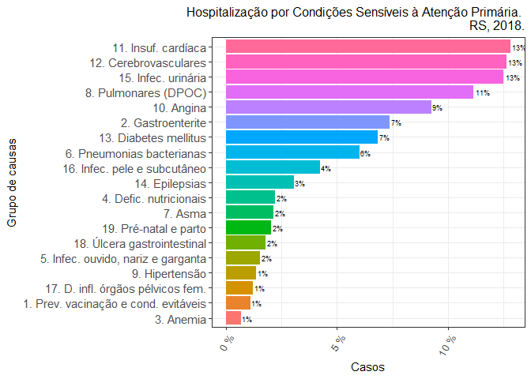
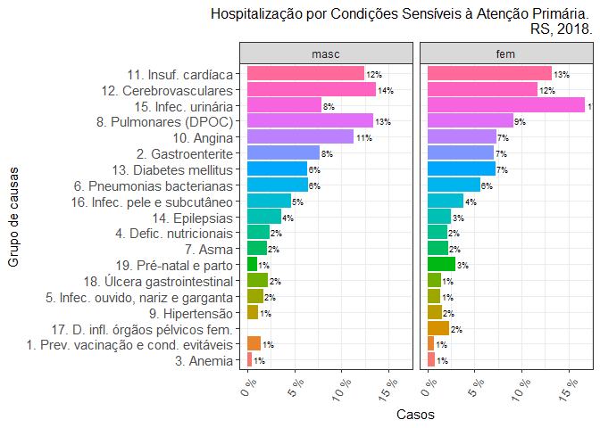
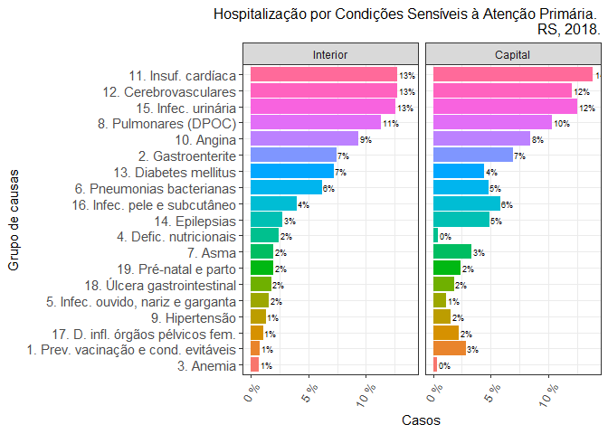

<!-- README.md is generated from README.Rmd. Please edit that file -->

# csapAIH

Classificar Condições Sensíveis à Atenção Primária

## Apresentação

Pacote em **R** para a classificação de códigos da CID-10 (Classificação
Internacional de Doenças, 10ª Revisão) segundo a Lista Brasileira de
Condições Sensíveis à Atenção Primária (CSAP). É particularmente voltado
ao trabalho com as bases de dados do Sistema de Informações Hospitalares
do SUS, o Sistema Único de Saúde brasileiro. Tais bases (BD-SIH/SUS)
contêm os “arquivos da AIH” (`RD??????.DBC`), que podem ser expandidos
para o formato DBF (`RD??????.DBF`), com as informações de cada
hospitalização ocorrida pelo SUS num período determinado. Assim, embora
o pacote permita a classificação de qualquer listagem de códigos da
CID-10, tem também algumas funcionalidades para facilitar o trabalho com
os “arquivos da AIH” e, atualmente, do Sistema de Informações sobre
Mortalidade (SIM).

## Justificativa

A hospitalização por CSAP é um indicador da qualidade do sistema de
saúde em sua primeira instância de atenção, uma vez que a internação por
tais condições —pneumonia, infecção urinária, sarampo, diabetes etc.— só
acontecerá se houver uma falha do sistema nesse âmbito de atenção, seja
por não prevenir a ocorrência da doença (caso das doenças preveníveis
por vacinação, como o sarampo), não diagnosticá-la ou tratá-la a tempo
(como na pneumonia ou infeccão urinária) ou por falhar no seu controle
clínico (como é o caso da diabete).

O Ministério da Saúde brasileiro estabeleceu em 2008, após amplo
processo de validação, uma lista com várias causas de internação
hospitalar consideradas CSAP, definindo em portaria a Lista Brasileira.
A Lista envolve vários códigos da CID-10 e classifica as CSAP em 19
subgrupos de causa, o que torna complexa e trabalhosa a sua
decodificação. Há alguns anos o Departamento de Informática do SUS
(DATASUS) incluiu em seu excelente programa de tabulação de dados TabWin
a opção de tabulação por essas causas, apresentando sua frequência
segundo a tabela definida pelo usuário.

Entretanto, muitas vezes a pesquisa exige a classificação de cada
internação individual como uma variável na base de dados. E não conheço
outro programa ou *script* (além do que tive de escrever em minha tese)
que automatize esse trabalho.

## Instalação

O pacote `csapAIH` pode ser instalado no **R** de duas maneiras:

- com a função `install.packages()` sobre os arquivos de instalação no
  [SourceForge](https://sourceforge.net/projects/csapaih/):

``` r
install.packages("https://sourceforge.net/projects/csapaih/files/csapAIH_0.0.4.tar.gz/download", type = "source", repos = NULL) 
```

ou

- através do pacote `remotes` sobre os arquivos-fonte da função em
  desenvolvimento, no [GitHub](https://github.com/fulvionedel):

``` r
# install.packages("remotes") # desnecessário se o pacote já estiver instalado
remotes::install_github("fulvionedel/csapAIH")
```

## Conteúdo (*timeline*)

Na sua primeira versão, o pacote `csapAIH` continha apenas uma função,
homônima: `csapAIH`.

Na versão 0.0.2, foram acrescentadas as funções `descreveCSAP`,
`desenhaCSAP` e `nomesgruposCSAP`, para a representação gráfica e
tabular das CSAP pela lista brasileira. Esta versão também permite a
leitura de arquivos da AIH em formato .DBC, sem necessidade de prévia
expansão a .DBF. Isso é possível pelo uso do pacote `read.dbc`, de
Daniela Petruzalek
(<https://cran.r-project.org/web/packages/read.dbc/index.html>).

A partir da versão 0.0.3, a função `desenhaCSAP` permite o detalhamento
do gráfico por categorias de outros fatores do banco de dados, com o uso
das funções `facet_wrap()` e `facet_grid()`, de `ggplot2`, e permite
ainda o desenho de gráficos com as funções básicas, sem a instalação do
pacote `ggplot2`. Foi ainda criada uma função para o cálculo da idade
nos arquivos da AIH: a função **idadeSUS** é usada internamente por
`csapAIH` e pode ser chamada pelo usuário para calcular a idade sem a
necessidade de classificar as CSAP.

Na versão 0.0.4, a função `csapAIH` oferece a opção de classificação das
CSAP em 20 grupos de causa, como sugerido por Alfradique et al. (2009).
As funções `desenhaCSAP` e `tabCSAP` têm um argumento para seleção do
idioma dos nomes de grupos, em português (`pt`, padrão), espanhol (`es`)
ou inglês (`en`). Foram criadas as funções `ler_popbr` e
`popbr2000_2021` (esta sobre o pacote de Saldanha (2022)) para acesso às
estimativas populacionais publicadas pelo DATASUS.

A ajuda sobre o pacote oferece mais detalhes sobre as funções e sua
evolução. Veja no
[manual](https://github.com/fulvionedel/csapAIH/blob/master/docs/csapAIH_0.0.4.pdf)
ou, no R, com `?'csapAIH-package'`.

## Dependências

A leitura de arquivos .DBC exige a instalação prévia do pacote
`read.csap`. Sua falta não impede o funcionamento das demais funções do
pacote (inclusive de leitura, mas em outro formato). A função
`desenhaCSAP` tem melhor desempenho com o pacote `ggplot2` instalado,
mas sua instalação não é necessária para que ela funcione.

## Exemplos de uso

``` r
library(csapAIH)
```

### Leitura dos arquivos

- A partir de um arquivo “RD??????.DBF” salvo no mesmo diretório da
  sessão de trabalho do **R**:

       csap <- csapAIH::csapAIH("RD??????.DBF")

- A partir de um arquivo “RD??????.DBC” salvo no mesmo diretório da
  sessão de trabalho do **R**:

       csap <- csapAIH::csapAIH("RD??????.DBC")

- A partir de um banco de dados com a estrutura da AIH já carregado no
  ambiente de trabalho:

       csap <- csapAIH::csapAIH(bancodedados)

- A partir de uma variável com códigos da CID-10:

``` r
variavel <- aih100$DIAG_PRINC
csap <- csapAIH::csapAIH(variavel)
head(csap)
#>    cid csap    grupo
#> 1 N189  não não-CSAP
#> 2 O689  não não-CSAP
#> 3 S423  não não-CSAP
#> 4 H938  não não-CSAP
#> 5 P584  não não-CSAP
#> 6 I200  sim      g10
descreveCSAP(csap)
#>                                    Grupo Casos %Total %CSAP
#> 1   1. Prev. vacinação e cond. evitáveis     0   0,00  0,00
#> 2                      2. Gastroenterite     1   1,00  5,00
#> 3                              3. Anemia     0   0,00  0,00
#> 4                 4. Defic. nutricionais     0   0,00  0,00
#> 5     5. Infec. ouvido, nariz e garganta     0   0,00  0,00
#> 6              6. Pneumonias bacterianas     3   3,00 15,00
#> 7                                7. Asma     0   0,00  0,00
#> 8                   8. Pulmonares (DPOC)     3   3,00 15,00
#> 9                         9. Hipertensão     0   0,00  0,00
#> 10                            10. Angina     2   2,00 10,00
#> 11                   11. Insuf. cardíaca     1   1,00  5,00
#> 12                 12. Cerebrovasculares     2   2,00 10,00
#> 13                 13. Diabetes mellitus     4   4,00 20,00
#> 14                        14. Epilepsias     0   0,00  0,00
#> 15                   15. Infec. urinária     1   1,00  5,00
#> 16          16. Infec. pele e subcutâneo     1   1,00  5,00
#> 17     17. D. infl. órgãos pélvicos fem.     0   0,00  0,00
#> 18           18. Úlcera gastrointestinal     0   0,00  0,00
#> 19                 19. Pré-natal e parto     2   2,00 10,00
#> 20                            Total CSAP    20  20,00   100
#> 21                              não-CSAP    80  80,00    --
#> 22                  Total de internações   100    100    --
tabCSAP(csap$grupo, lang = "es", format = TRUE)
#>                                       Grupo Casos % Total % CSAP
#> 1        1. Prev. vacunación y otros medios     0    0,00   0,00
#> 2                        2. Gastroenterites     1    1,00   5,00
#> 3                                 3. Anemia     0    0,00   0,00
#> 4                     4. Def. nutricionales     0    0,00   0,00
#> 5          5. Infec. oído, nariz y garganta     0    0,00   0,00
#> 6                    6. Neumonía bacteriana     3    3,00  15,00
#> 7                                   7. Asma     0    0,00   0,00
#> 8     8. Enf. vías respiratorias inferiores     3    3,00  15,00
#> 9                           9. Hipertensión     0    0,00   0,00
#> 10                      10. Angina de pecho     2    2,00  10,00
#> 11           11. Insuf. cardíaca congestiva     1    1,00   5,00
#> 12               12. Enf. cerebrovasculares     2    2,00  10,00
#> 13                    13. Diabetes mellitus     4    4,00  20,00
#> 14                           14. Epilepsias     0    0,00   0,00
#> 15                   15. Infección urinaria     1    1,00   5,00
#> 16             16. Infec. piel y subcutáneo     1    1,00   5,00
#> 17  17. Enf infl órganos pélvicos femeninos     0    0,00   0,00
#> 18              18. Úlcera gastrointestinal     0    0,00   0,00
#> 19 19. Enf. del embarazo, parto y puerperio     2    2,00  10,00
#> 20                               Total CSAP    20   20,00    100
#> 21                                  No-CSAP    80   80,00     --
#> 22                        Total de ingresos   100     100     --
```

### Apresentação de resultados

**Resumo de importação de dados**

O resumo de importação é guardado como atributo do banco de dados:

``` r
csap <- csapAIH("data-raw/RDRS1801.dbc") # cria o data.frame
#> Importados 60.529 registros.
#> Excluídos 8.240 (13,6%) registros de procedimentos obstétricos.
#> Excluídos 366 (0,6%) registros de AIH de longa permanência.
#> Exportados 51.923 (85,8%) registros.
attributes(csap)$resumo
#>           acao  freq  perc                                  objeto
#> 1   Importados 60529 100.0                              registros.
#> 2 Excluídos \t  8240  13.6 registros de procedimentos obstétricos.
#> 3 Excluídos \t   366   0.6  registros de AIH de longa permanência.
#> 4   Exportados 51923  85.8                              registros.
```

**Tabela “bruta”**

``` r
descreveCSAP(csap)
#>                                    Grupo  Casos %Total %CSAP
#> 1   1. Prev. vacinação e cond. evitáveis    118   0,23  1,09
#> 2                      2. Gastroenterite    802   1,54  7,38
#> 3                              3. Anemia     73   0,14  0,67
#> 4                 4. Defic. nutricionais    241   0,46  2,22
#> 5     5. Infec. ouvido, nariz e garganta    168   0,32  1,55
#> 6              6. Pneumonias bacterianas    653   1,26  6,01
#> 7                                7. Asma    234   0,45  2,15
#> 8                   8. Pulmonares (DPOC)  1.213   2,34 11,17
#> 9                         9. Hipertensão    147   0,28  1,35
#> 10                            10. Angina  1.005   1,94  9,25
#> 11                   11. Insuf. cardíaca  1.394   2,68 12,83
#> 12                 12. Cerebrovasculares  1.373   2,64 12,64
#> 13                 13. Diabetes mellitus    743   1,43  6,84
#> 14                        14. Epilepsias    331   0,64  3,05
#> 15                   15. Infec. urinária  1.360   2,62 12,52
#> 16          16. Infec. pele e subcutâneo    459   0,88  4,22
#> 17     17. D. infl. órgãos pélvicos fem.    133   0,26  1,22
#> 18           18. Úlcera gastrointestinal    195   0,38  1,79
#> 19                 19. Pré-natal e parto    222   0,43  2,04
#> 20                            Total CSAP 10.864  20,92   100
#> 21                              não-CSAP 41.059  79,08    --
#> 22                  Total de internações 51.923    100    --
```

**Tabela para apresentação ou impressão (com a função `kable`, do pacote
`knitr`)**

``` r
knitr::kable(descreveCSAP(csap), align = c('l', rep('r', 3)))
```

| Grupo                                 |  Casos | %Total | %CSAP |
|:--------------------------------------|-------:|-------:|------:|
| 1\. Prev. vacinação e cond. evitáveis |    118 |   0,23 |  1,09 |
| 2\. Gastroenterite                    |    802 |   1,54 |  7,38 |
| 3\. Anemia                            |     73 |   0,14 |  0,67 |
| 4\. Defic. nutricionais               |    241 |   0,46 |  2,22 |
| 5\. Infec. ouvido, nariz e garganta   |    168 |   0,32 |  1,55 |
| 6\. Pneumonias bacterianas            |    653 |   1,26 |  6,01 |
| 7\. Asma                              |    234 |   0,45 |  2,15 |
| 8\. Pulmonares (DPOC)                 |  1.213 |   2,34 | 11,17 |
| 9\. Hipertensão                       |    147 |   0,28 |  1,35 |
| 10\. Angina                           |  1.005 |   1,94 |  9,25 |
| 11\. Insuf. cardíaca                  |  1.394 |   2,68 | 12,83 |
| 12\. Cerebrovasculares                |  1.373 |   2,64 | 12,64 |
| 13\. Diabetes mellitus                |    743 |   1,43 |  6,84 |
| 14\. Epilepsias                       |    331 |   0,64 |  3,05 |
| 15\. Infec. urinária                  |  1.360 |   2,62 | 12,52 |
| 16\. Infec. pele e subcutâneo         |    459 |   0,88 |  4,22 |
| 17\. D. infl. órgãos pélvicos fem.    |    133 |   0,26 |  1,22 |
| 18\. Úlcera gastrointestinal          |    195 |   0,38 |  1,79 |
| 19\. Pré-natal e parto                |    222 |   0,43 |  2,04 |
| Total CSAP                            | 10.864 |  20,92 |   100 |
| não-CSAP                              | 41.059 |  79,08 |     – |
| Total de internações                  | 51.923 |    100 |     – |

**Gráfico**

``` r
gr <- desenhaCSAP(csap, titulo = "auto", onde = "RS", quando = 2018)
gr
#> Warning: The dot-dot notation (`..prop..`) was deprecated in ggplot2 3.4.0.
#> ℹ Please use `after_stat(prop)` instead.
#> ℹ The deprecated feature was likely used in the csapAIH package.
#>   Please report the issue to the authors.
```



*Estratificado por categorias de outra variável presente no banco de
dados:*

Observe que ao estratificar o gráfico mantém a ordenação por frequência
da variável em seu todo, sem a estratificação, quando o argumento
`ordenar = TRUE`(padrão).

``` r
gr + ggplot2::facet_grid(~ sexo)
```



``` r

gr + ggplot2::facet_wrap(~ munres == "431490", 
                         labeller = ggplot2::as_labeller(c("FALSE" = "Interior", 
                                                           "TRUE" = "Capital")))
```



***Veja o manual do pacote em:***
<https://github.com/fulvionedel/csapAIH/blob/master/docs/csapAIH_0.0.4.pdf>

<!-- # aqui  -->
<!-- badges: start -->
<!-- badges: end -->
<!-- You'll still need to render `README.Rmd` regularly, to keep `README.md` up-to-date. `devtools::build_readme()` is handy for this. You could also use GitHub Actions to re-render `README.Rmd` every time you push. An example workflow can be found here: <https://github.com/r-lib/actions/tree/v1/examples>. -->

## Referências

<div id="refs" class="references csl-bib-body hanging-indent">

<div id="ref-Alfradique2009" class="csl-entry">

Alfradique, Maria Elmira, Palmira de Fátima Bonolo, Inês Dourado, Maria
Fernanda Lima-Costa, James Macinko, Claunara Schilling Mendonça, Veneza
Berenice Oliveira, Luís Fernando Rolim Sampaio, Carmen de Simoni, and
Maria Aparecida Turci. 2009. “<span class="nocase">Interna<span
class="nocase">ç</span><span class="nocase">õ</span>es por condi<span
class="nocase">ç</span><span class="nocase">õ</span>es sens<span
class="nocase">í</span>veis <span class="nocase">à</span> aten<span
class="nocase">ç</span><span class="nocase">ã</span>o prim<span
class="nocase">á</span>ria: a constru<span class="nocase">ç</span><span
class="nocase">ã</span>o da lista brasileira como ferramenta para medir
o desempenho do sistema de sa<span class="nocase">ú</span>de (Projeto
ICSAP - Brasil)</span>.” *Cadernos de Saúde Pública* 25 (6): 1337–49.
<https://doi.org/10.1590/S0102-311X2009000600016>.

</div>

<div id="ref-brpopref" class="csl-entry">

Saldanha, Raphael. 2022. “Brpop: Brazilian Population Estimatives.”
<https://CRAN.R-project.org/package=brpop>.

</div>

</div>
