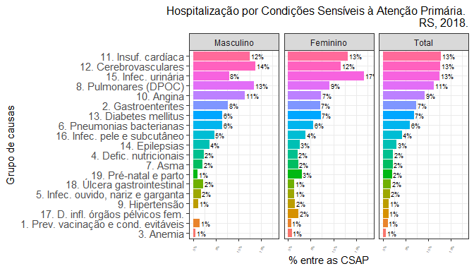

csapAIH: Classificar Condições Sensíveis à Atenção Primária
================
Fúlvio Borges Nedel
Atualizado em 16 de fevereiro de 2025

- [Apresentação](#apresentação)
- [Justificativa](#justificativa)
- [Instalação](#instalação)
- [Conteúdo (*timeline*)](#conteúdo-timeline)
- [Dependências](#dependências)
- [Exemplos de uso](#exemplos-de-uso)
  - [Classificação da causa (código
    CID-10)](#classificação-da-causa-código-cid-10)
    - [Em arquivos de dados](#em-arquivos-de-dados)
    - [Em um banco de dados existente na sessão de
      trabalho](#em-um-banco-de-dados-existente-na-sessão-de-trabalho)
    - [A partir de uma variável com códigos da
      CID-10:](#a-partir-de-uma-variável-com-códigos-da-cid-10)
  - [Apresentação de resultados](#apresentação-de-resultados)
    - [Resumo de importação de dados](#resumo-de-importação-de-dados)
    - [Tabela “bruta”](#tabela-bruta)
    - [Tabela para apresentação](#tabela-para-apresentação)
    - [Calcular taxas](#calcular-taxas)
    - [Gráficos](#gráficos)
- [Agradecimentos](#agradecimentos)
- [Referências](#referências)

------------------------------------------------------------------------

No [SourceForge](https://sourceforge.net/projects/csapaih/): [](https://sourceforge.net/projects/csapaih/files/latest/download)
[](https://sourceforge.net/projects/csapaih/files/latest/download)

------------------------------------------------------------------------

# Apresentação

Pacote em **R** para a classificação de códigos da CID-10 (Classificação
Internacional de Doenças, 10ª Revisão) segundo a Lista Brasileira de
Internações por Condições Sensíveis à Atenção Primária (ICSAP). É
particularmente voltado ao trabalho com as bases de dados do Sistema de
Informações Hospitalares do SUS, o Sistema Único de Saúde brasileiro.
Tais bases (BD-SIH/SUS) contêm os “arquivos da AIH” (`RD??????.DBC`),
que podem ser expandidos para o formato DBF (`RD??????.DBF`), com as
informações de cada hospitalização ocorrida pelo SUS num período
determinado. Assim, embora o pacote permita a classificação de qualquer
listagem de códigos da CID-10, tem também algumas funcionalidades para
facilitar o trabalho com os “arquivos da AIH” e, atualmente, do Sistema
de Informações sobre Mortalidade (SIM). Inclui ainda as estimativas e
contagens populacionais por sexo e faixa etária para os municípios
brasileiros, de 2012 a 2024.

# Justificativa

A hospitalização por CSAP é um indicador da efetividade do sistema de
saúde em sua primeira instância de atenção, uma vez que a internação por
tais condições —pneumonia, infecção urinária, sarampo, diabetes etc.— só
acontecerá se houver uma falha do sistema nesse âmbito de atenção, seja
por não prevenir a ocorrência da doença (caso das doenças evitáveis por
vacinação, como o sarampo), não diagnosticá-la ou tratá-la a tempo (como
na pneumonia ou infeccão urinária) ou por falhar no seu controle clínico
(como é o caso da diabete). ([Nedel et al. 2011](#ref-Nedel2011))

O Ministério da Saúde brasileiro estabeleceu em 2008, após amplo
processo de validação, uma lista com várias causas de internação
hospitalar consideradas CSAP, definindo em portaria a Lista Brasileira.
([Brasil. Ministério da Saúde. Secretaria de Atenção à Saúde
2008](#ref-MS2008lista); [Alfradique et al. 2009](#ref-Alfradique2009))
A Lista envolve vários códigos da CID-10 e classifica as CSAP em 19
subgrupos de causa, o que torna complexa e trabalhosa a sua
decodificação. Há alguns anos o Departamento de Informática do SUS
(DATASUS) incluiu em seu excelente programa de tabulação de dados
[TabWin](https://datasus.saude.gov.br/transferencia-de-arquivos/) a
opção de tabulação por essas causas, apresentando sua frequência segundo
a tabela definida pelo usuário.

Entretanto, muitas vezes a pesquisa exige a classificação de cada
internação individual como uma variável na base de dados. ([Nedel et al.
2008](#ref-Nedel2008)) E não conheço outro programa ou *script* (além do
que tive de escrever em minha tese ([Nedel 2009](#ref-NedelTese))) que
automatize esse trabalho.

# Instalação

O pacote `csapAIH` pode ser instalado no **R** de diferentes maneiras:

- baixando o arquivo de instalação no
  [SourceForge](https://sourceforge.net/projects/csapaih/) e depois
  instalando, com a IDE de preferência ou com o comando
  `install.packages("csapAIH_<versão>.tar.gz")` (em Linux ou Mac) ou
  `install.packages("csapAIH_<versão>.zip")` (em Windows);

- com a função `install.packages()` sobre o arquivo tar.gz no
  [SourceForge](https://sourceforge.net/projects/csapaih/) [^1]:

``` r
install.packages("https://sourceforge.net/projects/csapaih/files/csapAIH_0.0.4.5.tar.gz/download", type = "source", repos = NULL) 
```

ou

- através do pacote `remotes` sobre os arquivos-fonte da versão em
  desenvolvimento, no [GitHub](https://github.com/fulvionedel/csapAIH):

``` r
# install.packages("remotes") # desnecessário se o pacote já estiver instalado
remotes::install_github("fulvionedel/csapAIH")
```

# Conteúdo (*timeline*)

Na sua primeira versão ([Nedel 2017](#ref-Nedel2017)), o pacote
`csapAIH` continha apenas uma função, homônima: `csapAIH`.

Na versão 0.0.2, foram acrescentadas as funções `descreveCSAP`,
`desenhaCSAP` e `nomesgruposCSAP`, para a representação gráfica e
tabular das CSAP pela lista brasileira. Esta versão também permite a
leitura de arquivos da AIH em formato .DBC, sem necessidade de prévia
expansão a .DBF. Isso é possível pelo uso do pacote `read.dbc`, de
Daniela Petruzalek
(<https://cran.r-project.org/web/packages/read.dbc/index.html>).

A partir da versão 0.0.3 ([Nedel 2019](#ref-Nedel2019)), a função
`desenhaCSAP` permite o detalhamento do gráfico por categorias de outros
fatores do banco de dados, com o uso das funções `facet_wrap()` e
`facet_grid()`, de `ggplot2`, e permite ainda o desenho de gráficos com
as funções básicas, sem a instalação do pacote `ggplot2`. Foi ainda
criada uma função para o cálculo da idade nos arquivos da AIH: a função
`idadeSUS` é usada internamente por `csapAIH` e pode ser chamada pelo
usuário para calcular a idade sem a necessidade de classificar as CSAP.

Na versão 0.0.4, a função `csapAIH` oferece a opção de classificação das
CSAP em 20 grupos de causa, conforme proposto no processo de construção
da Lista Brasileira ([Alfradique et al. 2009](#ref-Alfradique2009)).
Essa é a lista sugerida pela Organização Panamericana da Saúde
([Organización Panamericana de la Salud (OPS) 2014](#ref-OPS2014)). As
funções `desenhaCSAP` e `tabCSAP` têm um argumento para seleção do
idioma dos nomes de grupos, em português (`pt`, padrão), espanhol (`es`)
ou inglês (`en`). Foram criadas as funções `ler_popbr` e
`popbr2000_2021` (esta sobre o pacote
[brpop](https://cran.r-project.org/package=brpop) de R. Saldanha
([2022](#ref-brpopref))) para acesso às estimativas populacionais
publicadas pelo DATASUS e funções para categorização da idade em faixas
etárias. Foi ainda criada uma função (`fetchcsap`) a partir da função
`fetchdatasus` do pacote `microdatasus`([R. de F. Saldanha, Bastos, and
Barcellos 2019](#ref-Saldanha2019)), para ler os arquivos no site FTP do
DATASUS e classificar as CSAP em um único comando. Foram criadas outras
funções para facilitar o manejo e apresentação de dados em estudos
ecológicos, como a categorização da idade em faixas etárias
(`fxetar_quinq` e `fxetar3g`) e a identificação dos diagnósticos de
parto (`partos`), particularmente para o Brasil e os arquivos do
DATASUS, como a listagem das Unidades da Federação do país (`ufbr`) e a
lista de procedimentos obstétricos em internações por eventos não
mórbidos (`procobst`). A v0.0.4.5 corrige um erro introduzido na
v0.0.4.4 em `csapAIH`, em que a variável `csap` registrava todos os
casos como “não” (embora estivessem classificados corretamente na
variável `grupo`). A v0.0.4.6 corrige um erro em `ler_popbr` e,
principalmente, acrescenta a possibilidade de leitura dos arquivos com
as estimativas populacionais atualizadas após o Censo 2022 do IBGE, além
de incluir novas possiblidades em `nomesgruposCSAP`.

A ajuda sobre o pacote oferece mais detalhes sobre as funções e seu uso.
Veja no
[manual](https://github.com/fulvionedel/csapAIH/blob/master/docs/csapAIH_0.0.4.6.pdf)
ou, no R, com `?'csapAIH-package'`.

# Dependências

A leitura de arquivos .DBC exige a instalação prévia do pacote
[`read.dbc`](https://cran.r-project.org/web/packages/read.dbc/index.html)
([Petruzalek 2016](#ref-readdbc)). Sua falta não impede o funcionamento
das demais funções do pacote (inclusive de leitura de arquivos em outro
formato). Da mesma forma, `popbr2000_2021` exige a instalação do
pacote[`brpop`](https://rfsaldanha.github.io/brpop/) e `fetchcsap` exige
a instalação do pacote
[`microdatasus`](https://github.com/rfsaldanha/microdatasus).

A função `desenhaCSAP` tem melhor desempenho com o pacote `ggplot2`
instalado, mas sua instalação não é necessária para que ela funcione.

A função `popbr2000_2021` usa o pacote
[`dplyr`](https://cran.r-project.org/package=dplyr), que é importado. O
pacote [`haven`](https://cran.r-project.org/package=haven) também é
importado. A partir da v0.0.4.4
[`Hmisc`](https://cran.r-project.org/web/packages/Hmisc/index.html) não
é mais.
<!-- O código da função `???` é escrito com a função de encadeamento de comandos  ("_piping_") própria do R ("|>") e seu uso exige, portanto, R>=4.1.0 (espero não gerar outro problema como [esse](https://github.com/fulvionedel/csapAIH/issues/5). -->

# Exemplos de uso

``` r
library(dplyr) # facilitar o trabalho
library(csapAIH)
```

## Classificação da causa (código CID-10)

### Em arquivos de dados

É possível classificar as CSAP diretamente a partir de arquivos com
extensão .DBC, .DBF, ou .CSV, sem necessidade da leitura prévia dos
dados. Para outras extensões de arquivo é necessária a prévia importação
dos dados para um objeto de classe `data.frame`.

#### Arquivos do DATASUS

Através de seu site FTP, o DATASUS disponibiliza dados de diferentes
Sistemas de Informação em Saúde do SUS, em arquivos comprimidos de
extensão DBC. Os arquivos podem ser baixados na página de [transferência
de arquivos](https://datasus.saude.gov.br/transferencia-de-arquivos/) do
DATASUS e expandidos para DBF ou CSV (entre várias outras possibilidades
de manejo) pelo TabWin, disponível na mesma página. Graças ao pacote
[read.dbc](https://github.com/danicat/read.dbc), de Daniela Petruzalek,
também podemos ler os arquivos comprimidos do DATASUS no R, e graças ao
pacote [microdatasus](https://github.com/rfsaldanha/microdatasus), de
Raphael Saldanha ([R. de F. Saldanha, Bastos, and Barcellos
2019](#ref-Saldanha2019)), podemos ler com facilidade esses arquivos na
internet, sem necessidade de download.

O código abaixo cria um banco com as informações das AIHs do “ano de
competência” 2021 ocorridas no RS e outro com as informações das
Declarações de Óbito (DO) de residentes no RS ocorridas em 2021:

``` r
# remotes::install_github("rfsaldanha/microdatasus") # desnecessário se o pacote estiver instalado
AIHRS2021 <- microdatasus::fetch_datasus(year_start = 2021, 1, 2021, 12, uf = "RS", 
                                         information_system = "SIH-RD")
nrow(AIHRS2021) |> Rcoisas::formatL(digits = 0) # linhas
[1] "709.893"
ncol(AIHRS2021) # colunas
[1] 113

DORS2021 <- microdatasus::fetch_datasus(year_start = 2021, year_end = 2021, uf = "RS", 
                                        information_system = "SIM-DO") 
nrow(DORS2021) |> Rcoisas::formatL(digits = 0)
[1] "117.722"
ncol(DORS2021)
[1] 87
```

Se o arquivo de dados estiver armazenado no computador, basta digitar,
entre aspas, o nome do arquivo — com o “*path*” se o arquivo estiver em
diretório diferente daquele da sessão de trabalho ativa (neste exemplo,
num sub-diretório do diretório de trabalho da sessão ativa, chamado
‘data-raw’).

<!-- têm o nome de acordo à seguinte estrutura: "RDUFAAMM.DBC", onde "UF" é a Unidade da Federação do hospital de internação e "AA" e "MM" são, respectivamente, o ano e mês "_de referência_", isto é, de faturamento da AIH. Os arquivos são disponibilizados em formato comprimido com a extensão "DBC", na página de ["transferência de arquivos"](https://datasus.saude.gov.br/transferencia-de-arquivos/) do site do DATASUS.  -->

``` r
csap.dbc <- csapAIH("data-raw/RDRS1801.dbc") 
Importados 60.529 registros.
Excluídos 8.240 (13,6%) registros de procedimentos obstétricos.
Excluídos 366 (0,6%) registros de AIH de longa permanência.
Exportados 51.923 (85,8%) registros.
csap.dbf <- csapAIH("data-raw/RDRS1801.dbf") 
Importados 60.529 registros.
Excluídos 8.240 (13,6%) registros de procedimentos obstétricos.
Excluídos 366 (0,6%) registros de AIH de longa permanência.
Exportados 51.923 (85,8%) registros.
```

- No caso de arquivos CSV é mandatório indicar o tipo de separador de
  campos, com o argumento `sep`.

``` r
csap.csv <- csapAIH("data-raw/RDRS1801.csv", sep = ",")
Importados 60.529 registros.
Excluídos 8.240 (13,6%) registros de procedimentos obstétricos.
Excluídos 366 (0,6%) registros de AIH de longa permanência.
Exportados 51.923 (85,8%) registros.
```

A função `fetchcsap` foi pensada para apresentar um extrato dos
registros por período de internação e não de “competência” da AIH, que é
commo se organizam os arquivos de dados. Assim, precisamos modificar
alguns argumentos para ter os mesmos registros:

``` r
csap.ftp <- fetchcsap('RS', 2018, mesfim = 1, anofim = 2018, periodo = "competencia")
ℹ Your local Internet connection seems to be ok.
ℹ DataSUS FTP server seems to be up and reachable.
ℹ Starting download...
Importados 60.529 registros.
Excluídos 8.240 (13,6%) registros de procedimentos obstétricos.
Excluídos 366 (0,6%) registros de AIH de longa permanência.
Exportados 51.923 (85,8%) registros.
```

Os extratos são iguais:

``` r
all.equal(attributes(csap.dbc)$resumo, attributes(csap.dbf)$resumo)
[1] TRUE
all.equal(attributes(csap.dbc)$resumo, attributes(csap.csv)$resumo)
[1] TRUE
all.equal(attributes(csap.ftp)$resumo, attributes(csap.dbc)$resumo)
[1] TRUE
```

Mas em estudos epidemiológicos geralmente nos interessa delimitar a
população pela data de internação, o que exige trabalho posterior à
leitura do arquivo “RD”, pois o arquivo de um determinado mês e ano de
“competência” pode conter registros de internações ocorridas em outro
momento. Vemos abaixo que a data de internação nos objetos criados
anteriormente (a partir de “RDRS1801.dbc”) varia de 01ago2017 a
31out2017. Além disso, o arquivo pode não conter o registro de todas as
internações ocorridas naquele mês.

Por isso `fetchcsap` tem seus argumentos de forma a devolver o banco de
dados apenas com os registros do período de interesse. Veja a seguir o
resultado com as internações não-obstétricas para jan2018 segundo a
seleção dos registros: a. todos daquele mês de competência (mesmo
comando anterior para a construção de csap.ftp”); b. apenas as
internações ocorridas no mesmo mês de competência da AIH; e c. apenas as
internações ocorridas em jan2018 e registradas nor arquivos “RD” dos
meses de competência janeiro a fevereiro de 20018.

``` r
a <- fetchcsap('RS', 2018, mesfim = 1, anofim = 2018, periodo = "c")
ℹ Your local Internet connection seems to be ok.
ℹ DataSUS FTP server seems to be up and reachable.
ℹ Starting download...
Importados 60.529 registros.
Excluídos 8.240 (13,6%) registros de procedimentos obstétricos.
Excluídos 366 (0,6%) registros de AIH de longa permanência.
Exportados 51.923 (85,8%) registros.
nrow(a)
[1] 51923
summary(a$data.inter)
        Min.      1st Qu.       Median         Mean      3rd Qu.         Max. 
"2017-06-06" "2017-12-08" "2017-12-28" "2017-12-20" "2018-01-10" "2018-01-31" 
b <- fetchcsap('RS', 2018, mesfim = 1, anofim = 2018)
ℹ Your local Internet connection seems to be ok.
ℹ DataSUS FTP server seems to be up and reachable.
ℹ Starting download...
Importados 29.086 registros.
Excluídos 5.005 (17,2%) registros de procedimentos obstétricos.
Excluídos NA (NA%) registros de AIH de longa permanência.
Exportados 24.081 (82,8%) registros.
nrow(b)
[1] 24081
summary(b$data.inter)
        Min.      1st Qu.       Median         Mean      3rd Qu.         Max. 
"2018-01-01" "2018-01-05" "2018-01-11" "2018-01-12" "2018-01-18" "2018-01-31" 
c <- fetchcsap('RS', 2018, mesfim = 2, anofim = 2018)
ℹ Your local Internet connection seems to be ok.
ℹ DataSUS FTP server seems to be up and reachable.
ℹ Starting download...
Importados 75.818 registros.
Excluídos 12.363 (16,3%) registros de procedimentos obstétricos.
Excluídos 164 (0,2%) registros de AIH de longa permanência.
Exportados 63.291 (83,5%) registros.
nrow(c)
[1] 63291
summary(c$data.inter)
        Min.      1st Qu.       Median         Mean      3rd Qu.         Max. 
"2018-01-01" "2018-01-11" "2018-01-23" "2018-01-24" "2018-02-05" "2018-02-28" 
```

``` r
# Limpar o ambiente de trabalho, renomear um dos bancos de dados:
csap <- csap.ftp
rm(csap.csv, csap.dbc, csap.dbf, csap.ftp)
```

### Em um banco de dados existente na sessão de trabalho

#### Com a estrutura dos arquivos da AIH

``` r
read.csv("data-raw/RDRS1801.csv") |> # criar o data.frame
  csapAIH() |>
  glimpse()
Importados 60.529 registros.
Excluídos 5.044 (8,3%) registros de procedimentos obstétricos.
Excluídos 366 (0,6%) registros de AIH de longa permanência.
Exportados 55.119 (91,1%) registros.
Rows: 55,119
Columns: 16
$ n.aih      <chr> "4318100063695", "4318100349508", "4318100349563", "4318100…
$ munres     <int> 431340, 430450, 430450, 430450, 430450, 430450, 430450, 430…
$ munint     <int> 431080, 430450, 430450, 430450, 430450, 430450, 430450, 430…
$ sexo       <fct> masc, fem, fem, fem, masc, masc, masc, masc, fem, masc, fem…
$ nasc       <date> 55633-04-16, 56511-08-19, 56537-12-10, 56292-01-04, 55005-…
$ idade      <dbl> 58, 25, 24, 33, 80, 69, 50, 58, 70, 69, 88, 61, 26, 42, 67,…
$ fxetar.det <fct> 55-59, 25-29, 20-24, 30-34, 80 e +, 65-69, 50-54, 55-59, 70…
$ fxetar5    <fct> 55-59, 25-29, 20-24, 30-34, 80 e +, 65-69, 50-54, 55-59, 70…
$ csap       <chr> "não", "não", "não", "não", "sim", "sim", "não", "não", "si…
$ grupo      <fct> no-CSAP, no-CSAP, no-CSAP, no-CSAP, g12, g03, no-CSAP, no-C…
$ cid        <chr> "K439", "O628", "O641", "O623", "I64", "D500", "I408", "T63…
$ proc.rea   <int> 407040064, 411010034, 411010034, 303100044, 303040149, 3030…
$ data.inter <date> 57221-04-11, 57221-03-29, 57221-04-08, 57221-04-08, 57221-…
$ data.saida <date> 57221-04-13, 57221-03-31, 57221-04-10, 57221-04-09, 57221-…
$ cep        <int> 93544360, 96600000, 96600000, 96600000, 96600000, 96600000,…
$ cnes       <int> 2232189, 2232928, 2232928, 2232928, 2232928, 2232928, 22329…
```

#### Sem o padrão dos arquivos da AIH

Mude o argumento `sihsus` para `FALSE` e indique no argumento `cid` qual
variável contém os códigos diagnósticos. As variáveis `csap` e `grupo`
(se `csapAIH(..., grupos = TRUE, ...)`) são acrescentadas ao final do
banco de dados alvo da função.

##### A *Encuesta de Egresos Hospitalarios* do Equador.

``` r
data("eeh20") # Amostra da "Encuesta de egresos hospitalarios" do Equador, ano 2020
names(eeh20) # Os nomes das variáveis
 [1] "prov_ubi"   "cant_ubi"   "parr_ubi"   "area_ubi"   "clase"     
 [6] "tipo"       "entidad"    "sector"     "mes_inv"    "nac_pac"   
[11] "cod_pais"   "nom_pais"   "sexo"       "cod_edad"   "edad"      
[16] "etnia"      "prov_res"   "area_res"   "anio_ingr"  "mes_ingr"  
[21] "dia_ingr"   "fecha_ingr" "anio_egr"   "mes_egr"    "dia_egr"   
[26] "fecha_egr"  "dia_estad"  "con_egrpa"  "esp_egrpa"  "cau_cie10" 
[31] "cant_res"   "parr_res"   "causa3"     "cap221rx"   "cau221rx"  
[36] "cau298rx"  
```

A variável `cau_cie10` (posição 30) tem o código do diagnóstico de
internação. A função csapAIH acrescenta à base duas (se `grupo == TRUE`)
variáveis, `csap` e `grupo`, dispostas nas últimas colunas (posição e
respectivamente.)

``` r
csap.eeh20 <- csapAIH(eeh20, sihsus = FALSE, cid = cau_cie10)
Importados 1.000 registros.
Excluídos 150 registros de parto (15% do total).
names(csap.eeh20)
 [1] "prov_ubi"   "cant_ubi"   "parr_ubi"   "area_ubi"   "clase"     
 [6] "tipo"       "entidad"    "sector"     "mes_inv"    "nac_pac"   
[11] "cod_pais"   "nom_pais"   "sexo"       "cod_edad"   "edad"      
[16] "etnia"      "prov_res"   "area_res"   "anio_ingr"  "mes_ingr"  
[21] "dia_ingr"   "fecha_ingr" "anio_egr"   "mes_egr"    "dia_egr"   
[26] "fecha_egr"  "dia_estad"  "con_egrpa"  "esp_egrpa"  "cau_cie10" 
[31] "cant_res"   "parr_res"   "causa3"     "cap221rx"   "cau221rx"  
[36] "cau298rx"   "csap"       "grupo"     
csap.eeh20[c(30,37:38)] |> 
  head(3) 
  cau_cie10 csap   grupo
1      C169  não no-CSAP
2      U072  não no-CSAP
3      A090  sim     g02
```

##### A Declaração de Óbito (DO) do SIM

A variável `CAUSABAS` tem o código da causa básica do óbito.

De modo semelhante à AIH, as bases de dados da DO também têm a idade
codificada e não a verdadeira idade da pessoa. Por exemplo, a variável
`IDADE` em `DORS2021` é um `factor` com 0 níveis, em que o primeiro é e
o último é . Neste caso podemos usar a função `idadeSUS` para computar a
idade, mas como o resultado de `idadeSUS` é “um objeto da classe data
frame com três variáveis” (v. `?idadeSUS`), necessitamos a função
`unnest` (de `tidyr`) para desagrupar as variáveis antes de inseri-las
em `DORS2021`. Além disso, foi excluída (com `unnest(...)[-2]`) a “faixa
etária detalhada”, que é a segunda variável no output de `idadeSUS`.

``` r
DORS2021 <- DORS2021 %>%
  csapAIH(sihsus = FALSE, cid = CAUSABAS, parto.rm = FALSE) %>%
  mutate(tidyr::unnest(idadeSUS(DORS2021, sis = "SIM"), cols = c())[-2],
         fxetar3 = fxetar3g(idade),
         SEXO = factor(SEXO, levels = c(1,2), labels = c("masc", "fem")))
Importados 117.722 registros.
DORS2021[1:3, (ncol(DORS2021)-5):ncol(DORS2021)]
  CONTADOR csap   grupo idade fxetar5 fxetar3
1        1  não no-CSAP    49   45-49   15-59
2        2  não no-CSAP    41   40-44   15-59
3        3  não no-CSAP    78   75-79    60e+
```

### A partir de uma variável com códigos da CID-10:

``` r
cids <- aih100$DIAG_PRINC[1:10]
cids
 [1] N189 O689 S423 H938 P584 I200 I442 C189 C409 K818
3254 Levels: A009 A020 A044 A045 A048 A049 A050 A058 A059 A061 A069 A071 ... Z990
csapAIH(cids) 
Excluídos 0 registros de parto (0% do total).
    cid csap   grupo
1  N189  não no-CSAP
2  O689  não no-CSAP
3  S423  não no-CSAP
4  H938  não no-CSAP
5  P584  não no-CSAP
6  I200  sim     g10
7  I442  não no-CSAP
8  C189  não no-CSAP
9  C409  não no-CSAP
10 K818  não no-CSAP
```

## Apresentação de resultados

### Resumo de importação de dados

Um resumo de importação, apresentado durante a realização do trabalho, é
guardado como atributo do banco de dados e pode ser recuperado com as
funções `attr()` ou `attributes()`:

``` r
attr(csap, "resumo")
          acao  freq  perc                                  objeto
1   Importados 60529 100.0                              registros.
2 Excluídos \t  8240  13.6 registros de procedimentos obstétricos.
3 Excluídos \t   366   0.6  registros de AIH de longa permanência.
4   Exportados 51923  85.8                              registros.
# attributes(csap)$resumo
```

Em tabela para apresentação:

``` r
attributes(csap)$resumo |>
  knitr::kable(format.args = c(big.mark = ".", decimal.mark = ","), 
               col.names = c("Ação", "N", "%", "Objeto") ) |>
  suppressWarnings()
```

| Ação       |      N |     % | Objeto                                  |
|:-----------|-------:|------:|:----------------------------------------|
| Importados | 60.529 | 100,0 | registros.                              |
| Excluídos  |  8.240 |  13,6 | registros de procedimentos obstétricos. |
| Excluídos  |    366 |   0,6 | registros de AIH de longa permanência.  |
| Exportados | 51.923 |  85,8 | registros.                              |

### Tabela “bruta”

A função `descreveCSAP` gera, a partir de um comando muito simples, uma
tabela pronta para apresentação, com as frequências brutas e absolutas
das CSAP por grupo de causa.

``` r
descreveCSAP(csap)
                                   Grupo  Casos %Total %CSAP
1   1. Prev. vacinação e cond. evitáveis    116   0,22  1,07
2                     2. Gastroenterites    802   1,54  7,38
3                              3. Anemia     73   0,14  0,67
4                 4. Defic. nutricionais    241   0,46  2,22
5     5. Infec. ouvido, nariz e garganta    168   0,32  1,55
6              6. Pneumonias bacterianas    653   1,26  6,01
7                                7. Asma    234   0,45  2,15
8                   8. Pulmonares (DPOC)  1.213   2,34 11,17
9                         9. Hipertensão    147   0,28  1,35
10                            10. Angina  1.005   1,94  9,25
11                   11. Insuf. cardíaca  1.394   2,68 12,83
12                 12. Cerebrovasculares  1.373   2,64 12,64
13                 13. Diabetes mellitus    743   1,43  6,84
14                        14. Epilepsias    331   0,64  3,05
15                   15. Infec. urinária  1.360   2,62 12,52
16          16. Infec. pele e subcutâneo    459   0,88  4,23
17     17. D. infl. órgãos pélvicos fem.    133   0,26  1,22
18           18. Úlcera gastrointestinal    195   0,38  1,80
19                 19. Pré-natal e parto    222   0,43  2,04
20                            Total CSAP 10.862  20,92   100
21                               no-CSAP 41.061  79,08    --
22                  Total de internações 51.923    100    --
```

### Tabela para apresentação

``` r
descreveCSAP(csap) |>
  knitr::kable(align = c('l', rep('r', 3)))
```

| Grupo                                 |  Casos | %Total | %CSAP |
|:--------------------------------------|-------:|-------:|------:|
| 1\. Prev. vacinação e cond. evitáveis |    116 |   0,22 |  1,07 |
| 2\. Gastroenterites                   |    802 |   1,54 |  7,38 |
| 3\. Anemia                            |     73 |   0,14 |  0,67 |
| 4\. Defic. nutricionais               |    241 |   0,46 |  2,22 |
| 5\. Infec. ouvido, nariz e garganta   |    168 |   0,32 |  1,55 |
| 6\. Pneumonias bacterianas            |    653 |   1,26 |  6,01 |
| 7\. Asma                              |    234 |   0,45 |  2,15 |
| 8\. Pulmonares (DPOC)                 |  1.213 |   2,34 | 11,17 |
| 9\. Hipertensão                       |    147 |   0,28 |  1,35 |
| 10\. Angina                           |  1.005 |   1,94 |  9,25 |
| 11\. Insuf. cardíaca                  |  1.394 |   2,68 | 12,83 |
| 12\. Cerebrovasculares                |  1.373 |   2,64 | 12,64 |
| 13\. Diabetes mellitus                |    743 |   1,43 |  6,84 |
| 14\. Epilepsias                       |    331 |   0,64 |  3,05 |
| 15\. Infec. urinária                  |  1.360 |   2,62 | 12,52 |
| 16\. Infec. pele e subcutâneo         |    459 |   0,88 |  4,23 |
| 17\. D. infl. órgãos pélvicos fem.    |    133 |   0,26 |  1,22 |
| 18\. Úlcera gastrointestinal          |    195 |   0,38 |  1,80 |
| 19\. Pré-natal e parto                |    222 |   0,43 |  2,04 |
| Total CSAP                            | 10.862 |  20,92 |   100 |
| no-CSAP                               | 41.061 |  79,08 |     – |
| Total de internações                  | 51.923 |    100 |     – |

Entretanto, ao transformar os valores para o formato latino, sua classe
se transforma em `character` e assim é impossível realizar cálculos com
esse output. Além disso, não serve para publicações em inglês. Por isso
a função `descreveCSAP` permanecerá no pacote mas seu desenvolvimento
seguirá em outra função, agora de nome `tabCSAP`. Nessa nova função, a
apresentação de uma tabela formatada se faz a partir do argumento
`format = TRUE`. Por padrão esse argumento é `FALSE`, o que permite
operações matemáticas com os valores da tabela (um `data.frame`, na
verdade), como veremos em seguida.

A função `tabCSAP` permite também a apresentação da tabela em inglês ou
espanhol, através do argumento `lang`:

``` r
tabCSAP(csap$grupo, digits = 1, lang = "en", format = T) |>
  knitr::kable(align = c('l', rep('r', 3)))
```

| Group                                |  Cases | Total % | ACSC % |
|:-------------------------------------|-------:|--------:|-------:|
| 1\. Vaccine prev. and amenable cond. |    116 |     0.2 |    1.1 |
| 2\. Gastroenteritis                  |    802 |     1.5 |    7.4 |
| 3\. Anemia                           |     73 |     0.1 |    0.7 |
| 4\. Nutritional deficiency           |    241 |     0.5 |    2.2 |
| 5\. Ear, nose and throat infec.      |    168 |     0.3 |    1.5 |
| 6\. Bacterial pneumonia              |    653 |     1.3 |    6.0 |
| 7\. Asthma                           |    234 |     0.5 |    2.2 |
| 8\. Pulmonary (COPD)                 |  1,213 |     2.3 |   11.2 |
| 9\. Hypertension                     |    147 |     0.3 |    1.4 |
| 10\. Angina                          |  1,005 |     1.9 |    9.3 |
| 11\. Heart failure                   |  1,394 |     2.7 |   12.8 |
| 12\. Cerebrovascular                 |  1,373 |     2.6 |   12.6 |
| 13\. Diabetes mellitus               |    743 |     1.4 |    6.8 |
| 14\. Convulsions and epilepsy        |    331 |     0.6 |    3.0 |
| 15\. Urinary infection               |  1,360 |     2.6 |   12.5 |
| 16\. Skin and subcutaneous infec.    |    459 |     0.9 |    4.2 |
| 17\. Pelvic inflammatory disease     |    133 |     0.3 |    1.2 |
| 18\. Gastrointestinal ulcers         |    195 |     0.4 |    1.8 |
| 19\. Pre-natal and childbirth        |    222 |     0.4 |    2.0 |
| ACSC                                 | 10,862 |    20.9 |    100 |
| Non ACSC                             | 41,061 |    79.1 |      – |
| TOTAL hospitalizations               | 51,923 |     100 |      – |

``` r

tabCSAP(csap$grupo, digits = 1, lang = "es", format = T) |>
  knitr::kable(align = c('l', rep('r', 3)))
```

| Grupo                                     |  Casos | % Total | % CSAP |
|:------------------------------------------|-------:|--------:|-------:|
| 1\. Prev. vacunación y otros medios       |    116 |     0,2 |    1,1 |
| 2\. Gastroenteritis                       |    802 |     1,5 |    7,4 |
| 3\. Anemia                                |     73 |     0,1 |    0,7 |
| 4\. Def. nutricionales                    |    241 |     0,5 |    2,2 |
| 5\. Infec. oído, nariz y garganta         |    168 |     0,3 |    1,5 |
| 6\. Neumonía bacteriana                   |    653 |     1,3 |    6,0 |
| 7\. Asma                                  |    234 |     0,5 |    2,2 |
| 8\. Enf. vías respiratorias inferiores    |  1.213 |     2,3 |   11,2 |
| 9\. Hipertensión                          |    147 |     0,3 |    1,4 |
| 10\. Angina de pecho                      |  1.005 |     1,9 |    9,3 |
| 11\. Insuf. cardíaca congestiva           |  1.394 |     2,7 |   12,8 |
| 12\. Enf. cerebrovasculares               |  1.373 |     2,6 |   12,6 |
| 13\. Diabetes mellitus                    |    743 |     1,4 |    6,8 |
| 14\. Epilepsias                           |    331 |     0,6 |    3,0 |
| 15\. Infección urinaria                   |  1.360 |     2,6 |   12,5 |
| 16\. Infec. piel y subcutáneo             |    459 |     0,9 |    4,2 |
| 17\. Enf infl órganos pélvicos femeninos  |    133 |     0,3 |    1,2 |
| 18\. Úlcera gastrointestinal              |    195 |     0,4 |    1,8 |
| 19\. Enf. del embarazo, parto y puerperio |    222 |     0,4 |    2,0 |
| Total CSAP                                | 10.862 |    20,9 |    100 |
| No-CSAP                                   | 41.061 |    79,1 |      – |
| Total de ingresos                         | 51.923 |     100 |      – |

Finalmente, [vimos](#lista) que a função `tabCSAP` permite ainda a
apresentação da lista em 20 grupos de causa. Assim, se as CSAP foram
classificadas em 20 grupos – usando, por exemplo o argumento
`lista = "Alfradique"` em `csapAIH()` –, essa tabela deve ser
apresentada com `tabCSAP` e não com `descreveCSAP`. Note ainda que, à
diferença de `descreveCSAP`, `tabCSAP` exige o nome da variável com o
grupo de causas.

``` r
listaOPS <- csapAIH(AIHRS2021, lista = "Alfradique")
Importados 709.893 registros.
Excluídos 88.345 (12,4%) registros de procedimentos obstétricos.
Excluídos 4.121 (0,6%) registros de AIH de longa permanência.
Exportados 617.427 (87%) registros.
# descreveCSAP(listaOPS) # Retorna o erro: "O vetor precisa ter os 19 grupos da Lista Brasileira.
#   Se essa for a lista 'Alfradique' use 'tabCSAP'.""
tabCSAP(listaOPS$grupo)
                                 grupo  casos perctot percsap
1               1. Prev. por vacinação    127    0.02    0.13
2            2. Outras cond. evitáveis   1316    0.21    1.31
3                   3. Gastroenterites   4205    0.68    4.20
4                            4. Anemia    695    0.11    0.69
5               5. Defic. nutricionais   1765    0.29    1.76
6   6. Infec. ouvido, nariz e garganta    954    0.15    0.95
7            7. Pneumonias bacterianas   5425    0.88    5.41
8                              8. Asma   3443    0.56    3.44
9                 9. Pulmonares (DPOC)  11389    1.84   11.36
10                     10. Hipertensão   1247    0.20    1.24
11                          11. Angina   8421    1.36    8.40
12                 12. Insuf. cardíaca  14119    2.29   14.09
13               13. Cerebrovasculares  16426    2.66   16.39
14               14. Diabetes mellitus   6784    1.10    6.77
15                      15. Epilepsias   3293    0.53    3.29
16                 16. Infec. urinária  11092    1.80   11.07
17        17. Infec. pele e subcutâneo   3852    0.62    3.84
18   18. D. infl. órgãos pélvicos fem.   1154    0.19    1.15
19         19. Úlcera gastrointestinal   2261    0.37    2.26
20               20. Pré-natal e parto   2260    0.37    2.25
21                          Total CSAP 100228   16.23  100.00
22                             No-CSAP 517199   83.77      NA
23                Total de internações 617427  100.00      NA
```

### Calcular taxas

**Exemplo: cálculo das taxas brutas de ICSAP por grupo de causa em Cerro
Largo, RS, 2021:**

O código IBGE (os seis primeiros dígitos) de Cerro Largo é “430520”.

#### As ICSAP

Selecionamos as informações sobre residentes de Cerro Largo em nosso
banco de dados da AIH em 2021.

``` r
claih <- AIHRS2021 %>% 
  filter(MUNIC_RES == "430520") %>% 
  droplevels() %>% 
  csapAIH()
Importados 753 registros.
Excluídos 46 (6,1%) registros de procedimentos obstétricos.
Excluídos NA (NA%) registros de AIH de longa permanência.
Exportados 707 (93,9%) registros.
```

#### A população

Desde que o DATASUS interrompeu a publicação dos arquivos com as
estimativas populacionais por sexo e faixa etária para os municípios
brasileiros (último arquivo no FTP é da população em 2012), passou a ser
necessária a tabulação no TABNET e posterior leitura dos dados no
programa de análise. Ano passado (2022) Raphael Saldanha dispôs-se ao
trabalho de fazer as muitas [tabulações
necessárias](http://tabnet.datasus.gov.br/cgi/deftohtm.exe?ibge/cnv/popsvsbr.def)
e nos brindou outro excelente e muito esperado pacote preenchendo essa
lacuna: [brpop](https://rfsaldanha.github.io/brpop/), com as as
estimativas da população por sexo e faixa etária para os municípios
brasileiros, de 2000 a 2021 ([Nota
técnica](http://tabnet.datasus.gov.br/cgi/IBGE/NT-POPULACAO-RESIDENTE-2000-2021.PDF)).

Entretanto, as tabelas no pacote *brpop* têm o total (a soma da
população nas diferentes faixas etárias), e os rótulos das faixas
etárias são longos e estão em inglês, por isso resolvi criar outra
função (`popbr2000_2021`) que retornasse a população com os rótulos em
português e apenas com a população estimada em cada faixa etária (sem o
total). Assim, a população estimada para Cerro Largo em 2021 foi
capturada com o seguinte comando,

``` r
clpop <- csapAIH::popbr2000_2021(2021, munic = "430520")
Setting `max_tries = 2`.
Setting `max_tries = 2`.
```

Com o pacote brpop, teríamos de acrescentar o filtro de exclusão da
categoria “Total” na faixa etária e os resultados seriam os mesmos,
porém com outra estrutura do objeto e outros rótulos de categorias:

``` r
clpop %>% 
  group_by(fxetar5, sexo) %>% 
  summarise(pop = sum(pop)) %>% 
  tidyr::pivot_wider(names_from = sexo, values_from = pop)
`summarise()` has grouped output by 'fxetar5'. You can override using the
`.groups` argument.
# A tibble: 17 × 3
# Groups:   fxetar5 [17]
   fxetar5  masc   fem
   <fct>   <int> <int>
 1 0-4       390   372
 2 5-9       408   393
 3 10-14     417   344
 4 15-19     434   370
 5 20-24     493   431
 6 25-29     552   503
 7 30-34     603   517
 8 35-39     572   500
 9 40-44     512   450
10 45-49     461   430
11 50-54     463   499
12 55-59     529   486
13 60-64     453   440
14 65-69     348   383
15 70-74     243   308
16 75-79     167   219
17 80 e +    192   361
brpop::mun_sex_pop() %>% 
  filter(code_muni == "430520", year == 2021, age_group != "Total") %>% 
  group_by(age_group, sex) %>% 
  summarise(pop = sum(pop)) %>% 
  tidyr::pivot_wider(names_from = sex, values_from = pop)
`summarise()` has grouped output by 'age_group'. You can override using the
`.groups` argument.
# A tibble: 17 × 3
# Groups:   age_group [17]
   age_group             Female  Male
   <chr>                  <int> <int>
 1 From 0 to 4 years        372   390
 2 From 10 to 14 years      344   417
 3 From 15 to 19 years      370   434
 4 From 20 to 24 years      431   493
 5 From 25 to 29 years      503   552
 6 From 30 to 34 years      517   603
 7 From 35 to 39 years      500   572
 8 From 40 to 44 years      450   512
 9 From 45 to 49 years      430   461
10 From 5 to 9 years        393   408
11 From 50 to 54 years      499   463
12 From 55 to 59 years      486   529
13 From 60 to 64 years      440   453
14 From 65 to 69 years      383   348
15 From 70 to 74 years      308   243
16 From 75 to 79 years      219   167
17 From 80 years or more    361   192
```

#### A tabela com as taxas

``` r
cte <- 1e5
tabCSAP(claih$grupo) %>% 
  mutate(taxa = casos / sum(clpop$pop)*cte) %>% 
  knitr::kable(format.args = list(decimal.mark = ",", big.mark = "."), digits = 1, 
               caption = paste("ICSAP em Cerro Largo, RS, 2021. Taxas por", 
                               Rcoisas::formatL(cte, digits = 0), "hab.")) 
```

| grupo                                 | casos | perctot | percsap |    taxa |
|:--------------------------------------|------:|--------:|--------:|--------:|
| 1\. Prev. vacinação e cond. evitáveis |     2 |     0,3 |     1,9 |    14,0 |
| 2\. Gastroenterites                   |     6 |     0,8 |     5,6 |    42,1 |
| 3\. Anemia                            |     0 |     0,0 |     0,0 |     0,0 |
| 4\. Defic. nutricionais               |     0 |     0,0 |     0,0 |     0,0 |
| 5\. Infec. ouvido, nariz e garganta   |     2 |     0,3 |     1,9 |    14,0 |
| 6\. Pneumonias bacterianas            |    20 |     2,8 |    18,5 |   140,4 |
| 7\. Asma                              |     1 |     0,1 |     0,9 |     7,0 |
| 8\. Pulmonares (DPOC)                 |    13 |     1,8 |    12,0 |    91,3 |
| 9\. Hipertensão                       |     1 |     0,1 |     0,9 |     7,0 |
| 10\. Angina                           |     3 |     0,4 |     2,8 |    21,1 |
| 11\. Insuf. cardíaca                  |    13 |     1,8 |    12,0 |    91,3 |
| 12\. Cerebrovasculares                |     7 |     1,0 |     6,5 |    49,1 |
| 13\. Diabetes mellitus                |    10 |     1,4 |     9,3 |    70,2 |
| 14\. Epilepsias                       |     2 |     0,3 |     1,9 |    14,0 |
| 15\. Infec. urinária                  |    24 |     3,4 |    22,2 |   168,5 |
| 16\. Infec. pele e subcutâneo         |     4 |     0,6 |     3,7 |    28,1 |
| 17\. D. infl. órgãos pélvicos fem.    |     0 |     0,0 |     0,0 |     0,0 |
| 18\. Úlcera gastrointestinal          |     0 |     0,0 |     0,0 |     0,0 |
| 19\. Pré-natal e parto                |     0 |     0,0 |     0,0 |     0,0 |
| Total CSAP                            |   108 |    15,3 |   100,0 |   758,3 |
| No-CSAP                               |   599 |    84,7 |      NA | 4.205,6 |
| Total de internações                  |   707 |   100,0 |      NA | 4.963,8 |

ICSAP em Cerro Largo, RS, 2021. Taxas por 100.000 hab.

### Gráficos

``` r
gr <- desenhaCSAP(csap, titulo = "auto", onde = "RS", quando = 2018, limsup = .18, x.size = 4)
gr
```


#### Estratificado por categorias de outra variável presente no banco de dados:

Observe que ao estratificar o gráfico mantém a ordenação por frequência
da variável em seu todo, sem a estratificação, quando o argumento
`ordenar = TRUE`(padrão).

``` r
rot <- ggplot2::as_labeller(c("masc" = "Masculino", "fem" = "Feminino", "(all)" = "Total"))
gr + ggplot2::facet_grid(~ sexo, margins = TRUE, labeller = rot)

gr + ggplot2::facet_wrap(~ munres == "431490", 
                         labeller = ggplot2::as_labeller(c("FALSE" = "Interior", 
                                                           "TRUE" = "Capital")))
```



``` r
 DORS2021 %>% 
  filter(!is.na(SEXO), !is.na(idade)) %>% 
  desenhaCSAP(x.size = 7, y.size = 8) + 
    ggplot2::facet_grid(SEXO ~ fxetar3)
```

<div class="figure">


<p class="caption">
Mortalidade por CSAP por grupos de causa, por sexo e faixa etária. RS,
2021.
</p>

</div>

------------------------------------------------------------------------

***Veja o manual do pacote em:***
<https://github.com/fulvionedel/csapAIH/blob/master/docs/csapAIH_0.0.4.5.pdf>

<!-- You'll still need to render `README.Rmd` regularly, to keep `README.md` up-to-date. `devtools::build_readme()` is handy for this. You could also use GitHub Actions to re-render `README.Rmd` every time you push. An example workflow can be found here: <https://github.com/r-lib/actions/tree/v1/examples>. -->

# Agradecimentos

Agradeço a todxs os usuárixs do pacote, particularmente a quem informa
problemas e sugere mudanças, como @laiovictor e @igortadeu @rafadbarros,
e (muito!!) a quem apresenta soluções, como @denis-or.

E, sempre, meus profundos agradecimentos a

- Daniela Petruzalek, pelo pacote
  [read.dbc](https://cran.r-project.org/web/packages/read.dbc/index.html);
  e
- A Raphael Saldanha, pelos pacotes
  [microdatasus](https://github.com/rfsaldanha/microdatasus) e
  [brpop](https://github.com/rfsaldanha/brpop).

# Referências

<div id="refs" class="references csl-bib-body hanging-indent"
entry-spacing="0">

<div id="ref-Alfradique2009" class="csl-entry">

Alfradique, Maria Elmira, Palmira de Fátima Bonolo, Inês Dourado, Maria
Fernanda Lima-Costa, James Macinko, Claunara Schilling Mendonça, Veneza
Berenice Oliveira, Luís Fernando Rolim Sampaio, Carmen de Simoni, and
Maria Aparecida Turci. 2009.
“<span class="nocase">Interna<span class="nocase">ç</span><span class="nocase">õ</span>es
por condi<span class="nocase">ç</span><span class="nocase">õ</span>es
sens<span class="nocase">í</span>veis <span class="nocase">à</span>
aten<span class="nocase">ç</span><span class="nocase">ã</span>o
prim<span class="nocase">á</span>ria: a
constru<span class="nocase">ç</span><span class="nocase">ã</span>o da
lista brasileira como ferramenta para medir o desempenho do sistema de
sa<span class="nocase">ú</span>de (Projeto ICSAP - Brasil)</span>.”
*Cadernos de Saúde Pública* 25 (6): 1337–49.
<https://doi.org/10.1590/S0102-311X2009000600016>.

</div>

<div id="ref-MS2008lista" class="csl-entry">

Brasil. Ministério da Saúde. Secretaria de Atenção à Saúde. 2008.
“<span class="nocase">Portaria Nº 221, de 17 de abril de 2008.</span>”
Ministério da Saúde.
<https://bvsms.saude.gov.br/bvs/saudelegis/sas/2008/prt0221_17_04_2008.html>.

</div>

<div id="ref-NedelTese" class="csl-entry">

Nedel, Fúlvio Borges. 2009.
“<span class="nocase">Interna<span class="nocase">ç</span><span class="nocase">õ</span>es
hospitalares evit<span class="nocase">á</span>veis pela
aten<span class="nocase">ç</span><span class="nocase">ã</span>o
prim<span class="nocase">á</span>ria: estudo do impacto do Programa
Sa<span class="nocase">ú</span>de da Fam<span class="nocase">ı́</span>lia
sobre as
interna<span class="nocase">ç</span><span class="nocase">õ</span>es por
Condi<span class="nocase">ç</span><span class="nocase">õ</span>es
Sens<span class="nocase">ı́</span>veis <span class="nocase">à</span>
Aten<span class="nocase">ç</span><span class="nocase">ã</span>o
Prim<span class="nocase">á</span>ria no Rio Grande do Sul,
Brasil.</span>” PhD thesis, Pelotas, RS: Universidade Federal de
Pelotas - UFPel.
<http://repositorio.ufpel.edu.br:8080/bitstream/prefix/3654/1/tese%20nedel.pdf>.

</div>

<div id="ref-Nedel2017" class="csl-entry">

———. 2017. “<span class="nocase">csapAIH: uma
fun<span class="nocase">ç</span><span class="nocase">ã</span>o para a
classifica<span class="nocase">ç</span><span class="nocase">ã</span>o
das condi<span class="nocase">ç</span><span class="nocase">õ</span>es
sens<span class="nocase">í</span>veis <span class="nocase">à</span>
aten<span class="nocase">ç</span><span class="nocase">ã</span>o
prim<span class="nocase">á</span>ria no programa
estat<span class="nocase">í</span>stico R</span>.” *Epidemiologia e
Serviços de Saúde* 26 (01): 199–209.
<https://doi.org/10.5123/S1679-49742017000100021>.

</div>

<div id="ref-Nedel2019" class="csl-entry">

———. 2019. “<span class="nocase">Pacote csapAIH: a Lista Brasileira de
Interna<span class="nocase">ç</span><span class="nocase">õ</span>es por
Condi<span class="nocase">ç</span><span class="nocase">õ</span>es
Sens<span class="nocase">í</span>veis <span class="nocase">à</span>
Aten<span class="nocase">ç</span><span class="nocase">ã</span>o
Prim<span class="nocase">á</span>ria no programa R</span>.”
*Epidemiologia e Serviços de Saúde* 28 (2): e2019084.
<https://doi.org/10.5123/S1679-49742019000200021>.

</div>

<div id="ref-Nedel2011" class="csl-entry">

Nedel, Fúlvio Borges, Luiz Augusto Facchini, João Luiz Bastos, and
Miguel Martín-Mateo. 2011. “<span class="nocase">Conceptual and
methodological aspects in the study of hospitalizations for ambulatory
care sensitive conditions</span>.” *Ciência & Saúde Coletiva* 16 (SUPPL.
1): 1145–54. <https://doi.org/10.1590/S1413-81232011000700046>.

</div>

<div id="ref-Nedel2008" class="csl-entry">

Nedel, Fúlvio Borges, Luiz Augusto Facchini, Miguel Martín-Mateo, Lúcia
Azambuja Saraiva Vieira, and Elaine Thumé. 2008.
“<span class="nocase">Programa Sa<span class="nocase">ú</span>de da
Fam<span class="nocase">í</span>lia e
condi<span class="nocase">ç</span><span class="nocase">õ</span>es
sens<span class="nocase">í</span>veis <span class="nocase">à</span>
aten<span class="nocase">ç</span><span class="nocase">ã</span>o
prim<span class="nocase">á</span>ria, Bag<span class="nocase">é</span>
(RS)</span>.” *Rev Saude Publica* 42 (6): 1041–52.
<https://www.scielo.br/j/rsp/a/NHNcRYsk8kwv4KYZqRD6S8c/?lang=pt>.

</div>

<div id="ref-OPS2014" class="csl-entry">

Organización Panamericana de la Salud (OPS). 2014.
*<span class="nocase">Compendio de indicadores del impacto y resultados
intermedios. Plan estrat<span class="nocase">é</span>gico de la OPS
2014-2019: "En pro de la salud: Desarrollo sostenible y
equidad"</span>*. Edited by OPS. Washington.
<https://www.paho.org/hq/dmdocuments/2016/ops-pe-14-19-compendium-indicadores-nov-2014.pdf>.

</div>

<div id="ref-readdbc" class="csl-entry">

Petruzalek, Daniela. 2016. *Read.dbc: Read Data Stored in DBC
(Compressed DBF) Files*. <https://CRAN.R-project.org/package=read.dbc>.

</div>

<div id="ref-brpopref" class="csl-entry">

Saldanha, Raphael. 2022. “Brpop: Brazilian Population Estimatives.”
<https://CRAN.R-project.org/package=brpop>.

</div>

<div id="ref-Saldanha2019" class="csl-entry">

Saldanha, Raphael de Freitas, Ronaldo Rocha Bastos, and Christovam
Barcellos. 2019. “<span class="nocase">Microdatasus: pacote para
download e pr<span class="nocase">é</span>-processamento de microdados
do Departamento de Inform<span class="nocase">á</span>tica do SUS
(DATASUS)</span>.” *Cadernos de Saúde Pública* 35 (9): e00032419.
<https://doi.org/10.1590/0102-311x00032419>.

</div>

</div>

[^1]: Como informado por [Rafael
    Barros](https://github.com/fulvionedel/csapAIH/issues/13#top), a
    instalação pelo arquivo .zip da internet resulta em erro.
    Estranhamente (pra mim, ao menos), uma vez baixado, o arquivo .zip é
    instalado sem erro.
