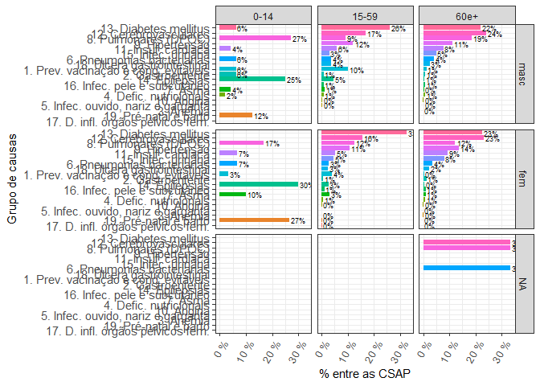

- <a href="#csapaih" id="toc-csapaih">csapAIH</a>
  - <a href="#apresentação" id="toc-apresentação">Apresentação</a>
  - <a href="#justificativa" id="toc-justificativa">Justificativa</a>
  - <a href="#instalação" id="toc-instalação">Instalação</a>
  - <a href="#conteúdo-timeline" id="toc-conteúdo-timeline">Conteúdo
    (<em>timeline</em>)</a>
  - <a href="#dependências" id="toc-dependências">Dependências</a>
  - <a href="#exemplos-de-uso" id="toc-exemplos-de-uso">Exemplos de uso</a>
    - <a href="#a-partir-da-leitura-de-arquivos-de-dados"
      id="toc-a-partir-da-leitura-de-arquivos-de-dados">A partir da leitura de
      arquivos de dados</a>
    - <a href="#apresentação-de-resultados"
      id="toc-apresentação-de-resultados">Apresentação de resultados</a>
  - <a href="#referências" id="toc-referências">Referências</a>

<!-- README.md is generated from README.Rmd. Please edit that file -->

# csapAIH

Classificar Condições Sensíveis à Atenção Primária

## Apresentação

Pacote em **R** para a classificação de códigos da CID-10 (Classificação
Internacional de Doenças, 10ª Revisão) segundo a Lista Brasileira de
Condições Sensíveis à Atenção Primária (CSAP). É particularmente voltado
ao trabalho com as bases de dados do Sistema de Informações Hospitalares
do SUS, o Sistema Único de Saúde brasileiro. Tais bases (BD-SIH/SUS)
contêm os “arquivos da AIH” (`RD??????.DBC`), que podem ser expandidos
para o formato DBF (`RD??????.DBF`), com as informações de cada
hospitalização ocorrida pelo SUS num período determinado. Assim, embora
o pacote permita a classificação de qualquer listagem de códigos da
CID-10, tem também algumas funcionalidades para facilitar o trabalho com
os “arquivos da AIH” e, atualmente, do Sistema de Informações sobre
Mortalidade (SIM).

## Justificativa

A hospitalização por CSAP é um indicador da qualidade do sistema de
saúde em sua primeira instância de atenção, uma vez que a internação por
tais condições —pneumonia, infecção urinária, sarampo, diabetes etc.— só
acontecerá se houver uma falha do sistema nesse âmbito de atenção, seja
por não prevenir a ocorrência da doença (caso das doenças preveníveis
por vacinação, como o sarampo), não diagnosticá-la ou tratá-la a tempo
(como na pneumonia ou infeccão urinária) ou por falhar no seu controle
clínico (como é o caso da diabete).

O Ministério da Saúde brasileiro estabeleceu em 2008, após amplo
processo de validação, uma lista com várias causas de internação
hospitalar consideradas CSAP, definindo em portaria a Lista Brasileira.
A Lista envolve vários códigos da CID-10 e classifica as CSAP em 19
subgrupos de causa, o que torna complexa e trabalhosa a sua
decodificação. Há alguns anos o Departamento de Informática do SUS
(DATASUS) incluiu em seu excelente programa de tabulação de dados TabWin
a opção de tabulação por essas causas, apresentando sua frequência
segundo a tabela definida pelo usuário.

Entretanto, muitas vezes a pesquisa exige a classificação de cada
internação individual como uma variável na base de dados. E não conheço
outro programa ou *script* (além do que tive de escrever em minha tese)
que automatize esse trabalho.

## Instalação

O pacote `csapAIH` pode ser instalado no **R** de duas maneiras:

- com a função `install.packages()` sobre os arquivos de instalação no
  [SourceForge](https://sourceforge.net/projects/csapaih/):

``` r
install.packages("https://sourceforge.net/projects/csapaih/files/csapAIH_0.0.4.tar.gz/download", type = "source", repos = NULL) 
```

ou

- através do pacote `remotes` sobre os arquivos-fonte da função em
  desenvolvimento, no [GitHub](https://github.com/fulvionedel):

``` r
# install.packages("remotes") # desnecessário se o pacote já estiver instalado
remotes::install_github("fulvionedel/csapAIH")
```

## Conteúdo (*timeline*)

Na sua primeira versão, o pacote `csapAIH` continha apenas uma função,
homônima: `csapAIH`.

Na versão 0.0.2, foram acrescentadas as funções `descreveCSAP`,
`desenhaCSAP` e `nomesgruposCSAP`, para a representação gráfica e
tabular das CSAP pela lista brasileira. Esta versão também permite a
leitura de arquivos da AIH em formato .DBC, sem necessidade de prévia
expansão a .DBF. Isso é possível pelo uso do pacote `read.dbc`, de
Daniela Petruzalek
(<https://cran.r-project.org/web/packages/read.dbc/index.html>).

A partir da versão 0.0.3, a função `desenhaCSAP` permite o detalhamento
do gráfico por categorias de outros fatores do banco de dados, com o uso
das funções `facet_wrap()` e `facet_grid()`, de `ggplot2`, e permite
ainda o desenho de gráficos com as funções básicas, sem a instalação do
pacote `ggplot2`. Foi ainda criada uma função para o cálculo da idade
nos arquivos da AIH: a função `idadeSUS` é usada internamente por
`csapAIH` e pode ser chamada pelo usuário para calcular a idade sem a
necessidade de classificar as CSAP.

Na versão 0.0.4, a função `csapAIH` oferece a opção de classificação das
CSAP em 20 grupos de causa, como sugerido por Alfradique et al.
([2009](#ref-Alfradique2009)). As funções `desenhaCSAP` e `tabCSAP` têm
um argumento para seleção do idioma dos nomes de grupos, em português
(`pt`, padrão), espanhol (`es`) ou inglês (`en`). Foram criadas as
funções `ler_popbr` e `popbr2000_2021` (esta sobre o pacote de Saldanha
([2022](#ref-brpopref))) para acesso às estimativas populacionais
publicadas pelo DATASUS e funções para categorização da idade em faixas
etárias.

A ajuda sobre o pacote oferece mais detalhes sobre as funções e seu uso.
Veja no
[manual](https://github.com/fulvionedel/csapAIH/blob/master/docs/csapAIH_0.0.4.pdf)
ou, no R, com `?'csapAIH-package'`.

## Dependências

A leitura de arquivos .DBC exige a instalação prévia do pacote
`read.csap`. Sua falta não impede o funcionamento das demais funções do
pacote (inclusive de leitura de arquivos em outro formato). A função
`desenhaCSAP` tem melhor desempenho com o pacote `ggplot2` instalado,
mas sua instalação não é necessária para que ela funcione.

## Exemplos de uso

``` r
library(csapAIH)
```

### A partir da leitura de arquivos de dados

É possível classificar as CSAP diretamente a partir de arquivos com
extensão .DBC, .DBF, ou .CSV armazenados no computador, sem necessidade
da leitura prévia do arquivo. Para outras extensões de arquivo é
necessária a prévia importação do arquivo para um objeto de classe
`data.frame`.

- A partir de um “arquivo da AIH” armazenado no computador (neste
  exemplo, num sub-diretório do diretório de trabalho da sessão ativa,
  chamado ‘data-raw’). Esses arquivos são disponibilizados em arquivos
  comprimidos no formato DBC e podem ser expandidos (pelo programa
  [TabWin](https://datasus.saude.gov.br/transferencia-de-arquivos/))
  para o formato DBF e CSV.
  <!-- têm o nome de acordo à seguinte estrutura: "RDUFAAMM.DBC", onde "UF" é a Unidade da Federação do hospital de internação e "AA" e "MM" são, respectivamente, o ano e mês "_de referência_", isto é, de faturamento da AIH. Os arquivos são disponibilizados em formato comprimido com a extensão "DBC", na página de ["transferência de arquivos"](https://datasus.saude.gov.br/transferencia-de-arquivos/) do site do DATASUS.  -->
- Notar que no caso de arquivos CSV é mandatório indicar o tipo de
  separador de campos, argumento `sep`.

``` r
csap <- csapAIH("data-raw/RDRS1801.dbc")
#> Importados 60.529 registros.
#> Excluídos 8.240 (13,6%) registros de procedimentos obstétricos.
#> Excluídos 366 (0,6%) registros de AIH de longa permanência.
#> Exportados 51.923 (85,8%) registros.
csap <- csapAIH("data-raw/RDRS1801.dbf")
#> Importados 60.529 registros.
#> Excluídos 8.240 (13,6%) registros de procedimentos obstétricos.
#> Excluídos 366 (0,6%) registros de AIH de longa permanência.
#> Exportados 51.923 (85,8%) registros.
csap <- csapAIH("data-raw/RDRS1801.csv", sep = ",")
#> Importados 60.529 registros.
#> Excluídos 8.240 (13,6%) registros de procedimentos obstétricos.
#> Excluídos 366 (0,6%) registros de AIH de longa permanência.
#> Exportados 51.923 (85,8%) registros.
```

- A partir de um banco de dados com a estrutura da AIH já carregado no
  ambiente de trabalho:

``` r
read.csv("data-raw/RDRS1801.csv") |> # criar o data.frame
  csapAIH() |>
  head()
#> Importados 60.529 registros.
#> Excluídos 5.044 (8,3%) registros de procedimentos obstétricos.
#> Excluídos 366 (0,6%) registros de AIH de longa permanência.
#> Exportados 55.119 (91,1%) registros.
#>           n.aih munres munint sexo       nasc idade fxetar.det fxetar5 csap
#> 1 4318100063695 431340 431080 masc 1960-01-14    58      55-59   55-59  não
#> 2 4318100349508 430450 430450  fem 1992-09-21    25      25-29   25-29  não
#> 3 4318100349563 430450 430450  fem 1993-05-31    24      20-24   20-24  não
#> 4 4318100349662 430450 430450  fem 1984-07-06    33      30-34   30-34  não
#> 5 4318100350840 430450 430450 masc 1937-09-15    80     80 e +  80 e +  sim
#> 6 4318100350850 430450 430450 masc 1948-12-03    69      65-69   65-69  sim
#>      grupo  cid  proc.rea data.inter data.saida      cep    cnes
#> 1 não-CSAP K439 407040064 2018-01-14 2018-01-16 93544360 2232189
#> 2 não-CSAP O628 411010034 2018-01-01 2018-01-03 96600000 2232928
#> 3 não-CSAP O641 411010034 2018-01-11 2018-01-13 96600000 2232928
#> 4 não-CSAP O623 303100044 2018-01-11 2018-01-12 96600000 2232928
#> 5      g12  I64 303040149 2018-01-19 2018-01-24 96600000 2232928
#> 6      g03 D500 303020059 2018-01-19 2018-01-23 96600000 2232928
```

- A partir de uma variável com códigos da CID-10:

``` r
cids <- aih100$DIAG_PRINC[1:10]
cids
#>  [1] N189 O689 S423 H938 P584 I200 I442 C189 C409 K818
#> 3254 Levels: A009 A020 A044 A045 A048 A049 A050 A058 A059 A061 A069 A071 ... Z990
csapAIH(cids) 
#>     cid csap    grupo
#> 1  N189  não não-CSAP
#> 2  O689  não não-CSAP
#> 3  S423  não não-CSAP
#> 4  H938  não não-CSAP
#> 5  P584  não não-CSAP
#> 6  I200  sim      g10
#> 7  I442  não não-CSAP
#> 8  C189  não não-CSAP
#> 9  C409  não não-CSAP
#> 10 K818  não não-CSAP
```

### Apresentação de resultados

#### Resumo de importação de dados

Um resumo de importação, apresentado durante a realização do trabalho, é
guardado como atributo do banco de dados e pode ser recuperado com as
funções `attr()` ou `attributes()`:

``` r
csap <- csapAIH("data-raw/RDRS1801.dbc") # cria o data.frame
#> Importados 60.529 registros.
#> Excluídos 8.240 (13,6%) registros de procedimentos obstétricos.
#> Excluídos 366 (0,6%) registros de AIH de longa permanência.
#> Exportados 51.923 (85,8%) registros.
attr(csap, "resumo")
#>           acao  freq  perc                                  objeto
#> 1   Importados 60529 100.0                              registros.
#> 2 Excluídos \t  8240  13.6 registros de procedimentos obstétricos.
#> 3 Excluídos \t   366   0.6  registros de AIH de longa permanência.
#> 4   Exportados 51923  85.8                              registros.
# attributes(csap)$resumo
```

Em tabela para apresentação:

``` r
attributes(csap)$resumo |>
  knitr::kable(format.args = c(big.mark = ".", decimal.mark = ","), 
               col.names = c("Ação", "N", "%", "Objeto") ) |>
  suppressWarnings()
```

| Ação       |      N |     % | Objeto                                  |
|:-----------|-------:|------:|:----------------------------------------|
| Importados | 60.529 | 100,0 | registros.                              |
| Excluídos  |  8.240 |  13,6 | registros de procedimentos obstétricos. |
| Excluídos  |    366 |   0,6 | registros de AIH de longa permanência.  |
| Exportados | 51.923 |  85,8 | registros.                              |

#### Tabela “bruta”

``` r
descreveCSAP(csap)
#>                                    Grupo  Casos %Total %CSAP
#> 1   1. Prev. vacinação e cond. evitáveis    118   0,23  1,09
#> 2                      2. Gastroenterite    802   1,54  7,38
#> 3                              3. Anemia     73   0,14  0,67
#> 4                 4. Defic. nutricionais    241   0,46  2,22
#> 5     5. Infec. ouvido, nariz e garganta    168   0,32  1,55
#> 6              6. Pneumonias bacterianas    653   1,26  6,01
#> 7                                7. Asma    234   0,45  2,15
#> 8                   8. Pulmonares (DPOC)  1.213   2,34 11,17
#> 9                         9. Hipertensão    147   0,28  1,35
#> 10                            10. Angina  1.005   1,94  9,25
#> 11                   11. Insuf. cardíaca  1.394   2,68 12,83
#> 12                 12. Cerebrovasculares  1.373   2,64 12,64
#> 13                 13. Diabetes mellitus    743   1,43  6,84
#> 14                        14. Epilepsias    331   0,64  3,05
#> 15                   15. Infec. urinária  1.360   2,62 12,52
#> 16          16. Infec. pele e subcutâneo    459   0,88  4,22
#> 17     17. D. infl. órgãos pélvicos fem.    133   0,26  1,22
#> 18           18. Úlcera gastrointestinal    195   0,38  1,79
#> 19                 19. Pré-natal e parto    222   0,43  2,04
#> 20                            Total CSAP 10.864  20,92   100
#> 21                              não-CSAP 41.059  79,08    --
#> 22                  Total de internações 51.923    100    --
```

#### Tabela para apresentação

``` r
descreveCSAP(csap) |>
  knitr::kable(align = c('l', rep('r', 3)))
```

| Grupo                                 |  Casos | %Total | %CSAP |
|:--------------------------------------|-------:|-------:|------:|
| 1\. Prev. vacinação e cond. evitáveis |    118 |   0,23 |  1,09 |
| 2\. Gastroenterite                    |    802 |   1,54 |  7,38 |
| 3\. Anemia                            |     73 |   0,14 |  0,67 |
| 4\. Defic. nutricionais               |    241 |   0,46 |  2,22 |
| 5\. Infec. ouvido, nariz e garganta   |    168 |   0,32 |  1,55 |
| 6\. Pneumonias bacterianas            |    653 |   1,26 |  6,01 |
| 7\. Asma                              |    234 |   0,45 |  2,15 |
| 8\. Pulmonares (DPOC)                 |  1.213 |   2,34 | 11,17 |
| 9\. Hipertensão                       |    147 |   0,28 |  1,35 |
| 10\. Angina                           |  1.005 |   1,94 |  9,25 |
| 11\. Insuf. cardíaca                  |  1.394 |   2,68 | 12,83 |
| 12\. Cerebrovasculares                |  1.373 |   2,64 | 12,64 |
| 13\. Diabetes mellitus                |    743 |   1,43 |  6,84 |
| 14\. Epilepsias                       |    331 |   0,64 |  3,05 |
| 15\. Infec. urinária                  |  1.360 |   2,62 | 12,52 |
| 16\. Infec. pele e subcutâneo         |    459 |   0,88 |  4,22 |
| 17\. D. infl. órgãos pélvicos fem.    |    133 |   0,26 |  1,22 |
| 18\. Úlcera gastrointestinal          |    195 |   0,38 |  1,79 |
| 19\. Pré-natal e parto                |    222 |   0,43 |  2,04 |
| Total CSAP                            | 10.864 |  20,92 |   100 |
| não-CSAP                              | 41.059 |  79,08 |     – |
| Total de internações                  | 51.923 |    100 |     – |

``` r
tabCSAP(csap$grupo, digits = 1, lang = "en", format = T) |>
  formattable::formattable()
```

<table class="table table-condensed">
<thead>
<tr>
<th style="text-align:right;">
Group
</th>
<th style="text-align:right;">
Cases
</th>
<th style="text-align:right;">
Total %
</th>
<th style="text-align:right;">
ACSC %
</th>
</tr>
</thead>
<tbody>
<tr>
<td style="text-align:right;">

1.  Vaccine prev. and amenable cond.
    </td>
    <td style="text-align:right;">
    118
    </td>
    <td style="text-align:right;">
    0.2
    </td>
    <td style="text-align:right;">
    1.1
    </td>
    </tr>
    <tr>
    <td style="text-align:right;">

    2.  Gastroenteritis
        </td>
        <td style="text-align:right;">
        802
        </td>
        <td style="text-align:right;">
        1.5
        </td>
        <td style="text-align:right;">
        7.4
        </td>
        </tr>
        <tr>
        <td style="text-align:right;">

        3.  Anemia
            </td>
            <td style="text-align:right;">
            73
            </td>
            <td style="text-align:right;">
            0.1
            </td>
            <td style="text-align:right;">
            0.7
            </td>
            </tr>
            <tr>
            <td style="text-align:right;">

            4.  Nutritional deficiency
                </td>
                <td style="text-align:right;">
                241
                </td>
                <td style="text-align:right;">
                0.5
                </td>
                <td style="text-align:right;">
                2.2
                </td>
                </tr>
                <tr>
                <td style="text-align:right;">

                5.  Ear, nose and throat infec.
                    </td>
                    <td style="text-align:right;">
                    168
                    </td>
                    <td style="text-align:right;">
                    0.3
                    </td>
                    <td style="text-align:right;">
                    1.5
                    </td>
                    </tr>
                    <tr>
                    <td style="text-align:right;">

                    6.  Bacterial pneumonia
                        </td>
                        <td style="text-align:right;">
                        653
                        </td>
                        <td style="text-align:right;">
                        1.3
                        </td>
                        <td style="text-align:right;">
                        6.0
                        </td>
                        </tr>
                        <tr>
                        <td style="text-align:right;">

                        7.  Asthma
                            </td>
                            <td style="text-align:right;">
                            234
                            </td>
                            <td style="text-align:right;">
                            0.5
                            </td>
                            <td style="text-align:right;">
                            2.2
                            </td>
                            </tr>
                            <tr>
                            <td style="text-align:right;">

                            8.  Pulmonary (COPD)
                                </td>
                                <td style="text-align:right;">
                                1,213
                                </td>
                                <td style="text-align:right;">
                                2.3
                                </td>
                                <td style="text-align:right;">
                                11.2
                                </td>
                                </tr>
                                <tr>
                                <td style="text-align:right;">

                                9.  Hypertension
                                    </td>
                                    <td style="text-align:right;">
                                    147
                                    </td>
                                    <td style="text-align:right;">
                                    0.3
                                    </td>
                                    <td style="text-align:right;">
                                    1.4
                                    </td>
                                    </tr>
                                    <tr>
                                    <td style="text-align:right;">

                                    10. Angina
                                        </td>
                                        <td style="text-align:right;">
                                        1,005
                                        </td>
                                        <td style="text-align:right;">
                                        1.9
                                        </td>
                                        <td style="text-align:right;">
                                        9.3
                                        </td>
                                        </tr>
                                        <tr>
                                        <td style="text-align:right;">

                                        11. Heart failure
                                            </td>
                                            <td style="text-align:right;">
                                            1,394
                                            </td>
                                            <td style="text-align:right;">
                                            2.7
                                            </td>
                                            <td style="text-align:right;">
                                            12.8
                                            </td>
                                            </tr>
                                            <tr>
                                            <td style="text-align:right;">

                                            12. Cerebrovascular
                                                </td>
                                                <td style="text-align:right;">
                                                1,373
                                                </td>
                                                <td style="text-align:right;">
                                                2.6
                                                </td>
                                                <td style="text-align:right;">
                                                12.6
                                                </td>
                                                </tr>
                                                <tr>
                                                <td style="text-align:right;">

                                                13. Diabetes mellitus
                                                    </td>
                                                    <td style="text-align:right;">
                                                    743
                                                    </td>
                                                    <td style="text-align:right;">
                                                    1.4
                                                    </td>
                                                    <td style="text-align:right;">
                                                    6.8
                                                    </td>
                                                    </tr>
                                                    <tr>
                                                    <td style="text-align:right;">

                                                    14. Convulsions and
                                                        epilepsy
                                                        </td>
                                                        <td style="text-align:right;">
                                                        331
                                                        </td>
                                                        <td style="text-align:right;">
                                                        0.6
                                                        </td>
                                                        <td style="text-align:right;">
                                                        3.0
                                                        </td>
                                                        </tr>
                                                        <tr>
                                                        <td style="text-align:right;">

                                                        15. Urinary
                                                            infection
                                                            </td>
                                                            <td style="text-align:right;">
                                                            1,360
                                                            </td>
                                                            <td style="text-align:right;">
                                                            2.6
                                                            </td>
                                                            <td style="text-align:right;">
                                                            12.5
                                                            </td>
                                                            </tr>
                                                            <tr>
                                                            <td style="text-align:right;">

                                                            16. Skin and
                                                                subcutaneous
                                                                infec.
                                                                </td>
                                                                <td style="text-align:right;">
                                                                459
                                                                </td>
                                                                <td style="text-align:right;">
                                                                0.9
                                                                </td>
                                                                <td style="text-align:right;">
                                                                4.2
                                                                </td>
                                                                </tr>
                                                                <tr>
                                                                <td style="text-align:right;">

                                                                17. Pelvic
                                                                    inflammatory
                                                                    disease
                                                                    </td>
                                                                    <td style="text-align:right;">
                                                                    133
                                                                    </td>
                                                                    <td style="text-align:right;">
                                                                    0.3
                                                                    </td>
                                                                    <td style="text-align:right;">
                                                                    1.2
                                                                    </td>
                                                                    </tr>
                                                                    <tr>
                                                                    <td style="text-align:right;">

                                                                    18. Gastrointestinal
                                                                        ulcers
                                                                        </td>
                                                                        <td style="text-align:right;">
                                                                        195
                                                                        </td>
                                                                        <td style="text-align:right;">
                                                                        0.4
                                                                        </td>
                                                                        <td style="text-align:right;">
                                                                        1.8
                                                                        </td>
                                                                        </tr>
                                                                        <tr>
                                                                        <td style="text-align:right;">

                                                                        19. Pre-natal
                                                                            and
                                                                            childbirth
                                                                            </td>
                                                                            <td style="text-align:right;">
                                                                            222
                                                                            </td>
                                                                            <td style="text-align:right;">
                                                                            0.4
                                                                            </td>
                                                                            <td style="text-align:right;">
                                                                            2.0
                                                                            </td>
                                                                            </tr>
                                                                            <tr>
                                                                            <td style="text-align:right;">
                                                                            ACSC
                                                                            </td>
                                                                            <td style="text-align:right;">
                                                                            10,864
                                                                            </td>
                                                                            <td style="text-align:right;">
                                                                            20.9
                                                                            </td>
                                                                            <td style="text-align:right;">
                                                                            100
                                                                            </td>
                                                                            </tr>
                                                                            <tr>
                                                                            <td style="text-align:right;">
                                                                            Non
                                                                            ACSC
                                                                            </td>
                                                                            <td style="text-align:right;">
                                                                            41,059
                                                                            </td>
                                                                            <td style="text-align:right;">
                                                                            79.1
                                                                            </td>
                                                                            <td style="text-align:right;">
                                                                            –
                                                                            </td>
                                                                            </tr>
                                                                            <tr>
                                                                            <td style="text-align:right;">
                                                                            TOTAL
                                                                            hospitalizations
                                                                            </td>
                                                                            <td style="text-align:right;">
                                                                            51,923
                                                                            </td>
                                                                            <td style="text-align:right;">
                                                                            100
                                                                            </td>
                                                                            <td style="text-align:right;">
                                                                            –
                                                                            </td>
                                                                            </tr>
                                                                            </tbody>
                                                                            </table>

``` r

tabCSAP(csap$grupo, lang = "es", format = T) |>
  formattable::formattable()
```

<table class="table table-condensed">
<thead>
<tr>
<th style="text-align:right;">
Grupo
</th>
<th style="text-align:right;">
Casos
</th>
<th style="text-align:right;">
% Total
</th>
<th style="text-align:right;">
% CSAP
</th>
</tr>
</thead>
<tbody>
<tr>
<td style="text-align:right;">

1.  Prev. vacunación y otros medios
    </td>
    <td style="text-align:right;">
    118
    </td>
    <td style="text-align:right;">
    0,23
    </td>
    <td style="text-align:right;">
    1,09
    </td>
    </tr>
    <tr>
    <td style="text-align:right;">

    2.  Gastroenterites
        </td>
        <td style="text-align:right;">
        802
        </td>
        <td style="text-align:right;">
        1,54
        </td>
        <td style="text-align:right;">
        7,38
        </td>
        </tr>
        <tr>
        <td style="text-align:right;">

        3.  Anemia
            </td>
            <td style="text-align:right;">
            73
            </td>
            <td style="text-align:right;">
            0,14
            </td>
            <td style="text-align:right;">
            0,67
            </td>
            </tr>
            <tr>
            <td style="text-align:right;">

            4.  Def. nutricionales
                </td>
                <td style="text-align:right;">
                241
                </td>
                <td style="text-align:right;">
                0,46
                </td>
                <td style="text-align:right;">
                2,22
                </td>
                </tr>
                <tr>
                <td style="text-align:right;">

                5.  Infec. oído, nariz y garganta
                    </td>
                    <td style="text-align:right;">
                    168
                    </td>
                    <td style="text-align:right;">
                    0,32
                    </td>
                    <td style="text-align:right;">
                    1,55
                    </td>
                    </tr>
                    <tr>
                    <td style="text-align:right;">

                    6.  Neumonía bacteriana
                        </td>
                        <td style="text-align:right;">
                        653
                        </td>
                        <td style="text-align:right;">
                        1,26
                        </td>
                        <td style="text-align:right;">
                        6,01
                        </td>
                        </tr>
                        <tr>
                        <td style="text-align:right;">

                        7.  Asma
                            </td>
                            <td style="text-align:right;">
                            234
                            </td>
                            <td style="text-align:right;">
                            0,45
                            </td>
                            <td style="text-align:right;">
                            2,15
                            </td>
                            </tr>
                            <tr>
                            <td style="text-align:right;">

                            8.  Enf. vías respiratorias inferiores
                                </td>
                                <td style="text-align:right;">
                                1.213
                                </td>
                                <td style="text-align:right;">
                                2,34
                                </td>
                                <td style="text-align:right;">
                                11,17
                                </td>
                                </tr>
                                <tr>
                                <td style="text-align:right;">

                                9.  Hipertensión
                                    </td>
                                    <td style="text-align:right;">
                                    147
                                    </td>
                                    <td style="text-align:right;">
                                    0,28
                                    </td>
                                    <td style="text-align:right;">
                                    1,35
                                    </td>
                                    </tr>
                                    <tr>
                                    <td style="text-align:right;">

                                    10. Angina de pecho
                                        </td>
                                        <td style="text-align:right;">
                                        1.005
                                        </td>
                                        <td style="text-align:right;">
                                        1,94
                                        </td>
                                        <td style="text-align:right;">
                                        9,25
                                        </td>
                                        </tr>
                                        <tr>
                                        <td style="text-align:right;">

                                        11. Insuf. cardíaca congestiva
                                            </td>
                                            <td style="text-align:right;">
                                            1.394
                                            </td>
                                            <td style="text-align:right;">
                                            2,68
                                            </td>
                                            <td style="text-align:right;">
                                            12,83
                                            </td>
                                            </tr>
                                            <tr>
                                            <td style="text-align:right;">

                                            12. Enf. cerebrovasculares
                                                </td>
                                                <td style="text-align:right;">
                                                1.373
                                                </td>
                                                <td style="text-align:right;">
                                                2,64
                                                </td>
                                                <td style="text-align:right;">
                                                12,64
                                                </td>
                                                </tr>
                                                <tr>
                                                <td style="text-align:right;">

                                                13. Diabetes mellitus
                                                    </td>
                                                    <td style="text-align:right;">
                                                    743
                                                    </td>
                                                    <td style="text-align:right;">
                                                    1,43
                                                    </td>
                                                    <td style="text-align:right;">
                                                    6,84
                                                    </td>
                                                    </tr>
                                                    <tr>
                                                    <td style="text-align:right;">

                                                    14. Epilepsias
                                                        </td>
                                                        <td style="text-align:right;">
                                                        331
                                                        </td>
                                                        <td style="text-align:right;">
                                                        0,64
                                                        </td>
                                                        <td style="text-align:right;">
                                                        3,05
                                                        </td>
                                                        </tr>
                                                        <tr>
                                                        <td style="text-align:right;">

                                                        15. Infección
                                                            urinaria
                                                            </td>
                                                            <td style="text-align:right;">
                                                            1.360
                                                            </td>
                                                            <td style="text-align:right;">
                                                            2,62
                                                            </td>
                                                            <td style="text-align:right;">
                                                            12,52
                                                            </td>
                                                            </tr>
                                                            <tr>
                                                            <td style="text-align:right;">

                                                            16. Infec.
                                                                piel y
                                                                subcutáneo
                                                                </td>
                                                                <td style="text-align:right;">
                                                                459
                                                                </td>
                                                                <td style="text-align:right;">
                                                                0,88
                                                                </td>
                                                                <td style="text-align:right;">
                                                                4,22
                                                                </td>
                                                                </tr>
                                                                <tr>
                                                                <td style="text-align:right;">

                                                                17. Enf
                                                                    infl
                                                                    órganos
                                                                    pélvicos
                                                                    femeninos
                                                                    </td>
                                                                    <td style="text-align:right;">
                                                                    133
                                                                    </td>
                                                                    <td style="text-align:right;">
                                                                    0,26
                                                                    </td>
                                                                    <td style="text-align:right;">
                                                                    1,22
                                                                    </td>
                                                                    </tr>
                                                                    <tr>
                                                                    <td style="text-align:right;">

                                                                    18. Úlcera
                                                                        gastrointestinal
                                                                        </td>
                                                                        <td style="text-align:right;">
                                                                        195
                                                                        </td>
                                                                        <td style="text-align:right;">
                                                                        0,38
                                                                        </td>
                                                                        <td style="text-align:right;">
                                                                        1,79
                                                                        </td>
                                                                        </tr>
                                                                        <tr>
                                                                        <td style="text-align:right;">

                                                                        19. Enf.
                                                                            del
                                                                            embarazo,
                                                                            parto
                                                                            y
                                                                            puerperio
                                                                            </td>
                                                                            <td style="text-align:right;">
                                                                            222
                                                                            </td>
                                                                            <td style="text-align:right;">
                                                                            0,43
                                                                            </td>
                                                                            <td style="text-align:right;">
                                                                            2,04
                                                                            </td>
                                                                            </tr>
                                                                            <tr>
                                                                            <td style="text-align:right;">
                                                                            Total
                                                                            CSAP
                                                                            </td>
                                                                            <td style="text-align:right;">
                                                                            10.864
                                                                            </td>
                                                                            <td style="text-align:right;">
                                                                            20,92
                                                                            </td>
                                                                            <td style="text-align:right;">
                                                                            100
                                                                            </td>
                                                                            </tr>
                                                                            <tr>
                                                                            <td style="text-align:right;">
                                                                            No-CSAP
                                                                            </td>
                                                                            <td style="text-align:right;">
                                                                            41.059
                                                                            </td>
                                                                            <td style="text-align:right;">
                                                                            79,08
                                                                            </td>
                                                                            <td style="text-align:right;">
                                                                            –
                                                                            </td>
                                                                            </tr>
                                                                            <tr>
                                                                            <td style="text-align:right;">
                                                                            Total
                                                                            de
                                                                            ingresos
                                                                            </td>
                                                                            <td style="text-align:right;">
                                                                            51.923
                                                                            </td>
                                                                            <td style="text-align:right;">
                                                                            100
                                                                            </td>
                                                                            <td style="text-align:right;">
                                                                            –
                                                                            </td>
                                                                            </tr>
                                                                            </tbody>
                                                                            </table>

#### Gráficos

``` r
gr <- desenhaCSAP(csap, titulo = "auto", onde = "RS", quando = 2018, limsup = .18)
#> Scale for y is already present.
#> Adding another scale for y, which will replace the existing scale.
gr
#> Warning: The dot-dot notation (`..prop..`) was deprecated in ggplot2 3.4.0.
#> ℹ Please use `after_stat(prop)` instead.
#> ℹ The deprecated feature was likely used in the csapAIH package.
#>   Please report the issue to the authors.
```



**Estratificado por categorias de outra variável presente no banco de
dados:**

Observe que ao estratificar o gráfico mantém a ordenação por frequência
da variável em seu todo, sem a estratificação, quando o argumento
`ordenar = TRUE`(padrão).

``` r
rot <- ggplot2::as_labeller(c("masc" = "Masculino", "fem" = "Feminino", "(all)" = "Total"))
gr + ggplot2::facet_grid(~ sexo, margins = TRUE, labeller = rot)
```


``` r

gr + ggplot2::facet_wrap(~ munres == "431490", 
                         labeller = ggplot2::as_labeller(c("FALSE" = "Interior", 
                                                           "TRUE" = "Capital")))
```


***Veja o manual do pacote em:***
<https://github.com/fulvionedel/csapAIH/blob/master/docs/csapAIH_0.0.4.pdf>

<!-- badges: start -->
<!-- badges: end -->
<!-- You'll still need to render `README.Rmd` regularly, to keep `README.md` up-to-date. `devtools::build_readme()` is handy for this. You could also use GitHub Actions to re-render `README.Rmd` every time you push. An example workflow can be found here: <https://github.com/r-lib/actions/tree/v1/examples>. -->

## Referências

<div id="refs" class="references csl-bib-body hanging-indent">

<div id="ref-Alfradique2009" class="csl-entry">

Alfradique, Maria Elmira, Palmira de Fátima Bonolo, Inês Dourado, Maria
Fernanda Lima-Costa, James Macinko, Claunara Schilling Mendonça, Veneza
Berenice Oliveira, Luís Fernando Rolim Sampaio, Carmen de Simoni, and
Maria Aparecida Turci. 2009. “<span class="nocase">Interna<span
class="nocase">ç</span><span class="nocase">õ</span>es por condi<span
class="nocase">ç</span><span class="nocase">õ</span>es sens<span
class="nocase">í</span>veis <span class="nocase">à</span> aten<span
class="nocase">ç</span><span class="nocase">ã</span>o prim<span
class="nocase">á</span>ria: a constru<span class="nocase">ç</span><span
class="nocase">ã</span>o da lista brasileira como ferramenta para medir
o desempenho do sistema de sa<span class="nocase">ú</span>de (Projeto
ICSAP - Brasil)</span>.” *Cadernos de Saúde Pública* 25 (6): 1337–49.
<https://doi.org/10.1590/S0102-311X2009000600016>.

</div>

<div id="ref-brpopref" class="csl-entry">

Saldanha, Raphael. 2022. “Brpop: Brazilian Population Estimatives.”
<https://CRAN.R-project.org/package=brpop>.

</div>

</div>
