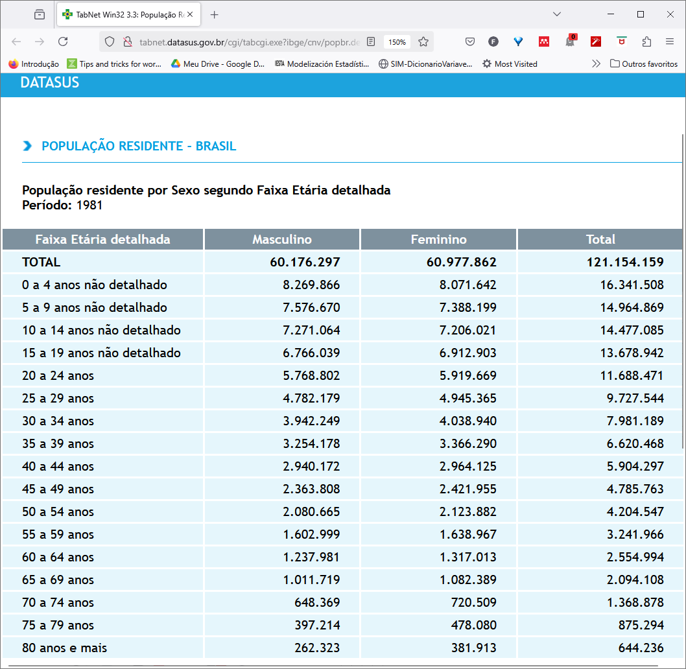
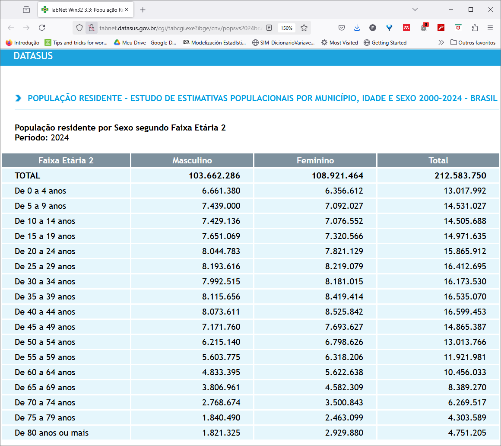

# Estimativas populacionais por sexo e faixa etária para os municípios brasileiros, 1980 - 2024.

``` r
library(csapAIH)
library(dplyr) 
library(Rcoisas) 
library(ggplot2)
library(knitr)
```

O Departamento de Informática do SUS (DATASUS) distribuía as estimativas
e contagens populacionais por sexo e faixa etária quinquenal para os
municípios brasileiros em arquivos separados por ano, desde 1980 até
2012. Após ficarmos um período sem estimativas para os anos seguintes,
foi publicado no aplicativo on-line de tabulação de dados do DATASUS, o
[TABNET](https://datasus.saude.gov.br/informacoes-de-saude-tabnet/), o
[*Estudo de estimativas populacionais para os municípios brasileiros,
desagregadas por sexo e idade,
2000-2021*](http://tabnet.datasus.gov.br/cgi/IBGE/NT-POPULACAO-RESIDENTE-2000-2021.PDF),
cujos resultados ainda podem ser tabulados [nessa
página](http://tabnet.datasus.gov.br/cgi/deftohtm.exe?ibge/cnv/popsvsbr.def),
agora com o aviso de “*população não mais em uso*”, porque o Censo 2022
mostrou que os cálculos foram superestimados. Entretanto, os
arquivos-fonte não eram disponibilizados, o que levou à criação do
pacote [brpop](https://rfsaldanha.github.io/brpop/) e, posteriormente,
da função
[`popbr2000_2021()`](https://fulvionedel.github.io/csapAIH/reference/popbr2000_2021.md).

Com a atualização das estimativas populacionais após o Censo 2022, o
DATASUS voltou a disponibilizar arquivos com as contagens e estimativas
da população por sexo e idade para os municípios brasileiros. Assim,
além das tabulações no
[TABNET](http://tabnet.datasus.gov.br/cgi/deftohtm.exe?ibge/cnv/popsvs2024br.def),
podemos novamente baixar os arquivos na página de [transferência de
arquivos](https://datasus.saude.gov.br/transferencia-de-arquivos/) ou no
site FTP do DATASUS, em
<ftp://ftp.datasus.gov.br/dissemin/publicos/IBGE/POP/> e
<ftp://ftp.datasus.gov.br/dissemin/publicos/IBGE/POPSVS/>. ([Nota
técnica](http://tabnet.datasus.gov.br/cgi/IBGE/NT-POPULACAO-RESIDENTE-2000-2024.PDF))

Portanto, a função
[`popbr2000_2021()`](https://fulvionedel.github.io/csapAIH/reference/popbr2000_2021.md)
não é mais necessária, salvo para a reprodução de resultados anteriores
e eventual comparação com as estimativas atualizadas, razão pela qual é
mantida no pacote. As estimativas atualizadas são lidas pela função
[`ler_popbr()`](https://fulvionedel.github.io/csapAIH/reference/ler_popbr.md),
que anteriormente lia os arquivos de 1980 a 2012 ([página de
tabulação](http://tabnet.datasus.gov.br/cgi/deftohtm.exe?ibge/cnv/popbr.def))
e agora lê as novas estimativas e medidas, disponíveis nos arquivos de
2013 a 2024 ([página de
tabulação](http://tabnet.datasus.gov.br/cgi/deftohtm.exe?ibge/cnv/popsvs2024br.def)).

## Os arquivos de população no DATASUS

Os arquivos são disponibilizados com registros para todos os municípios
brasileiros, com estrutura um pouco diferente entre os períodos
1980-2012 e 2013-2024.

No período 1980 a 2012, a estrutura é a seguinte (veja que é a mesma
estrutura para os dois anos selecionados):

``` r
br1980 <- ler_popbr(1980)
all.equal( str(br1980), str(ler_popbr(2012)) )
'data.frame':   524171 obs. of  7 variables:
 $ munic_res: chr  "110002" "110002" "110002" "110002" ...
 $ situacao : Factor w/ 2 levels "urbana","rural": 1 1 1 1 1 1 1 1 1 1 ...
 $ ano      : Factor w/ 1 level "1980": 1 1 1 1 1 1 1 1 1 1 ...
 $ sexo     : Factor w/ 2 levels "masc","fem": 1 1 1 1 1 1 1 1 1 1 ...
 $ fxetar5  : Factor w/ 17 levels "0-4","5-9","10-14",..: 1 1 1 1 1 2 2 2 2 2 ...
  ..- attr(*, "label")= chr "Faixa etária quinquenal"
 $ fxetaria : Factor w/ 34 levels "0000","0101",..: 1 2 3 4 5 6 7 8 9 10 ...
  ..- attr(*, "label")= chr "Faixa etária detalhada"
 $ populacao: int  402 318 303 387 347 318 280 306 284 301 ...
 - attr(*, "data_types")= chr [1:6] "C" "C" "C" "C" ...
'data.frame':   367290 obs. of  7 variables:
 $ munic_res: chr  "110001" "110001" "110001" "110001" ...
 $ situacao : Factor w/ 2 levels "urbana","rural": 1 1 1 1 1 1 1 1 1 1 ...
 $ ano      : Factor w/ 1 level "2012": 1 1 1 1 1 1 1 1 1 1 ...
 $ sexo     : Factor w/ 2 levels "masc","fem": 1 1 1 1 1 1 1 1 1 1 ...
 $ fxetar5  : Factor w/ 17 levels "0-4","5-9","10-14",..: 1 1 1 1 1 2 2 2 2 2 ...
  ..- attr(*, "label")= chr "Faixa etária quinquenal"
 $ fxetaria : Factor w/ 33 levels "0000","0101",..: 1 2 3 4 5 6 7 8 9 10 ...
  ..- attr(*, "label")= chr "Faixa etária detalhada"
 $ populacao: int  187 186 187 190 193 198 204 211 219 226 ...
 - attr(*, "data_types")= chr [1:6] "C" "C" "C" "C" ...
[1] TRUE
```

Primeiros e últimos registros:

``` r
br1980 |> head()
  munic_res situacao  ano sexo fxetar5 fxetaria populacao
1    110002   urbana 1980 masc     0-4     0000       402
2    110002   urbana 1980 masc     0-4     0101       318
3    110002   urbana 1980 masc     0-4     0202       303
4    110002   urbana 1980 masc     0-4     0303       387
5    110002   urbana 1980 masc     0-4     0404       347
6    110002   urbana 1980 masc     5-9     0505       318
br1980 |> tail()
       munic_res situacao  ano sexo fxetar5 fxetaria populacao
524166    530010    rural 1980  fem   60-64     6064       210
524167    530010    rural 1980  fem   65-69     6569       187
524168    530010    rural 1980  fem   70-74     7074        99
524169    530010    rural 1980  fem   75-79     7579        51
524170    530010    rural 1980  fem  80 e +     8099        47
524171    530010    rural 1980  fem    <NA>     I000         7
```

Já de 2013 a 2024, a estrutura é a seguinte (veja que também é a mesma
estrutura para os dois anos selecionados):

``` r
br2024 <- ler_popbr(2024)
all.equal( str(ler_popbr(2013)), str(br2024) )
'data.frame':   902340 obs. of  6 variables:
 $ munic_res: chr  "110001" "110001" "110001" "110001" ...
 $ ano      : Factor w/ 1 level "2013": 1 1 1 1 1 1 1 1 1 1 ...
 $ sexo     : Factor w/ 2 levels "masc","fem": 1 1 1 1 1 1 1 1 1 1 ...
 $ fxetar5  : Factor w/ 17 levels "0-4","5-9","10-14",..: 1 1 1 1 1 2 2 2 2 2 ...
  ..- attr(*, "label")= chr "Faixa etária quinquenal"
 $ fxetaria : Factor w/ 81 levels "000","001","002",..: 1 2 3 4 5 6 7 8 9 10 ...
  ..- attr(*, "label")= chr "Idade em anos completos"
 $ populacao: int  201 204 202 198 197 195 201 210 220 226 ...
 - attr(*, "data_types")= chr [1:5] "C" "C" "C" "C" ...
'data.frame':   902340 obs. of  6 variables:
 $ munic_res: chr  "110001" "110001" "110001" "110001" ...
 $ ano      : Factor w/ 1 level "2024": 1 1 1 1 1 1 1 1 1 1 ...
 $ sexo     : Factor w/ 2 levels "masc","fem": 1 1 1 1 1 1 1 1 1 1 ...
 $ fxetar5  : Factor w/ 17 levels "0-4","5-9","10-14",..: 1 1 1 1 1 2 2 2 2 2 ...
  ..- attr(*, "label")= chr "Faixa etária quinquenal"
 $ fxetaria : Factor w/ 81 levels "000","001","002",..: 1 2 3 4 5 6 7 8 9 10 ...
  ..- attr(*, "label")= chr "Idade em anos completos"
 $ populacao: int  158 159 161 163 168 176 176 172 174 178 ...
 - attr(*, "data_types")= chr [1:5] "C" "C" "C" "C" ...
[1] TRUE
```

Primeiros e últimos registros:

``` r
br2024 |> head()
  munic_res  ano sexo fxetar5 fxetaria populacao
1    110001 2024 masc     0-4      000       158
2    110001 2024 masc     0-4      001       159
3    110001 2024 masc     0-4      002       161
4    110001 2024 masc     0-4      003       163
5    110001 2024 masc     0-4      004       168
6    110001 2024 masc     5-9      005       176
br2024 |> tail()
       munic_res  ano sexo fxetar5 fxetaria populacao
902335    530010 2024  fem   75-79      075      6962
902336    530010 2024  fem   75-79      076      6392
902337    530010 2024  fem   75-79      077      5889
902338    530010 2024  fem   75-79      078      5392
902339    530010 2024  fem   75-79      079      4904
902340    530010 2024  fem  80 e +      080     33813
```

No primeiro período os bancos têm sete variáveis, já de 2013 em diante
apenas seis, porque estes últimos não contêm a variável `situacao`
(urbana ou rural). Além disso, a variável `fxetaria`, que tem o mesmo
nome e rótulo nos dois períodos (Faixa etária detalhada, e Idade em anos
completos) tampouco tem a mesma estrutura nos dois períodos. De 1980 a
2012 a “Faixa etária detalhada” se refere a essa classificação em
algumas tabulações do DATASUS, em que a idade é definida anualmente até
os 19 anos de idade e em faixas quinquenais até 80 anos ou mais (e mais
uma categoria para ignorados, com um total de 34 categorias), enquanto
nas estimativas atualizadas a “Faixa etária detalhada” é a idade em anos
até 80 ou mais (81 categorias).

Vejamos novamente a variável `fxetaria`:

- em 1980

``` r
str(br1980$fxetaria)
 Factor w/ 34 levels "0000","0101",..: 1 2 3 4 5 6 7 8 9 10 ...
 - attr(*, "label")= chr "Faixa etária detalhada"
br1980$fxetaria |> unique()
 [1] 0000 0101 0202 0303 0404 0505 0606 0707 0808 0909 1010 1111 1212 1313 1414
[16] 1515 1616 1717 1818 1919 2024 2529 3034 3539 4044 4549 5054 5559 6064 6569
[31] 7074 7579 8099 I000
34 Levels: 0000 0101 0202 0303 0404 0505 0606 0707 0808 0909 1010 1111 ... I000
```

- em 2024

``` r
str(br2024$fxetaria)
 Factor w/ 81 levels "000","001","002",..: 1 2 3 4 5 6 7 8 9 10 ...
 - attr(*, "label")= chr "Idade em anos completos"
br2024$fxetaria |> unique()
 [1] 000 001 002 003 004 005 006 007 008 009 010 011 012 013 014 015 016 017 018
[20] 019 020 021 022 023 024 025 026 027 028 029 030 031 032 033 034 035 036 037
[39] 038 039 040 041 042 043 044 045 046 047 048 049 050 051 052 053 054 055 056
[58] 057 058 059 060 061 062 063 064 065 066 067 068 069 070 071 072 073 074 075
[77] 076 077 078 079 080
81 Levels: 000 001 002 003 004 005 006 007 008 009 010 011 012 013 014 ... 080
```

Isto é, para criar um banco com as estimativas para vários anos, há que
se levar em conta se o período desejado inclui arquivos com diferente
estrutura e em tal caso retirar a variável `situacao` e as linhas de
idade ignorada (registro `I000`) das estimativas até 2012 e retirar a
variável `fxetaria` de todos os bancos. Em qualquer caso, ao se
trabalhar com faixas etárias quinquenais (`fxetar5`) a população
estimada para cada `fxetaria` deve ser agregada (somada) nas categorias
de `fxetar5`.

## Montando um banco na sessão de trabalho

Assim podemos, por exemplo, criar um banco com as estimativas por sexo e
faixa etária quinquenal para os municípios brasileiros nos anos 1980,
1991, 2010, 2013, 2022 e 2024 da seguinte forma:

``` r
br <- rbind(rbind(br1980, ler_popbr(1991), ler_popbr(2010)) %>%
              filter(fxetaria != "I000") %>% 
              select(-situacao),
            rbind(ler_popbr(2013), ler_popbr(2022), br2024)
            ) %>% 
  arrange(munic_res) %>% 
  group_by(munic_res, ano, sexo, fxetar5) %>% 
  reframe(populacao = sum(populacao))

str(br)
tibble [1,045,291 × 5] (S3: tbl_df/tbl/data.frame)
 $ munic_res: chr [1:1045291] "110001" "110001" "110001" "110001" ...
 $ ano      : Factor w/ 6 levels "1980","1991",..: 2 2 2 2 2 2 2 2 2 2 ...
 $ sexo     : Factor w/ 2 levels "masc","fem": 1 1 1 1 1 1 1 1 1 1 ...
 $ fxetar5  : Factor w/ 17 levels "0-4","5-9","10-14",..: 1 2 3 4 5 6 7 8 9 10 ...
 $ populacao: int [1:1045291] 2328 2139 2202 1984 1677 1532 1216 932 742 641 ...
summary(br)
  munic_res           ano           sexo           fxetar5      
 Length:1045291     1980:135251   masc:522658   0-4    : 61514  
 Class :character   1991:152690   fem :522633   5-9    : 61514  
 Mode  :character   2010:189210                 10-14  : 61514  
                    2013:189380                 15-19  : 61514  
                    2022:189380                 20-24  : 61514  
                    2024:189380                 25-29  : 61514  
                                                (Other):676207  
   populacao     
 Min.   :     1  
 1st Qu.:   128  
 Median :   287  
 Mean   :  1032  
 3rd Qu.:   696  
 Max.   :567340  
                 
```

## Criando uma tabela

Uma tabela com a população por sexo e faixa etária para um ano
determinado pode ser conseguida da seguinte forma:

``` r
tab81 <- ler_popbr(1981) %>% 
  group_by(sexo, fxetar5) %>% 
  mutate(sexo = case_match(sexo, "masc" ~ "Masculino", "fem" ~ "Feminino")) %>% 
  reframe(populacao = sum(populacao)) %>% 
  tidyr::pivot_wider(names_from = sexo, values_from = populacao) %>% 
  relocate(Masculino, .before = Feminino) %>% 
  mutate(Total = Masculino + Feminino) %>% 
  adissoma()
```

A tabela pode ser exportada para um arquivo .csv (veja
[`?write.csv`](https://rdrr.io/r/utils/write.table.html)) ou impressa:

``` r
knitr::kable(tab81, format.args = list(big.mark = "."))
```

| fxetar5 |  Masculino |   Feminino |       Total |
|:--------|-----------:|-----------:|------------:|
| 0-4     |  8.269.866 |  8.071.642 |  16.341.508 |
| 5-9     |  7.576.670 |  7.388.199 |  14.964.869 |
| 10-14   |  7.271.064 |  7.206.021 |  14.477.085 |
| 15-19   |  6.766.039 |  6.912.903 |  13.678.942 |
| 20-24   |  5.768.802 |  5.919.669 |  11.688.471 |
| 25-29   |  4.782.179 |  4.945.365 |   9.727.544 |
| 30-34   |  3.942.249 |  4.038.940 |   7.981.189 |
| 35-39   |  3.254.178 |  3.366.290 |   6.620.468 |
| 40-44   |  2.940.172 |  2.964.125 |   5.904.297 |
| 45-49   |  2.363.808 |  2.421.955 |   4.785.763 |
| 50-54   |  2.080.665 |  2.123.882 |   4.204.547 |
| 55-59   |  1.602.999 |  1.638.967 |   3.241.966 |
| 60-64   |  1.237.981 |  1.317.013 |   2.554.994 |
| 65-69   |  1.011.719 |  1.082.389 |   2.094.108 |
| 70-74   |    648.369 |    720.509 |   1.368.878 |
| 75-79   |    397.214 |    478.080 |     875.294 |
| 80 e +  |    262.323 |    381.913 |     644.236 |
| Total   | 60.176.297 | 60.977.862 | 121.154.159 |

As funções `plot_pir` e `ggplot_pir`, do pacote Rcoisas, ajudam na
visualização dos câmbios na estrutura demográfica brasileira ao longo
desses anos:

``` r
par(mfrow = c(1,2))
plot_pir(br1980, local = "Brasil", fontsize = .8)
plot_pir(br2024, local = "Brasil", fontsize = .8)
```


``` r
ggplot_pir(br, "fxetar5", "sexo", "populacao", nsize = 0) +
  facet_wrap(vars(ano)) + 
  theme_classic() +
  theme(axis.text.y = element_text(size = 6),
        legend.position = "bottom",
        legend.key.size = unit(3, 'mm'),
        legend.key.width = unit(1, 'cm')) 
```


## Validando os resultados

Se quisermos uma tabulação da população brasileira por sexo e faixa
etária quinquenal no período de 1980 a 2012, devemos pedir no
[TABNET](http://tabnet.datasus.gov.br/cgi/tabcgi.exe?ibge/cnv/popbr.def)
uma tabulação por “faixa etária detalhada”.[¹](#fn1) Para 1981, temos a
seguinte tabela:

``` r

```


População por sexo e faixa etária. Brasil, 1981. Tabulação no TABNET,
25/02/2025.

Vamos ler essa tabela, salva como arquivo .CSV através do botão “Copia
para .csv”, no TABNET.

``` r
tab81tabnet <- read.csv2("../../data-raw/ibge_cnv_popbr1981.csv", skip = 3, nrows = 18, encoding = "latin1")
tab81tabnet |> kable(format.args = list(big.mark = "."))
```

| Faixa.Etária.detalhada     |  Masculino |   Feminino |       Total |
|:---------------------------|-----------:|-----------:|------------:|
| 0 a 4 anos não detalhado   |  8.269.866 |  8.071.642 |  16.341.508 |
| 5 a 9 anos não detalhado   |  7.576.670 |  7.388.199 |  14.964.869 |
| 10 a 14 anos não detalhado |  7.271.064 |  7.206.021 |  14.477.085 |
| 15 a 19 anos não detalhado |  6.766.039 |  6.912.903 |  13.678.942 |
| 20 a 24 anos               |  5.768.802 |  5.919.669 |  11.688.471 |
| 25 a 29 anos               |  4.782.179 |  4.945.365 |   9.727.544 |
| 30 a 34 anos               |  3.942.249 |  4.038.940 |   7.981.189 |
| 35 a 39 anos               |  3.254.178 |  3.366.290 |   6.620.468 |
| 40 a 44 anos               |  2.940.172 |  2.964.125 |   5.904.297 |
| 45 a 49 anos               |  2.363.808 |  2.421.955 |   4.785.763 |
| 50 a 54 anos               |  2.080.665 |  2.123.882 |   4.204.547 |
| 55 a 59 anos               |  1.602.999 |  1.638.967 |   3.241.966 |
| 60 a 64 anos               |  1.237.981 |  1.317.013 |   2.554.994 |
| 65 a 69 anos               |  1.011.719 |  1.082.389 |   2.094.108 |
| 70 a 74 anos               |    648.369 |    720.509 |   1.368.878 |
| 75 a 79 anos               |    397.214 |    478.080 |     875.294 |
| 80 anos e mais             |    262.323 |    381.913 |     644.236 |
| Total                      | 60.176.297 | 60.977.862 | 121.154.159 |

Os valores são iguais aos que obtivemos acima na criação do objeto
`tab81`:

``` r
all.equal(tab81[2:4], tab81tabnet[2:4], check.attributes = FALSE)
[1] TRUE
```

Para 2024, temos a seguinte tabela, e um resultado análogo:

``` r

```


População por sexo e faixa etária. Brasil, 2024. Tabulação no TABNET,
25/02/2025.

``` r
tab24tabnet <- read.csv2("../../data-raw/ibge_cnv_popbr2024.csv", skip = 3, nrows = 18, encoding = "latin1")
tab24tabnet |> kable(format.args = list(big.mark = "."))
```

| Faixa.Etária.2     |   Masculino |    Feminino |       Total |
|:-------------------|------------:|------------:|------------:|
| De 0 a 4 anos      |   6.661.380 |   6.356.612 |  13.017.992 |
| De 5 a 9 anos      |   7.439.000 |   7.092.027 |  14.531.027 |
| De 10 a 14 anos    |   7.429.136 |   7.076.552 |  14.505.688 |
| De 15 a 19 anos    |   7.651.069 |   7.320.566 |  14.971.635 |
| De 20 a 24 anos    |   8.044.783 |   7.821.129 |  15.865.912 |
| De 25 a 29 anos    |   8.193.616 |   8.219.079 |  16.412.695 |
| De 30 a 34 anos    |   7.992.515 |   8.181.015 |  16.173.530 |
| De 35 a 39 anos    |   8.115.656 |   8.419.414 |  16.535.070 |
| De 40 a 44 anos    |   8.073.611 |   8.525.842 |  16.599.453 |
| De 45 a 49 anos    |   7.171.760 |   7.693.627 |  14.865.387 |
| De 50 a 54 anos    |   6.215.140 |   6.798.626 |  13.013.766 |
| De 55 a 59 anos    |   5.603.775 |   6.318.206 |  11.921.981 |
| De 60 a 64 anos    |   4.833.395 |   5.622.638 |  10.456.033 |
| De 65 a 69 anos    |   3.806.961 |   4.582.309 |   8.389.270 |
| De 70 a 74 anos    |   2.768.674 |   3.500.843 |   6.269.517 |
| De 75 a 79 anos    |   1.840.490 |   2.463.099 |   4.303.589 |
| De 80 anos ou mais |   1.821.325 |   2.929.880 |   4.751.205 |
| Total              | 103.662.286 | 108.921.464 | 212.583.750 |

``` r
tab24 <- ler_popbr(2024) %>% 
  group_by(sexo, fxetar5) %>% 
  mutate(sexo = case_match(sexo, "masc" ~ "Masculino", "fem" ~ "Feminino")) %>% 
  reframe(populacao = sum(populacao)) %>% 
  tidyr::pivot_wider(names_from = sexo, values_from = populacao) %>% 
  relocate(Masculino, .before = Feminino) %>% 
  mutate(Total = Masculino + Feminino) %>% 
  adissoma()
knitr::kable(tab24, format.args = list(big.mark = "."))
```

| fxetar5 |   Masculino |    Feminino |       Total |
|:--------|------------:|------------:|------------:|
| 0-4     |   6.661.380 |   6.356.612 |  13.017.992 |
| 5-9     |   7.439.000 |   7.092.027 |  14.531.027 |
| 10-14   |   7.429.136 |   7.076.552 |  14.505.688 |
| 15-19   |   7.651.069 |   7.320.566 |  14.971.635 |
| 20-24   |   8.044.783 |   7.821.129 |  15.865.912 |
| 25-29   |   8.193.616 |   8.219.079 |  16.412.695 |
| 30-34   |   7.992.515 |   8.181.015 |  16.173.530 |
| 35-39   |   8.115.656 |   8.419.414 |  16.535.070 |
| 40-44   |   8.073.611 |   8.525.842 |  16.599.453 |
| 45-49   |   7.171.760 |   7.693.627 |  14.865.387 |
| 50-54   |   6.215.140 |   6.798.626 |  13.013.766 |
| 55-59   |   5.603.775 |   6.318.206 |  11.921.981 |
| 60-64   |   4.833.395 |   5.622.638 |  10.456.033 |
| 65-69   |   3.806.961 |   4.582.309 |   8.389.270 |
| 70-74   |   2.768.674 |   3.500.843 |   6.269.517 |
| 75-79   |   1.840.490 |   2.463.099 |   4.303.589 |
| 80 e +  |   1.821.325 |   2.929.880 |   4.751.205 |
| Total   | 103.662.286 | 108.921.464 | 212.583.750 |

Os valores são os mesmos em ambos casos:

``` r
all.equal(tab24[2:4], tab24tabnet[2:4], check.attributes = FALSE)
[1] TRUE
```

------------------------------------------------------------------------

1.  A opção “faixa etária” tem faixas decenais após os 20 anos.
