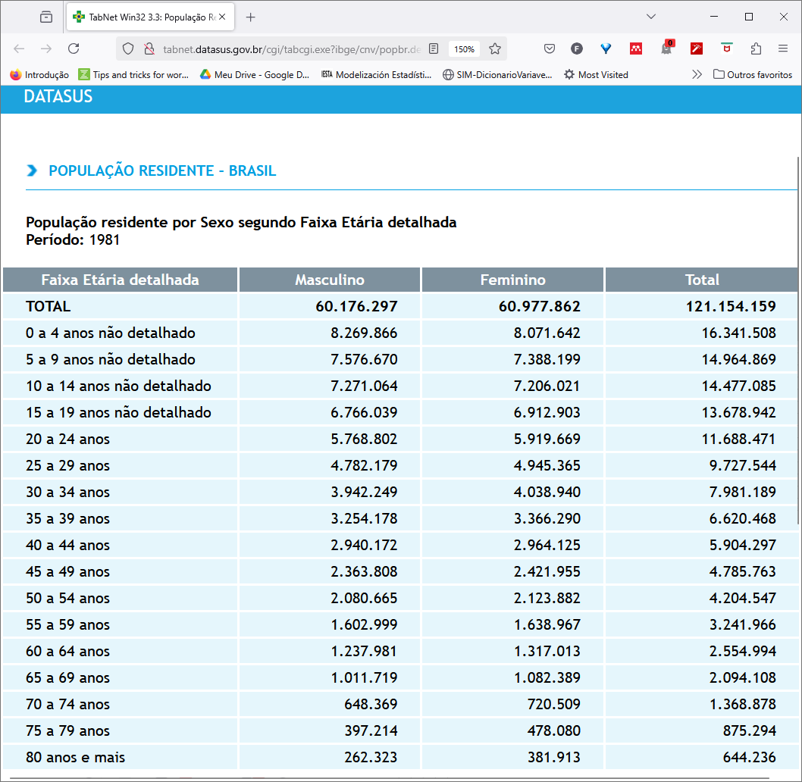
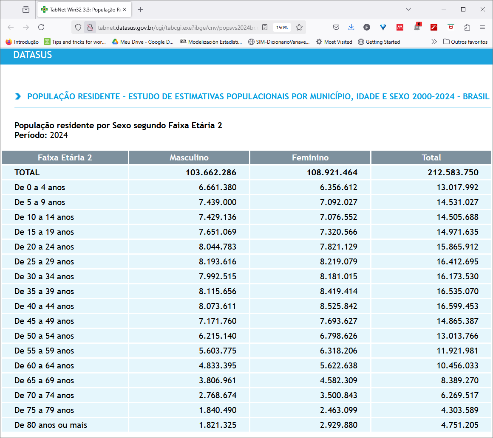

```{r, include = FALSE}
knitr::opts_chunk$set(warning = FALSE,
  collapse = TRUE,
  comment = NULL
)
```

```{r setup, message=FALSE}
library(csapAIH)
library(dplyr) 
library(Rcoisas) 
library(ggplot2)
library(knitr)
```

O Departamento de Informática do SUS (DATASUS) distribuía as estimativas e contagens populacionais por sexo e faixa etária quinquenal para os municípios brasileiros em arquivos separados por ano, desde 1980 até 2012. Após ficarmos um período sem estimativas para os anos seguintes, foi publicado no aplicativo on-line de tabulação de dados do DATASUS, o [TABNET](https://datasus.saude.gov.br/informacoes-de-saude-tabnet/), o [*Estudo de estimativas populacionais para os municípios brasileiros, desagregadas por sexo e idade, 2000-2021*](http://tabnet.datasus.gov.br/cgi/IBGE/NT-POPULACAO-RESIDENTE-2000-2021.PDF), cujos resultados ainda podem ser tabulados [nessa página](http://tabnet.datasus.gov.br/cgi/deftohtm.exe?ibge/cnv/popsvsbr.def), agora com o aviso de "*população não mais em uso*", porque o Censo 2022 mostrou que os cálculos foram superestimados. Entretanto, os arquivos-fonte não eram disponibilizados, o que levou à criação do pacote [brpop](https://rfsaldanha.github.io/brpop/) e, posteriormente, da função `popbr2000_2021()`.

Com a atualização das estimativas populacionais após o Censo 2022, o DATASUS voltou a disponibilizar arquivos com as contagens e estimativas da população por sexo e idade para os municípios brasileiros. Assim, 
além das tabulações no [TABNET](http://tabnet.datasus.gov.br/cgi/deftohtm.exe?ibge/cnv/popsvs2024br.def),
podemos novamente baixar os arquivos na página de [transferência de arquivos](https://datasus.saude.gov.br/transferencia-de-arquivos/) ou no site FTP do DATASUS, em <ftp://ftp.datasus.gov.br/dissemin/publicos/IBGE/POP/> e <ftp://ftp.datasus.gov.br/dissemin/publicos/IBGE/POPSVS/>. ([Nota técnica](http://tabnet.datasus.gov.br/cgi/IBGE/NT-POPULACAO-RESIDENTE-2000-2024.PDF))

Portanto, a função `popbr2000_2021()` não é mais necessária, salvo para a reprodução de resultados anteriores e eventual comparação com as estimativas atualizadas, razão pela qual é mantida no pacote. As estimativas atualizadas são lidas pela função `ler_popbr()`, que anteriormente lia os arquivos de 1980 a 2012 ([página de tabulação](http://tabnet.datasus.gov.br/cgi/deftohtm.exe?ibge/cnv/popbr.def)) e agora lê as novas estimativas e medidas, disponíveis nos arquivos de 2013 a 2024 ([página de tabulação](http://tabnet.datasus.gov.br/cgi/deftohtm.exe?ibge/cnv/popsvs2024br.def)).

## Os arquivos de população no DATASUS

Os arquivos são disponibilizados com registros para todos os municípios brasileiros, com estrutura um pouco diferente entre os períodos 1980-2012 e 2013-2024.

No período 1980 a 2012, a estrutura é a seguinte (veja que é a mesma estrutura para os dois anos selecionados):
```{r}
br1980 <- ler_popbr(1980)
all.equal( str(br1980), str(ler_popbr(2012)) )
```

Primeiros e últimos registros:
```{r}
br1980 |> head()
br1980 |> tail()
```

Já de 2013 a 2024, a estrutura é a seguinte (veja que também é a mesma estrutura para os dois anos selecionados):

```{r}
br2024 <- ler_popbr(2024)
all.equal( str(ler_popbr(2013)), str(br2024) )
```

Primeiros e últimos registros:
```{r}
br2024 |> head()
br2024 |> tail()
```

No primeiro período os bancos têm `r numescrito(ncol(br1980))` variáveis, já de 2013 em diante apenas `r numescrito(ncol(br2024))`, porque estes últimos não contêm a variável ``r names(br1980)[names(br1980) %in% names(br2024) == FALSE]`` (`r levels(br1980$situacao)[1]` ou `r levels(br1980$situacao)[2]`). Além disso, a variável `fxetaria`, que tem o mesmo nome e rótulo nos dois períodos (`r attr(br1980$fxetaria, "label")`, e `r attr(br2024$fxetaria, "label")`) tampouco tem a mesma estrutura nos dois períodos. De 1980 a 2012 a "Faixa etária detalhada" se refere a essa classificação em algumas tabulações do DATASUS, em que a idade é definida anualmente até os 19 anos de idade e em faixas quinquenais até 80 anos ou mais (e mais uma categoria para ignorados, com um total de 34 categorias), enquanto nas estimativas atualizadas a "Faixa etária detalhada" é a idade em anos até 80 ou mais (81 categorias).

Vejamos novamente a variável `fxetaria`:

 - em 1980
```{r}
str(br1980$fxetaria)
br1980$fxetaria |> unique()
```

 - em 2024
```{r}
str(br2024$fxetaria)
br2024$fxetaria |> unique()
```

Isto é, para criar um banco com as estimativas para vários anos, há que se levar em conta se o período desejado inclui arquivos com diferente estrutura e em tal caso retirar a variável `situacao` e as linhas de idade ignorada (registro `I000`) das estimativas até 2012 e retirar a variável `fxetaria` de todos os bancos. Em qualquer caso, ao se trabalhar com faixas etárias quinquenais (`fxetar5`) a população estimada para cada `fxetaria` deve ser agregada (somada) nas categorias de `fxetar5`.

## Montando um banco na sessão de trabalho

Assim podemos, por exemplo, criar um banco com as estimativas por sexo e faixa etária quinquenal para os municípios brasileiros nos anos 1980, 1991, 2010, 2013, 2022 e 2024 da seguinte forma:

```{r}
br <- rbind(rbind(br1980, ler_popbr(1991), ler_popbr(2010)) %>%
              filter(fxetaria != "I000") %>% 
              select(-situacao),
            rbind(ler_popbr(2013), ler_popbr(2022), br2024)
            ) %>% 
  arrange(munic_res) %>% 
  group_by(munic_res, ano, sexo, fxetar5) %>% 
  reframe(populacao = sum(populacao))

str(br)
summary(br)
```

## Criando uma tabela 

Uma tabela com a população por sexo e faixa etária para um ano determinado pode ser conseguida da seguinte forma: 
```{r}
tab81 <- ler_popbr(1981) %>% 
  group_by(sexo, fxetar5) %>% 
  mutate(sexo = case_match(sexo, "masc" ~ "Masculino", "fem" ~ "Feminino")) %>% 
  reframe(populacao = sum(populacao)) %>% 
  tidyr::pivot_wider(names_from = sexo, values_from = populacao) %>% 
  relocate(Masculino, .before = Feminino) %>% 
  mutate(Total = Masculino + Feminino) %>% 
  adissoma()
```

A tabela pode ser exportada para um arquivo .csv (veja `?write.csv`) ou impressa:
```{r}
knitr::kable(tab81, format.args = list(big.mark = "."))
```

As funções `plot_pir` e `ggplot_pir`, do pacote Rcoisas, ajudam na visualização dos câmbios na estrutura demográfica brasileira ao longo desses anos:

```{r results='hide', fig.align='center', fig.height=4, out.width='90%'}
#| fig.alt: >
#|   Pirâmide populacional com a função plot_pir
par(mfrow = c(1,2))
plot_pir(br1980, local = "Brasil", fontsize = .8)
plot_pir(br2024, local = "Brasil", fontsize = .8)
```

```{r fig.alt="Pirâmide populacional", fig.align='center'}
#| fig.alt: >
#|   Pirâmide populacional com a função ggplot_pir
ggplot_pir(br, "fxetar5", "sexo", "populacao", nsize = 0) +
  facet_wrap(vars(ano)) + 
  theme_classic() +
  theme(axis.text.y = element_text(size = 6),
        legend.position = "bottom",
        legend.key.size = unit(3, 'mm'),
        legend.key.width = unit(1, 'cm')) 
```


## Validando os resultados

Se quisermos uma tabulação da população brasileira por sexo e faixa etária quinquenal no período de 1980 a 2012, devemos pedir no [TABNET](http://tabnet.datasus.gov.br/cgi/tabcgi.exe?ibge/cnv/popbr.def) uma tabulação por "faixa etária detalhada".^[A opção "faixa etária" tem faixas decenais após os 20 anos.] Para 1981, temos a seguinte tabela:

```{r fig.cap="População por sexo e faixa etária. Brasil, 1981. Tabulação no TABNET, 25/02/2025.", fig.align='center'}

```

Vamos ler essa tabela, salva como arquivo .CSV através do botão "Copia para .csv", no TABNET.

```{r}
tab81tabnet <- read.csv2("../../data-raw/ibge_cnv_popbr1981.csv", skip = 3, nrows = 18, encoding = "latin1")
tab81tabnet |> kable(format.args = list(big.mark = "."))
```

Os valores são iguais aos que obtivemos acima na criação do objeto `tab81`:
```{r}
all.equal(tab81[2:4], tab81tabnet[2:4], check.attributes = FALSE)
```

Para 2024, temos a seguinte tabela, e um resultado análogo:

```{r fig.cap="População por sexo e faixa etária. Brasil, 2024. Tabulação no TABNET, 25/02/2025.", fig.align='center'}

```

```{r}
tab24tabnet <- read.csv2("../../data-raw/ibge_cnv_popbr2024.csv", skip = 3, nrows = 18, encoding = "latin1")
tab24tabnet |> kable(format.args = list(big.mark = "."))
```

```{r}
tab24 <- ler_popbr(2024) %>% 
  group_by(sexo, fxetar5) %>% 
  mutate(sexo = case_match(sexo, "masc" ~ "Masculino", "fem" ~ "Feminino")) %>% 
  reframe(populacao = sum(populacao)) %>% 
  tidyr::pivot_wider(names_from = sexo, values_from = populacao) %>% 
  relocate(Masculino, .before = Feminino) %>% 
  mutate(Total = Masculino + Feminino) %>% 
  adissoma()
knitr::kable(tab24, format.args = list(big.mark = "."))
```


Os valores são os mesmos em ambos casos:
```{r}
all.equal(tab24[2:4], tab24tabnet[2:4], check.attributes = FALSE)
```

